# Note Graph

> Auto-generated by `scripts/notegraph.mjs` on 2026-06-20.
> Re-run with `node scripts/notegraph.mjs` to update.

**35 notes**, 106 hard edges, 64 soft edges, 1 orphans, 0 bundled atomic notes.

Hard edges only are shown below. For the full interactive graph (soft edges + zoom + search), open [`notegraph.html`](./notegraph.html).

```mermaid
flowchart LR
  subgraph docs["docs/ (23)"]
    docs__posts_2026_03_19_changelog_week_of_2026_03_19_md["Changelog — Week of 2026-03-19"]
    docs__posts_2026_03_25_aeon_is_the_anti_openclaw_md["Aeon Is the Anti-OpenClaw: Why Backgroun"]
    docs__posts_2026_03_28_the_agent_that_fixes_itself_md["The Agent That Fixes Itself: Inside Aeon"]
    docs__posts_2026_05_24_aeon_on_gitlawb_md["Aeon on GitLawb Could Spawn the Largest "]
    docs__posts_2026_05_25_autonomous_agents_on_gitlawb_md["We Spawned Autonomous Agents on GitLawb."]
    docs__posts_2026_06_02_earn_or_die_vs_lent_authority_md["Earn-or-Die vs. Lent Authority: Two Off-"]
    docs_activity_md["Activity"]
    docs_agent_worktrees_md["Agent Worktrees"]
    docs_articles_md["Articles"]
    docs_community_skill_packs_md["Community Skill Packs"]
    docs_fleet_runner_md["Fleet Runner — operations runbook"]
    docs_gitlawb_demo_recap_md["GitLawb Demo Recap"]
    docs_gitlawb_demo_script_md["GitLawb Demo Script"]
    docs_gitlawb_pr_body_md["PR Body — GitLawb Prototype Positioning"]
    docs_index_md["Aeon — Skill Gallery"]
    docs_memory_md["Memory"]
    docs_pr_review_presets_md["PR Review Presets for `pr-review`"]
    docs_skill_graph_md["Skill Dependency Graph"]
    docs_skillpacks_chains_md["Suggested aeon.yml Chains"]
    docs_skillpacks_md["Skillpacks"]
    docs_skills_md["Skills"]
    docs_smithery_submission_md["Aeon — Smithery / MCP Registry Submissio"]
    docs_status_md["Status"]
  end
  subgraph memory["memory/ (11)"]
    memory_MEMORY_md["Memory Index"]
    memory_notes_agi_tracker_data_model_md["agi-tracker-data-model"]
    memory_notes_agi_tracker_site_md["agi-tracker-site"]
    memory_notes_agi_tracker_weekly_skill_md["agi-tracker-weekly-skill"]
    memory_notes_aschenbrenner_8_claim_scorecard_md["aschenbrenner-8-claim-scorecard"]
    memory_notes_daily_2026_06_20_md["Notes — 2026-06-20"]
    memory_notes_generate_skills_json_newline_bug_md["generate-skills-json-newline-bug"]
    memory_notes_metr_doubling_4_38mo_md["metr-doubling-4-38mo"]
    memory_notes_metr_saturates_above_16h_md["metr-saturates-above-16h"]
    memory_notes_skills_json_count_drift_md["skills-json-count-drift"]
    memory_topics_agi_tracker_md["AGI Tracker"]
  end
  docs__posts_2026_03_19_changelog_week_of_2026_03_19_md -.-> docs_skills_md
  docs__posts_2026_03_25_aeon_is_the_anti_openclaw_md -.-> docs_memory_md
  docs__posts_2026_03_25_aeon_is_the_anti_openclaw_md -.-> docs_skills_md
  docs__posts_2026_03_28_the_agent_that_fixes_itself_md -.-> docs_articles_md
  docs__posts_2026_03_28_the_agent_that_fixes_itself_md -.-> docs_index_md
  docs__posts_2026_03_28_the_agent_that_fixes_itself_md -.-> docs_memory_md
  docs__posts_2026_03_28_the_agent_that_fixes_itself_md -.-> docs_skills_md
  docs__posts_2026_03_28_the_agent_that_fixes_itself_md -.-> memory_MEMORY_md
  docs__posts_2026_05_24_aeon_on_gitlawb_md -.-> docs_activity_md
  docs__posts_2026_05_24_aeon_on_gitlawb_md -.-> docs_memory_md
  docs__posts_2026_05_24_aeon_on_gitlawb_md -.-> docs_skills_md
  docs__posts_2026_05_25_autonomous_agents_on_gitlawb_md -.-> docs_activity_md
  docs__posts_2026_05_25_autonomous_agents_on_gitlawb_md -.-> docs_memory_md
  docs__posts_2026_06_02_earn_or_die_vs_lent_authority_md -.-> docs__posts_2026_05_24_aeon_on_gitlawb_md
  docs__posts_2026_06_02_earn_or_die_vs_lent_authority_md -.-> docs_activity_md
  docs__posts_2026_06_02_earn_or_die_vs_lent_authority_md -.-> docs_index_md
  docs_activity_md -.-> docs_memory_md
  docs_activity_md -.-> docs_skills_md
  docs_agent_worktrees_md -.-> docs_index_md
  docs_agent_worktrees_md -.-> docs_status_md
  docs_community_skill_packs_md -.-> docs_skills_md
  docs_fleet_runner_md -.-> docs_memory_md
  docs_fleet_runner_md -.-> docs_skills_md
  docs_gitlawb_demo_recap_md --> docs_gitlawb_demo_script_md
  docs_gitlawb_demo_recap_md -.-> docs_gitlawb_demo_script_md
  docs_gitlawb_pr_body_md -.-> docs_gitlawb_demo_recap_md
  docs_gitlawb_pr_body_md -.-> docs_gitlawb_demo_script_md
  docs_gitlawb_pr_body_md -.-> docs_memory_md
  docs_index_md -.-> docs_articles_md
  docs_index_md -.-> docs_memory_md
  docs_index_md -.-> docs_skills_md
  docs_memory_md -.-> memory_MEMORY_md
  docs_pr_review_presets_md -.-> docs_skills_md
  docs_skill_graph_md -.-> docs_memory_md
  docs_skill_graph_md -.-> docs_skillpacks_md
  docs_skill_graph_md -.-> docs_skills_md
  docs_skillpacks_chains_md -.-> docs_skillpacks_md
  docs_skillpacks_chains_md -.-> docs_skills_md
  docs_skillpacks_md --> docs_skillpacks_chains_md
  docs_skillpacks_md -.-> docs_activity_md
  docs_skillpacks_md -.-> docs_articles_md
  docs_skillpacks_md -.-> docs_memory_md
  docs_skillpacks_md -.-> docs_skill_graph_md
  docs_skillpacks_md -.-> docs_skillpacks_chains_md
  docs_skillpacks_md -.-> docs_skills_md
  docs_skillpacks_md -.-> docs_status_md
  docs_skillpacks_md -.-> memory_MEMORY_md
  docs_skills_md -.-> docs_activity_md
  docs_skills_md -.-> docs_articles_md
  docs_skills_md -.-> docs_memory_md
  docs_skills_md -.-> memory_MEMORY_md
  docs_smithery_submission_md -.-> docs_activity_md
  docs_smithery_submission_md -.-> docs_articles_md
  docs_smithery_submission_md -.-> docs_memory_md
  docs_smithery_submission_md -.-> docs_skills_md
  docs_smithery_submission_md -.-> docs_status_md
  docs_smithery_submission_md -.-> memory_MEMORY_md
  docs_status_md -.-> docs_memory_md
  docs_status_md -.-> docs_skill_graph_md
  docs_status_md -.-> docs_skillpacks_md
  memory_MEMORY_md --> memory_topics_agi_tracker_md
  memory_MEMORY_md --> memory_notes_daily_2026_06_20_md
  memory_MEMORY_md -.-> docs_activity_md
  memory_MEMORY_md -.-> docs_index_md
  memory_MEMORY_md -.-> docs_memory_md
  memory_MEMORY_md -.-> memory_notes_daily_2026_06_20_md
  memory_MEMORY_md -.-> memory_topics_agi_tracker_md
  memory_notes_agi_tracker_weekly_skill_md -.-> docs_skills_md
  memory_notes_daily_2026_06_20_md --> memory_notes_agi_tracker_site_md
  memory_notes_daily_2026_06_20_md --> memory_notes_agi_tracker_data_model_md
  memory_notes_daily_2026_06_20_md --> memory_notes_agi_tracker_weekly_skill_md
  memory_notes_daily_2026_06_20_md --> memory_notes_metr_doubling_4_38mo_md
  memory_notes_daily_2026_06_20_md --> memory_notes_metr_saturates_above_16h_md
  memory_notes_daily_2026_06_20_md --> memory_notes_aschenbrenner_8_claim_scorecard_md
  memory_notes_daily_2026_06_20_md --> memory_notes_generate_skills_json_newline_bug_md
  memory_notes_daily_2026_06_20_md --> memory_notes_skills_json_count_drift_md
  memory_notes_daily_2026_06_20_md -.-> docs_skills_md
  memory_notes_daily_2026_06_20_md -.-> memory_notes_agi_tracker_data_model_md
  memory_notes_daily_2026_06_20_md -.-> memory_notes_agi_tracker_site_md
  memory_notes_daily_2026_06_20_md -.-> memory_notes_agi_tracker_weekly_skill_md
  memory_notes_daily_2026_06_20_md -.-> memory_notes_aschenbrenner_8_claim_scorecard_md
  memory_notes_daily_2026_06_20_md -.-> memory_notes_generate_skills_json_newline_bug_md
  memory_notes_daily_2026_06_20_md -.-> memory_notes_metr_doubling_4_38mo_md
  memory_notes_daily_2026_06_20_md -.-> memory_notes_metr_saturates_above_16h_md
  memory_notes_daily_2026_06_20_md -.-> memory_notes_skills_json_count_drift_md
  memory_notes_daily_2026_06_20_md -.-> memory_topics_agi_tracker_md
  memory_notes_skills_json_count_drift_md --> memory_notes_generate_skills_json_newline_bug_md
  memory_notes_skills_json_count_drift_md -.-> docs_skills_md
  memory_notes_skills_json_count_drift_md -.-> memory_notes_generate_skills_json_newline_bug_md
  memory_topics_agi_tracker_md --> memory_notes_agi_tracker_site_md
  memory_topics_agi_tracker_md --> memory_notes_agi_tracker_data_model_md
  memory_topics_agi_tracker_md --> memory_notes_agi_tracker_weekly_skill_md
  memory_topics_agi_tracker_md --> memory_notes_aschenbrenner_8_claim_scorecard_md
  memory_topics_agi_tracker_md --> memory_notes_metr_doubling_4_38mo_md
  memory_topics_agi_tracker_md --> memory_notes_metr_saturates_above_16h_md
  memory_topics_agi_tracker_md --> memory_notes_generate_skills_json_newline_bug_md
  memory_topics_agi_tracker_md --> memory_notes_skills_json_count_drift_md
  memory_topics_agi_tracker_md -.-> docs_skills_md
  memory_topics_agi_tracker_md -.-> memory_notes_agi_tracker_data_model_md
  memory_topics_agi_tracker_md -.-> memory_notes_agi_tracker_site_md
  memory_topics_agi_tracker_md -.-> memory_notes_agi_tracker_weekly_skill_md
  memory_topics_agi_tracker_md -.-> memory_notes_aschenbrenner_8_claim_scorecard_md
  memory_topics_agi_tracker_md -.-> memory_notes_generate_skills_json_newline_bug_md
  memory_topics_agi_tracker_md -.-> memory_notes_metr_doubling_4_38mo_md
  memory_topics_agi_tracker_md -.-> memory_notes_metr_saturates_above_16h_md
  memory_topics_agi_tracker_md -.-> memory_notes_skills_json_count_drift_md
```

## Edge legend

| Style | Meaning |
|---|---|
| `-->` solid | explicit `[[wikilink]]` or markdown link |
| `-.->` dotted | path or filename mention in body text |

Soft edges (shared tags, co-headings) are omitted here to keep the diagram legible — they live in `notegraph.json` and the HTML view.
