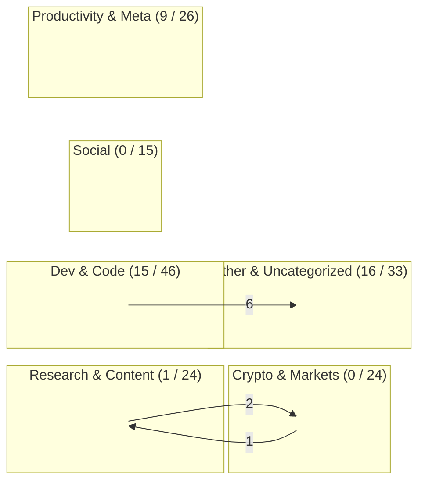
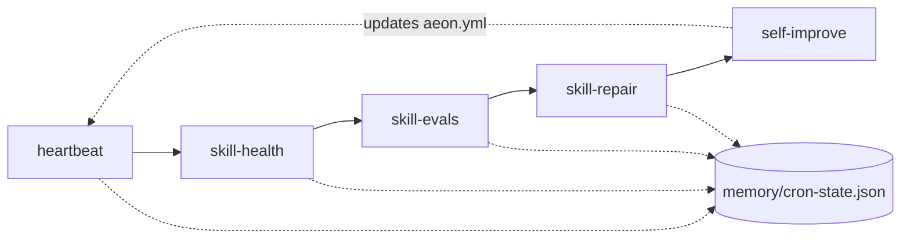

# Skill Dependency Graph

> Auto-generated by `skill-graph` on 2026-05-31. Mode: `SKILL_GRAPH_NEW`.

**Verdict:** SKILL_GRAPH_NEW — 168 skills mapped across 6 categories, 41 enabled

## Overview

Category boxes show **enabled / total** skill counts. Cross-category edges carry their count.

_Every skill also writes `memory/cron-state.json`, which is read by `heartbeat`, `skill-health`, `skill-repair`, and `skill-evals`. Collapsed here to keep the map readable — see Self-healing loop below._

## Self-healing loop

Reactive trigger: `skill-repair` fires on `consecutive_failures >= 3` for any skill; `planner` fires on `>= 2` to re-plan the day around the regressing area.

## Per-category breakdown

### Research & Content (1 / 24)

```mermaid
flowchart LR
    classDef enabled fill:#fff,stroke:#000,stroke-width:2px,color:#000
    classDef disabled fill:#f5f5f5,stroke:#bbb,color:#888
    classDef external fill:none,stroke:#bbb,stroke-dasharray:3 3,color:#888
    agent-displacement["agent-displacement"]
    ai-framework-watch["ai-framework-watch<br/><i>30 8 * * 1</i>"]
    article["article"]
    channel-recap["channel-recap"]
    competitor-launch-radar["competitor-launch-radar"]
    content-engine["content-engine"]
    deep-research["deep-research"]
    digest["digest"]
    ecosystem-pulse["ecosystem-pulse"]
    fetch-tweets["fetch-tweets"]
    hacker-news-digest["hacker-news-digest"]
    huggingface-trending["huggingface-trending"]
    last30["last30"]
    list-digest["list-digest"]
    paper-digest["paper-digest"]
    paper-pick["paper-pick"]
    pm-intel["pm-intel"]
    reddit-digest["reddit-digest"]
    research-brief["research-brief"]
    rss-digest["rss-digest"]
    security-digest["security-digest"]
    technical-explainer["technical-explainer"]
    telegram-digest["telegram-digest"]
    vibecoding-digest["vibecoding-digest"]
    pm-manipulation["pm-manipulation<br/><i>crypto</i>"]
    pm-pulse["pm-pulse<br/><i>crypto</i>"]
    pm-intel -..-> pm-manipulation
    pm-intel -..-> pm-pulse
    pm-pulse -..-> pm-intel
    click agent-displacement "../skills/agent-displacement/SKILL.md"
    click ai-framework-watch "../skills/ai-framework-watch/SKILL.md"
    click article "../skills/article/SKILL.md"
    click channel-recap "../skills/channel-recap/SKILL.md"
    click competitor-launch-radar "../skills/competitor-launch-radar/SKILL.md"
    click content-engine "../skills/content-engine/SKILL.md"
    click deep-research "../skills/deep-research/SKILL.md"
    click digest "../skills/digest/SKILL.md"
    click ecosystem-pulse "../skills/ecosystem-pulse/SKILL.md"
    click fetch-tweets "../skills/fetch-tweets/SKILL.md"
    click hacker-news-digest "../skills/hacker-news-digest/SKILL.md"
    click huggingface-trending "../skills/huggingface-trending/SKILL.md"
    click last30 "../skills/last30/SKILL.md"
    click list-digest "../skills/list-digest/SKILL.md"
    click paper-digest "../skills/paper-digest/SKILL.md"
    click paper-pick "../skills/paper-pick/SKILL.md"
    click pm-intel "../skills/pm-intel/SKILL.md"
    click reddit-digest "../skills/reddit-digest/SKILL.md"
    click research-brief "../skills/research-brief/SKILL.md"
    click rss-digest "../skills/rss-digest/SKILL.md"
    click security-digest "../skills/security-digest/SKILL.md"
    click technical-explainer "../skills/technical-explainer/SKILL.md"
    click telegram-digest "../skills/telegram-digest/SKILL.md"
    click vibecoding-digest "../skills/vibecoding-digest/SKILL.md"
    click pm-manipulation "../skills/pm-manipulation/SKILL.md"
    click pm-pulse "../skills/pm-pulse/SKILL.md"
    class ai-framework-watch enabled
    class agent-displacement,article,channel-recap,competitor-launch-radar,content-engine,deep-research,digest,ecosystem-pulse,fetch-tweets,hacker-news-digest,huggingface-trending,last30,list-digest,paper-digest,paper-pick,pm-intel,reddit-digest,research-brief,rss-digest,security-digest,technical-explainer,telegram-digest,vibecoding-digest disabled
    class pm-manipulation,pm-pulse external
```

### Dev & Code (15 / 46)

```mermaid
flowchart LR
    classDef enabled fill:#fff,stroke:#000,stroke-width:2px,color:#000
    classDef disabled fill:#f5f5f5,stroke:#bbb,color:#888
    classDef external fill:none,stroke:#bbb,stroke-dasharray:3 3,color:#888
    auto-merge["auto-merge"]
    auto-workflow["auto-workflow"]
    autoresearch["autoresearch"]
    autoresearch-goal["autoresearch-goal"]
    builder-map["builder-map"]
    changelog["changelog<br/><i>0 16 * * 1</i>"]
    code-health["code-health<br/><i>0 16 * * *</i>"]
    config-validator["config-validator<br/><i>0 7 * * 0</i>"]
    create-skill["create-skill"]
    deploy-prototype["deploy-prototype"]
    external-feature["external-feature"]
    feature["feature"]
    fleet-control["fleet-control<br/><i>0 9 * * *</i>"]
    fork-cohort["fork-cohort"]
    fork-first-run-alert["fork-first-run-alert"]
    fork-fleet["fork-fleet"]
    fork-skill-gap["fork-skill-gap"]
    github-issues["github-issues"]
    github-monitor["github-monitor<br/><i>0 9 * * *</i>"]
    github-releases["github-releases"]
    github-trending["github-trending"]
    gitlawb-fleet["gitlawb-fleet"]
    gitlawb-fleet-metrics["gitlawb-fleet-metrics<br/><i>0 8 * * *</i>"]
    issue-triage["issue-triage<br/><i>0 9 * * *</i>"]
    pr-review["pr-review<br/><i>0 9,18 * * *</i>"]
    pr-triage["pr-triage<br/><i>30 9 * * *</i>"]
    project-lens["project-lens"]
    push-recap["push-recap"]
    repo-actions["repo-actions"]
    repo-article["repo-article"]
    repo-pulse["repo-pulse"]
    repo-revive["repo-revive<br/><i>0 10 * * 6</i>"]
    repo-scanner["repo-scanner"]
    search-skill["search-skill"]
    skill-enabler["skill-enabler"]
    skill-freshness["skill-freshness<br/><i>0 8 * * *</i>"]
    skill-graph["skill-graph<br/><i>0 17 * * 0</i>"]
    skill-security-scan["skill-security-scan"]
    smithery-manifest["smithery-manifest"]
    spawn-instance["spawn-instance"]
    star-milestone["star-milestone"]
    swarm-safety-eval["swarm-safety-eval<br/><i>30 7 * * 0</i>"]
    vercel-projects["vercel-projects"]
    vuln-scanner["vuln-scanner<br/><i>0 16 * * 6</i>"]
    workflow-security-audit["workflow-security-audit<br/><i>0 16 * * 0</i>"]
    x402-monitor["x402-monitor"]
    github-trending --> vuln-scanner
    repo-scanner --> external-feature
    fork-cohort -..-> fork-first-run-alert
    fork-cohort -..-> fork-skill-gap
    repo-scanner -..-> external-feature
    repo-scanner -..-> repo-actions
    repo-scanner -..-> vercel-projects
    vercel-projects -..-> external-feature
    vercel-projects -..-> repo-actions
    vercel-projects -..-> repo-scanner
    contributor-spotlight["contributor-spotlight<br/><i>other</i>"]
    fleet-state["fleet-state<br/><i>other</i>"]
    idea-pipeline["idea-pipeline<br/><i>other</i>"]
    vuln-tracker["vuln-tracker<br/><i>other</i>"]
    vuln-scanner --> vuln-tracker
    builder-map -..-> idea-pipeline
    deploy-prototype -..-> idea-pipeline
    fork-cohort -..-> contributor-spotlight
    fork-cohort -..-> fleet-state
    vercel-projects -..-> idea-pipeline
    click auto-merge "../skills/auto-merge/SKILL.md"
    click auto-workflow "../skills/auto-workflow/SKILL.md"
    click autoresearch "../skills/autoresearch/SKILL.md"
    click autoresearch-goal "../skills/autoresearch-goal/SKILL.md"
    click builder-map "../skills/builder-map/SKILL.md"
    click changelog "../skills/changelog/SKILL.md"
    click code-health "../skills/code-health/SKILL.md"
    click config-validator "../skills/config-validator/SKILL.md"
    click create-skill "../skills/create-skill/SKILL.md"
    click deploy-prototype "../skills/deploy-prototype/SKILL.md"
    click external-feature "../skills/external-feature/SKILL.md"
    click feature "../skills/feature/SKILL.md"
    click fleet-control "../skills/fleet-control/SKILL.md"
    click fork-cohort "../skills/fork-cohort/SKILL.md"
    click fork-first-run-alert "../skills/fork-first-run-alert/SKILL.md"
    click fork-fleet "../skills/fork-fleet/SKILL.md"
    click fork-skill-gap "../skills/fork-skill-gap/SKILL.md"
    click github-issues "../skills/github-issues/SKILL.md"
    click github-monitor "../skills/github-monitor/SKILL.md"
    click github-releases "../skills/github-releases/SKILL.md"
    click github-trending "../skills/github-trending/SKILL.md"
    click gitlawb-fleet "../skills/gitlawb-fleet/SKILL.md"
    click gitlawb-fleet-metrics "../skills/gitlawb-fleet-metrics/SKILL.md"
    click issue-triage "../skills/issue-triage/SKILL.md"
    click pr-review "../skills/pr-review/SKILL.md"
    click pr-triage "../skills/pr-triage/SKILL.md"
    click project-lens "../skills/project-lens/SKILL.md"
    click push-recap "../skills/push-recap/SKILL.md"
    click repo-actions "../skills/repo-actions/SKILL.md"
    click repo-article "../skills/repo-article/SKILL.md"
    click repo-pulse "../skills/repo-pulse/SKILL.md"
    click repo-revive "../skills/repo-revive/SKILL.md"
    click repo-scanner "../skills/repo-scanner/SKILL.md"
    click search-skill "../skills/search-skill/SKILL.md"
    click skill-enabler "../skills/skill-enabler/SKILL.md"
    click skill-freshness "../skills/skill-freshness/SKILL.md"
    click skill-graph "../skills/skill-graph/SKILL.md"
    click skill-security-scan "../skills/skill-security-scan/SKILL.md"
    click smithery-manifest "../skills/smithery-manifest/SKILL.md"
    click spawn-instance "../skills/spawn-instance/SKILL.md"
    click star-milestone "../skills/star-milestone/SKILL.md"
    click swarm-safety-eval "../skills/swarm-safety-eval/SKILL.md"
    click vercel-projects "../skills/vercel-projects/SKILL.md"
    click vuln-scanner "../skills/vuln-scanner/SKILL.md"
    click workflow-security-audit "../skills/workflow-security-audit/SKILL.md"
    click x402-monitor "../skills/x402-monitor/SKILL.md"
    click contributor-spotlight "../skills/contributor-spotlight/SKILL.md"
    click fleet-state "../skills/fleet-state/SKILL.md"
    click idea-pipeline "../skills/idea-pipeline/SKILL.md"
    click vuln-tracker "../skills/vuln-tracker/SKILL.md"
    class changelog,code-health,config-validator,fleet-control,github-monitor,gitlawb-fleet-metrics,issue-triage,pr-review,pr-triage,repo-revive,skill-freshness,skill-graph,swarm-safety-eval,vuln-scanner,workflow-security-audit enabled
    class auto-merge,auto-workflow,autoresearch,autoresearch-goal,builder-map,create-skill,deploy-prototype,external-feature,feature,fork-cohort,fork-first-run-alert,fork-fleet,fork-skill-gap,github-issues,github-releases,github-trending,gitlawb-fleet,project-lens,push-recap,repo-actions,repo-article,repo-pulse,repo-scanner,search-skill,skill-enabler,skill-security-scan,smithery-manifest,spawn-instance,star-milestone,vercel-projects,x402-monitor disabled
    class contributor-spotlight,fleet-state,idea-pipeline,vuln-tracker external
```

### Crypto & Markets (0 / 24)

```mermaid
flowchart LR
    classDef enabled fill:#fff,stroke:#000,stroke-width:2px,color:#000
    classDef disabled fill:#f5f5f5,stroke:#bbb,color:#888
    classDef external fill:none,stroke:#bbb,stroke-dasharray:3 3,color:#888
    aixbt-pulse["aixbt-pulse"]
    contributor-reward["contributor-reward"]
    defi-monitor["defi-monitor"]
    defi-overview["defi-overview"]
    distribute-tokens["distribute-tokens"]
    market-context-refresh["market-context-refresh"]
    monitor-kalshi["monitor-kalshi"]
    monitor-polymarket["monitor-polymarket"]
    monitor-runners["monitor-runners"]
    narrative-tracker["narrative-tracker"]
    on-chain-monitor["on-chain-monitor"]
    pm-manipulation["pm-manipulation"]
    pm-pulse["pm-pulse"]
    polymarket["polymarket"]
    polymarket-comments["polymarket-comments"]
    price-threshold-alert["price-threshold-alert"]
    rwa-pulse["rwa-pulse"]
    token-alert["token-alert"]
    token-movers["token-movers"]
    token-pick["token-pick"]
    token-report["token-report"]
    treasury-info["treasury-info"]
    unlock-monitor["unlock-monitor"]
    wallet-digest["wallet-digest"]
    pm-pulse -..-> pm-manipulation
    pm-intel["pm-intel<br/><i>research</i>"]
    pm-intel -..-> pm-manipulation
    pm-intel -..-> pm-pulse
    pm-pulse -..-> pm-intel
    click aixbt-pulse "../skills/aixbt-pulse/SKILL.md"
    click contributor-reward "../skills/contributor-reward/SKILL.md"
    click defi-monitor "../skills/defi-monitor/SKILL.md"
    click defi-overview "../skills/defi-overview/SKILL.md"
    click distribute-tokens "../skills/distribute-tokens/SKILL.md"
    click market-context-refresh "../skills/market-context-refresh/SKILL.md"
    click monitor-kalshi "../skills/monitor-kalshi/SKILL.md"
    click monitor-polymarket "../skills/monitor-polymarket/SKILL.md"
    click monitor-runners "../skills/monitor-runners/SKILL.md"
    click narrative-tracker "../skills/narrative-tracker/SKILL.md"
    click on-chain-monitor "../skills/on-chain-monitor/SKILL.md"
    click pm-manipulation "../skills/pm-manipulation/SKILL.md"
    click pm-pulse "../skills/pm-pulse/SKILL.md"
    click polymarket "../skills/polymarket/SKILL.md"
    click polymarket-comments "../skills/polymarket-comments/SKILL.md"
    click price-threshold-alert "../skills/price-threshold-alert/SKILL.md"
    click rwa-pulse "../skills/rwa-pulse/SKILL.md"
    click token-alert "../skills/token-alert/SKILL.md"
    click token-movers "../skills/token-movers/SKILL.md"
    click token-pick "../skills/token-pick/SKILL.md"
    click token-report "../skills/token-report/SKILL.md"
    click treasury-info "../skills/treasury-info/SKILL.md"
    click unlock-monitor "../skills/unlock-monitor/SKILL.md"
    click wallet-digest "../skills/wallet-digest/SKILL.md"
    click pm-intel "../skills/pm-intel/SKILL.md"
    class aixbt-pulse,contributor-reward,defi-monitor,defi-overview,distribute-tokens,market-context-refresh,monitor-kalshi,monitor-polymarket,monitor-runners,narrative-tracker,on-chain-monitor,pm-manipulation,pm-pulse,polymarket,polymarket-comments,price-threshold-alert,rwa-pulse,token-alert,token-movers,token-pick,token-report,treasury-info,unlock-monitor,wallet-digest disabled
    class pm-intel external
```

### Social (0 / 15)

```mermaid
flowchart LR
    classDef enabled fill:#fff,stroke:#000,stroke-width:2px,color:#000
    classDef disabled fill:#f5f5f5,stroke:#bbb,color:#888
    classDef external fill:none,stroke:#bbb,stroke-dasharray:3 3,color:#888
    agent-buzz["agent-buzz"]
    create-campaign["create-campaign"]
    engagement-act["engagement-act"]
    farcaster-digest["farcaster-digest"]
    product-hunt-launch["product-hunt-launch"]
    refresh-x["refresh-x"]
    remix-tweets["remix-tweets"]
    reply-maker["reply-maker"]
    schedule-ads["schedule-ads"]
    show-hn-draft["show-hn-draft"]
    syndicate-article["syndicate-article"]
    thread-formatter["thread-formatter"]
    tweet-digest["tweet-digest"]
    tweet-roundup["tweet-roundup"]
    write-tweet["write-tweet"]
    click agent-buzz "../skills/agent-buzz/SKILL.md"
    click create-campaign "../skills/create-campaign/SKILL.md"
    click engagement-act "../skills/engagement-act/SKILL.md"
    click farcaster-digest "../skills/farcaster-digest/SKILL.md"
    click product-hunt-launch "../skills/product-hunt-launch/SKILL.md"
    click refresh-x "../skills/refresh-x/SKILL.md"
    click remix-tweets "../skills/remix-tweets/SKILL.md"
    click reply-maker "../skills/reply-maker/SKILL.md"
    click schedule-ads "../skills/schedule-ads/SKILL.md"
    click show-hn-draft "../skills/show-hn-draft/SKILL.md"
    click syndicate-article "../skills/syndicate-article/SKILL.md"
    click thread-formatter "../skills/thread-formatter/SKILL.md"
    click tweet-digest "../skills/tweet-digest/SKILL.md"
    click tweet-roundup "../skills/tweet-roundup/SKILL.md"
    click write-tweet "../skills/write-tweet/SKILL.md"
    class agent-buzz,create-campaign,engagement-act,farcaster-digest,product-hunt-launch,refresh-x,remix-tweets,reply-maker,schedule-ads,show-hn-draft,syndicate-article,thread-formatter,tweet-digest,tweet-roundup,write-tweet disabled
```

### Productivity & Meta (9 / 26)

```mermaid
flowchart LR
    classDef enabled fill:#fff,stroke:#000,stroke-width:2px,color:#000
    classDef disabled fill:#f5f5f5,stroke:#bbb,color:#888
    classDef external fill:none,stroke:#bbb,stroke-dasharray:3 3,color:#888
    action-converter["action-converter"]
    cost-report["cost-report<br/><i>0 7 * * 1</i>"]
    daily-routine["daily-routine"]
    deal-flow["deal-flow"]
    evening-recap["evening-recap"]
    goal-tracker["goal-tracker<br/><i>0 18 * * *</i>"]
    heartbeat["heartbeat<br/><i>0 8 * * *</i>"]
    idea-capture["idea-capture"]
    morning-brief["morning-brief"]
    onboard["onboard"]
    operator-scorecard["operator-scorecard"]
    reflect["reflect<br/><i>0 18 * * *</i>"]
    reg-monitor["reg-monitor"]
    rss-feed["rss-feed"]
    self-improve["self-improve"]
    skill-evals["skill-evals<br/><i>0 6 * * 0</i>"]
    skill-health["skill-health<br/><i>0 18 * * *</i>"]
    skill-leaderboard["skill-leaderboard"]
    skill-repair["skill-repair<br/><i>reactive</i>"]
    skill-update-check["skill-update-check<br/><i>0 19 * * 0</i>"]
    startup-idea["startup-idea"]
    tool-builder["tool-builder"]
    update-gallery["update-gallery"]
    v4-readiness["v4-readiness"]
    weekly-review["weekly-review"]
    weekly-shiplog["weekly-shiplog<br/><i>0 9 * * 1</i>"]
    action-converter --> tool-builder
    skill-health --> skill-repair
    click action-converter "../skills/action-converter/SKILL.md"
    click cost-report "../skills/cost-report/SKILL.md"
    click daily-routine "../skills/daily-routine/SKILL.md"
    click deal-flow "../skills/deal-flow/SKILL.md"
    click evening-recap "../skills/evening-recap/SKILL.md"
    click goal-tracker "../skills/goal-tracker/SKILL.md"
    click heartbeat "../skills/heartbeat/SKILL.md"
    click idea-capture "../skills/idea-capture/SKILL.md"
    click morning-brief "../skills/morning-brief/SKILL.md"
    click onboard "../skills/onboard/SKILL.md"
    click operator-scorecard "../skills/operator-scorecard/SKILL.md"
    click reflect "../skills/reflect/SKILL.md"
    click reg-monitor "../skills/reg-monitor/SKILL.md"
    click rss-feed "../skills/rss-feed/SKILL.md"
    click self-improve "../skills/self-improve/SKILL.md"
    click skill-evals "../skills/skill-evals/SKILL.md"
    click skill-health "../skills/skill-health/SKILL.md"
    click skill-leaderboard "../skills/skill-leaderboard/SKILL.md"
    click skill-repair "../skills/skill-repair/SKILL.md"
    click skill-update-check "../skills/skill-update-check/SKILL.md"
    click startup-idea "../skills/startup-idea/SKILL.md"
    click tool-builder "../skills/tool-builder/SKILL.md"
    click update-gallery "../skills/update-gallery/SKILL.md"
    click v4-readiness "../skills/v4-readiness/SKILL.md"
    click weekly-review "../skills/weekly-review/SKILL.md"
    click weekly-shiplog "../skills/weekly-shiplog/SKILL.md"
    class cost-report,goal-tracker,heartbeat,reflect,skill-evals,skill-health,skill-repair,skill-update-check,weekly-shiplog enabled
    class action-converter,daily-routine,deal-flow,evening-recap,idea-capture,morning-brief,onboard,operator-scorecard,reg-monitor,rss-feed,self-improve,skill-leaderboard,startup-idea,tool-builder,update-gallery,v4-readiness,weekly-review disabled
```

### Other & Uncategorized (16 / 33)

```mermaid
flowchart LR
    classDef enabled fill:#fff,stroke:#000,stroke-width:2px,color:#000
    classDef disabled fill:#f5f5f5,stroke:#bbb,color:#888
    classDef external fill:none,stroke:#bbb,stroke-dasharray:3 3,color:#888
    batch-health["batch-health<br/><i>0 8 * * *</i>"]
    compute-futures-eda["compute-futures-eda<br/><i>0 6 * * *</i>"]
    compute-pulse["compute-pulse<br/><i>0 11 * * 6</i>"]
    contributor-spotlight["contributor-spotlight"]
    disclosure-tracker["disclosure-tracker"]
    fleet-state["fleet-state"]
    fork-contributor-leaderboard["fork-contributor-leaderboard"]
    fork-release-tracker["fork-release-tracker"]
    fork-skill-digest["fork-skill-digest"]
    idea-pipeline["idea-pipeline"]
    idea-validator["idea-validator"]
    janitor["janitor<br/><i>30 5 * * 0</i>"]
    launch-radar["launch-radar"]
    memory-flush["memory-flush<br/><i>0 6 2/2 * *</i>"]
    memory-structural-dedupe["memory-structural-dedupe<br/><i>10 6 2/2 * *</i>"]
    milestone-tracker["milestone-tracker<br/><i>0 12 * * 1</i>"]
    note-taking["note-taking"]
    notegraph["notegraph<br/><i>0 5 * * *</i>"]
    planner["planner<br/><i>30 6 * * *</i>"]
    pr-tracker["pr-tracker<br/><i>0 10 * * *</i>"]
    programmatic-eda["programmatic-eda"]
    pvr-triage-monitor["pvr-triage-monitor"]
    pvr-watchlist["pvr-watchlist"]
    run-frequency-guard["run-frequency-guard<br/><i>0 23 * * *</i>"]
    self-review["self-review<br/><i>30 18 * * 0</i>"]
    signal-verdict["signal-verdict"]
    skill-analytics["skill-analytics<br/><i>30 18 * * 3</i>"]
    skillpacks["skillpacks<br/><i>0 6 * * 0</i>"]
    star-momentum-alert["star-momentum-alert"]
    suggest-edges["suggest-edges<br/><i>30 5 * * *</i>"]
    surplus-pulse["surplus-pulse<br/><i>30 16 * * *</i>"]
    topic-momentum["topic-momentum"]
    vuln-tracker["vuln-tracker"]
    contributor-spotlight -..-> fleet-state
    fork-release-tracker -..-> fleet-state
    idea-validator -..-> idea-pipeline
    idea-validator -..-> launch-radar
    pr-tracker -..-> disclosure-tracker
    builder-map["builder-map<br/><i>dev</i>"]
    deploy-prototype["deploy-prototype<br/><i>dev</i>"]
    fork-cohort["fork-cohort<br/><i>dev</i>"]
    vercel-projects["vercel-projects<br/><i>dev</i>"]
    vuln-scanner["vuln-scanner<br/><i>dev</i>"]
    vuln-scanner --> vuln-tracker
    builder-map -..-> idea-pipeline
    deploy-prototype -..-> idea-pipeline
    fork-cohort -..-> contributor-spotlight
    fork-cohort -..-> fleet-state
    vercel-projects -..-> idea-pipeline
    click batch-health "../skills/batch-health/SKILL.md"
    click compute-futures-eda "../skills/compute-futures-eda/SKILL.md"
    click compute-pulse "../skills/compute-pulse/SKILL.md"
    click contributor-spotlight "../skills/contributor-spotlight/SKILL.md"
    click disclosure-tracker "../skills/disclosure-tracker/SKILL.md"
    click fleet-state "../skills/fleet-state/SKILL.md"
    click fork-contributor-leaderboard "../skills/fork-contributor-leaderboard/SKILL.md"
    click fork-release-tracker "../skills/fork-release-tracker/SKILL.md"
    click fork-skill-digest "../skills/fork-skill-digest/SKILL.md"
    click idea-pipeline "../skills/idea-pipeline/SKILL.md"
    click idea-validator "../skills/idea-validator/SKILL.md"
    click janitor "../skills/janitor/SKILL.md"
    click launch-radar "../skills/launch-radar/SKILL.md"
    click memory-flush "../skills/memory-flush/SKILL.md"
    click memory-structural-dedupe "../skills/memory-structural-dedupe/SKILL.md"
    click milestone-tracker "../skills/milestone-tracker/SKILL.md"
    click note-taking "../skills/note-taking/SKILL.md"
    click notegraph "../skills/notegraph/SKILL.md"
    click planner "../skills/planner/SKILL.md"
    click pr-tracker "../skills/pr-tracker/SKILL.md"
    click programmatic-eda "../skills/programmatic-eda/SKILL.md"
    click pvr-triage-monitor "../skills/pvr-triage-monitor/SKILL.md"
    click pvr-watchlist "../skills/pvr-watchlist/SKILL.md"
    click run-frequency-guard "../skills/run-frequency-guard/SKILL.md"
    click self-review "../skills/self-review/SKILL.md"
    click signal-verdict "../skills/signal-verdict/SKILL.md"
    click skill-analytics "../skills/skill-analytics/SKILL.md"
    click skillpacks "../skills/skillpacks/SKILL.md"
    click star-momentum-alert "../skills/star-momentum-alert/SKILL.md"
    click suggest-edges "../skills/suggest-edges/SKILL.md"
    click surplus-pulse "../skills/surplus-pulse/SKILL.md"
    click topic-momentum "../skills/topic-momentum/SKILL.md"
    click vuln-tracker "../skills/vuln-tracker/SKILL.md"
    click builder-map "../skills/builder-map/SKILL.md"
    click deploy-prototype "../skills/deploy-prototype/SKILL.md"
    click fork-cohort "../skills/fork-cohort/SKILL.md"
    click vercel-projects "../skills/vercel-projects/SKILL.md"
    click vuln-scanner "../skills/vuln-scanner/SKILL.md"
    class batch-health,compute-futures-eda,compute-pulse,janitor,memory-flush,memory-structural-dedupe,milestone-tracker,notegraph,planner,pr-tracker,run-frequency-guard,self-review,skill-analytics,skillpacks,suggest-edges,surplus-pulse enabled
    class contributor-spotlight,disclosure-tracker,fleet-state,fork-contributor-leaderboard,fork-release-tracker,fork-skill-digest,idea-pipeline,idea-validator,launch-radar,note-taking,programmatic-eda,pvr-triage-monitor,pvr-watchlist,signal-verdict,star-momentum-alert,topic-momentum,vuln-tracker disabled
    class builder-map,deploy-prototype,fork-cohort,vercel-projects,vuln-scanner external
```

## Legend

| Edge | Meaning |
|------|---------|
| `-->` solid | `depends_on` — declared in frontmatter |
| `-.->` dashed | `consume` — chain step receives prior output |
| `-..->` dotted | shared-state — one skill writes a memory file another reads |

| Node style | Meaning |
|------------|---------|
| **Bold border** | Enabled in `aeon.yml` (schedule shown beneath) |
| Faded grey | Disabled / not scheduled |
| Dashed border | External skill referenced from another category |

Click any node on github.com to open its `SKILL.md`. Reactive triggers and the shared `memory/cron-state.json` ledger are documented in the **Self-healing loop** section, not duplicated as edges in the per-category diagrams.

## Summary

| Category | Total | Enabled |
|----------|-------|---------|
| Research & Content | 24 | 1 |
| Dev & Code | 46 | 15 |
| Crypto & Markets | 24 | 0 |
| Social | 15 | 0 |
| Productivity & Meta | 26 | 9 |
| Other & Uncategorized | 33 | 16 |
| **Total** | **168** | **41** |

| Edge type | Count |
|-----------|-------|
| `depends_on` | 5 |
| `consume` (chains) | 0 |
| `reactive` | 2 |
| `shared_state` (derived) | 22 |

---

_skills parsed: 168 · depends_on: 5 · consume: 0 · reactive: 2 · shared-state derived: 22 · enabled: 41/168 · mode: SKILL_GRAPH_NEW_
