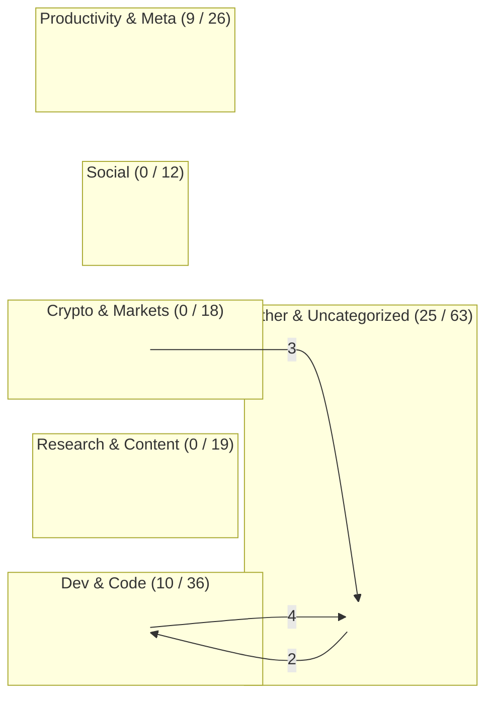
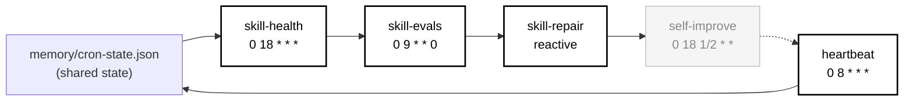
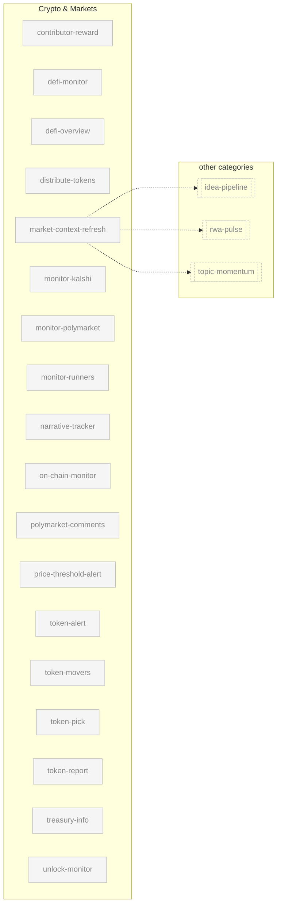

# Skill Dependency Graph

> Auto-generated by `skill-graph` on 2026-09-20. Mode: `SKILL_GRAPH_NEW`.

**Verdict:** SKILL_GRAPH_NEW — 174 skills mapped across 6 categories, 44 enabled

## Overview

Category boxes show **enabled / total** skill counts. Cross-category edges carry their count.

## Self-healing loop

Every skill writes `memory/cron-state.json`. The five nodes below read/act on it — the rest of the graph collapses that shared edge into this callout rather than drawing it 170× over.

## Per-category diagrams

### Research & Content

### Dev & Code

```mermaid
flowchart LR
    subgraph dev["Dev & Code"]
        auto-merge["auto-merge"]
        auto-workflow["auto-workflow"]
        autoresearch["autoresearch"]
        autoresearch-goal["autoresearch-goal"]
        changelog["changelog<br/>0 16 * * 1"]
        code-health["code-health<br/>0 16 * * *"]
        create-skill["create-skill"]
        deploy-prototype["deploy-prototype"]
        external-feature["external-feature"]
        fleet-control["fleet-control<br/>0 9 * * *"]
        fork-cohort["fork-cohort"]
        fork-first-run-alert["fork-first-run-alert"]
        fork-fleet["fork-fleet"]
        fork-skill-gap["fork-skill-gap"]
        github-issues["github-issues"]
        github-monitor["github-monitor<br/>0 9 * * *"]
        github-releases["github-releases"]
        github-trending["github-trending"]
        issue-triage["issue-triage<br/>0 9 * * *"]
        pr-review["pr-review<br/>0 9,18 * * *"]
        pr-triage["pr-triage<br/>30 9 * * *"]
        project-lens["project-lens"]
        push-recap["push-recap"]
        repo-actions["repo-actions"]
        repo-article["repo-article"]
        repo-pulse["repo-pulse"]
        repo-scanner["repo-scanner"]
        search-skill["search-skill"]
        skill-security-scan["skill-security-scan"]
        smithery-manifest["smithery-manifest"]
        spawn-instance["spawn-instance"]
        stale-content-pr-sweeper["stale-content-pr-sweeper<br/>45 23 * * *"]
        star-milestone["star-milestone"]
        vercel-projects["vercel-projects"]
        vuln-scanner["vuln-scanner<br/>0 16 * * 6"]
        workflow-security-audit["workflow-security-audit<br/>0 16 * * 0"]
    end
    subgraph dev_ext["other categories"]
        contributor-spotlight[["contributor-spotlight"]]:::external
        fleet-state[["fleet-state"]]:::external
        idea-pipeline[["idea-pipeline"]]:::external
        notegraph[["notegraph"]]:::external
        vuln-tracker[["vuln-tracker"]]:::external
    end
    external-feature --> repo-scanner
    vuln-scanner --> github-trending
    fork-cohort -..-> fork-first-run-alert
    fork-cohort -..-> fork-skill-gap
    repo-scanner -..-> external-feature
    repo-scanner -..-> repo-actions
    vercel-projects -..-> external-feature
    vercel-projects -..-> repo-actions
    vuln-tracker --> vuln-scanner
    deploy-prototype -..-> idea-pipeline
    fork-cohort -..-> contributor-spotlight
    fork-cohort -..-> fleet-state
    notegraph -..-> stale-content-pr-sweeper
    vercel-projects -..-> idea-pipeline
    class changelog,code-health,fleet-control,github-monitor,issue-triage,pr-review,pr-triage,stale-content-pr-sweeper,vuln-scanner,workflow-security-audit enabled
    class auto-merge,auto-workflow,autoresearch,autoresearch-goal,create-skill,deploy-prototype,external-feature,fork-cohort,fork-first-run-alert,fork-fleet,fork-skill-gap,github-issues,github-releases,github-trending,project-lens,push-recap,repo-actions,repo-article,repo-pulse,repo-scanner,search-skill,skill-security-scan,smithery-manifest,spawn-instance,star-milestone,vercel-projects disabled
    classDef enabled fill:#fff,stroke:#000,stroke-width:2px,color:#000;
    classDef disabled fill:#f5f5f5,stroke:#bbb,color:#888;
    classDef external fill:none,stroke:#bbb,stroke-dasharray:3 3,color:#888;
    click auto-merge "../skills/auto-merge/SKILL.md"
    click auto-workflow "../skills/auto-workflow/SKILL.md"
    click autoresearch "../skills/autoresearch/SKILL.md"
    click autoresearch-goal "../skills/autoresearch-goal/SKILL.md"
    click changelog "../skills/changelog/SKILL.md"
    click code-health "../skills/code-health/SKILL.md"
    click create-skill "../skills/create-skill/SKILL.md"
    click deploy-prototype "../skills/deploy-prototype/SKILL.md"
    click external-feature "../skills/external-feature/SKILL.md"
    click fleet-control "../skills/fleet-control/SKILL.md"
    click fork-cohort "../skills/fork-cohort/SKILL.md"
    click fork-first-run-alert "../skills/fork-first-run-alert/SKILL.md"
    click fork-fleet "../skills/fork-fleet/SKILL.md"
    click fork-skill-gap "../skills/fork-skill-gap/SKILL.md"
    click github-issues "../skills/github-issues/SKILL.md"
    click github-monitor "../skills/github-monitor/SKILL.md"
    click github-releases "../skills/github-releases/SKILL.md"
    click github-trending "../skills/github-trending/SKILL.md"
    click issue-triage "../skills/issue-triage/SKILL.md"
    click pr-review "../skills/pr-review/SKILL.md"
    click pr-triage "../skills/pr-triage/SKILL.md"
    click project-lens "../skills/project-lens/SKILL.md"
    click push-recap "../skills/push-recap/SKILL.md"
    click repo-actions "../skills/repo-actions/SKILL.md"
    click repo-article "../skills/repo-article/SKILL.md"
    click repo-pulse "../skills/repo-pulse/SKILL.md"
    click repo-scanner "../skills/repo-scanner/SKILL.md"
    click search-skill "../skills/search-skill/SKILL.md"
    click skill-security-scan "../skills/skill-security-scan/SKILL.md"
    click smithery-manifest "../skills/smithery-manifest/SKILL.md"
    click spawn-instance "../skills/spawn-instance/SKILL.md"
    click stale-content-pr-sweeper "../skills/stale-content-pr-sweeper/SKILL.md"
    click star-milestone "../skills/star-milestone/SKILL.md"
    click vercel-projects "../skills/vercel-projects/SKILL.md"
    click vuln-scanner "../skills/vuln-scanner/SKILL.md"
    click workflow-security-audit "../skills/workflow-security-audit/SKILL.md"
```

### Crypto & Markets

### Social

```mermaid
flowchart LR
    subgraph social["Social"]
        agent-buzz["agent-buzz"]
        create-campaign["create-campaign"]
        farcaster-digest["farcaster-digest"]
        product-hunt-launch["product-hunt-launch"]
        refresh-x["refresh-x"]
        remix-tweets["remix-tweets"]
        reply-maker["reply-maker"]
        schedule-ads["schedule-ads"]
        show-hn-draft["show-hn-draft"]
        syndicate-article["syndicate-article"]
        tweet-roundup["tweet-roundup"]
        write-tweet["write-tweet"]
    end
    class agent-buzz,create-campaign,farcaster-digest,product-hunt-launch,refresh-x,remix-tweets,reply-maker,schedule-ads,show-hn-draft,syndicate-article,tweet-roundup,write-tweet disabled
    classDef enabled fill:#fff,stroke:#000,stroke-width:2px,color:#000;
    classDef disabled fill:#f5f5f5,stroke:#bbb,color:#888;
    classDef external fill:none,stroke:#bbb,stroke-dasharray:3 3,color:#888;
    click agent-buzz "../skills/agent-buzz/SKILL.md"
    click create-campaign "../skills/create-campaign/SKILL.md"
    click farcaster-digest "../skills/farcaster-digest/SKILL.md"
    click product-hunt-launch "../skills/product-hunt-launch/SKILL.md"
    click refresh-x "../skills/refresh-x/SKILL.md"
    click remix-tweets "../skills/remix-tweets/SKILL.md"
    click reply-maker "../skills/reply-maker/SKILL.md"
    click schedule-ads "../skills/schedule-ads/SKILL.md"
    click show-hn-draft "../skills/show-hn-draft/SKILL.md"
    click syndicate-article "../skills/syndicate-article/SKILL.md"
    click tweet-roundup "../skills/tweet-roundup/SKILL.md"
    click write-tweet "../skills/write-tweet/SKILL.md"
```

### Productivity & Meta

```mermaid
flowchart LR
    subgraph productivity["Productivity & Meta"]
        action-converter["action-converter"]
        cost-report["cost-report<br/>0 7 * * 1"]
        daily-routine["daily-routine"]
        deal-flow["deal-flow"]
        evening-recap["evening-recap"]
        goal-tracker["goal-tracker<br/>0 18 * * *"]
        heartbeat["heartbeat<br/>0 8 * * *"]
        idea-capture["idea-capture"]
        morning-brief["morning-brief"]
        onboard["onboard"]
        operator-scorecard["operator-scorecard"]
        reflect["reflect<br/>0 18 * * *"]
        reg-monitor["reg-monitor"]
        rss-feed["rss-feed"]
        self-improve["self-improve"]
        skill-evals["skill-evals<br/>0 9 * * 0"]
        skill-health["skill-health<br/>0 18 * * *"]
        skill-leaderboard["skill-leaderboard"]
        skill-repair["skill-repair<br/>reactive"]
        skill-update-check["skill-update-check<br/>0 19 * * 0"]
        startup-idea["startup-idea"]
        tool-builder["tool-builder"]
        update-gallery["update-gallery"]
        v4-readiness["v4-readiness"]
        weekly-review["weekly-review"]
        weekly-shiplog["weekly-shiplog<br/>0 9 * * 1"]
    end
    skill-repair --> skill-health
    tool-builder --> action-converter
    class cost-report,goal-tracker,heartbeat,reflect,skill-evals,skill-health,skill-repair,skill-update-check,weekly-shiplog enabled
    class action-converter,daily-routine,deal-flow,evening-recap,idea-capture,morning-brief,onboard,operator-scorecard,reg-monitor,rss-feed,self-improve,skill-leaderboard,startup-idea,tool-builder,update-gallery,v4-readiness,weekly-review disabled
    classDef enabled fill:#fff,stroke:#000,stroke-width:2px,color:#000;
    classDef disabled fill:#f5f5f5,stroke:#bbb,color:#888;
    classDef external fill:none,stroke:#bbb,stroke-dasharray:3 3,color:#888;
    click action-converter "../skills/action-converter/SKILL.md"
    click cost-report "../skills/cost-report/SKILL.md"
    click daily-routine "../skills/daily-routine/SKILL.md"
    click deal-flow "../skills/deal-flow/SKILL.md"
    click evening-recap "../skills/evening-recap/SKILL.md"
    click goal-tracker "../skills/goal-tracker/SKILL.md"
    click heartbeat "../skills/heartbeat/SKILL.md"
    click idea-capture "../skills/idea-capture/SKILL.md"
    click morning-brief "../skills/morning-brief/SKILL.md"
    click onboard "../skills/onboard/SKILL.md"
    click operator-scorecard "../skills/operator-scorecard/SKILL.md"
    click reflect "../skills/reflect/SKILL.md"
    click reg-monitor "../skills/reg-monitor/SKILL.md"
    click rss-feed "../skills/rss-feed/SKILL.md"
    click self-improve "../skills/self-improve/SKILL.md"
    click skill-evals "../skills/skill-evals/SKILL.md"
    click skill-health "../skills/skill-health/SKILL.md"
    click skill-leaderboard "../skills/skill-leaderboard/SKILL.md"
    click skill-repair "../skills/skill-repair/SKILL.md"
    click skill-update-check "../skills/skill-update-check/SKILL.md"
    click startup-idea "../skills/startup-idea/SKILL.md"
    click tool-builder "../skills/tool-builder/SKILL.md"
    click update-gallery "../skills/update-gallery/SKILL.md"
    click v4-readiness "../skills/v4-readiness/SKILL.md"
    click weekly-review "../skills/weekly-review/SKILL.md"
    click weekly-shiplog "../skills/weekly-shiplog/SKILL.md"
```

### Other & Uncategorized

```mermaid
flowchart LR
    subgraph other["Other & Uncategorized"]
        agent-displacement["agent-displacement"]
        agi-tracker["agi-tracker<br/>0 13 * * 1"]
        ai-framework-watch["ai-framework-watch<br/>30 8 * * 1"]
        aixbt-pulse["aixbt-pulse"]
        batch-health["batch-health<br/>0 8 * * *"]
        builder-map["builder-map"]
        compute-futures-eda["compute-futures-eda<br/>0 6 * * *"]
        compute-macro-correlate["compute-macro-correlate<br/>30 6 * * 0"]
        compute-pulse["compute-pulse<br/>0 11 * * 6"]
        config-validator["config-validator<br/>0 7 * * 0"]
        content-engine["content-engine"]
        contributor-spotlight["contributor-spotlight"]
        disclosure-tracker["disclosure-tracker"]
        ecosystem-pulse["ecosystem-pulse"]
        engagement-act["engagement-act"]
        feature["feature"]
        fleet-runner["fleet-runner"]
        fleet-state["fleet-state"]
        fork-contributor-leaderboard["fork-contributor-leaderboard"]
        fork-release-tracker["fork-release-tracker"]
        fork-skill-digest["fork-skill-digest"]
        frontier-eval["frontier-eval"]
        gitlawb-fleet["gitlawb-fleet"]
        gitlawb-fleet-metrics["gitlawb-fleet-metrics<br/>0 8 * * *"]
        idea-pipeline["idea-pipeline"]
        idea-validator["idea-validator"]
        janitor["janitor<br/>30 5 * * 0"]
        launch-radar["launch-radar"]
        memory-flush["memory-flush<br/>0 6 2/2 * *"]
        memory-structural-dedupe["memory-structural-dedupe<br/>10 6 2/2 * *"]
        milestone-tracker["milestone-tracker<br/>0 12 * * 1"]
        note-taking["note-taking"]
        notegraph["notegraph<br/>0 5 * * *"]
        planner["planner<br/>30 6 * * *"]
        pm-intel["pm-intel"]
        pm-manipulation["pm-manipulation"]
        pm-pulse["pm-pulse"]
        polymarket["polymarket"]
        pr-tracker["pr-tracker<br/>0 10 * * *"]
        programmatic-eda["programmatic-eda"]
        pvr-triage-monitor["pvr-triage-monitor"]
        pvr-watchlist["pvr-watchlist"]
        repo-revive["repo-revive<br/>0 10 * * 6"]
        run-frequency-guard["run-frequency-guard<br/>0 23 * * *"]
        runpod-spot-pricing["runpod-spot-pricing"]
        rwa-pulse["rwa-pulse"]
        self-review["self-review<br/>30 18 * * 0"]
        signal-verdict["signal-verdict"]
        skill-analytics["skill-analytics<br/>30 18 * * 3"]
        skill-enabler["skill-enabler"]
        skill-freshness["skill-freshness<br/>0 8 * * *"]
        skill-graph["skill-graph<br/>0 17 * * 0"]
        skillpacks["skillpacks<br/>0 6 * * 0"]
        star-momentum-alert["star-momentum-alert"]
        suggest-edges["suggest-edges<br/>30 5 * * *"]
        surplus-pulse["surplus-pulse<br/>30 16 * * *"]
        swarm-safety-eval["swarm-safety-eval<br/>30 7 * * 0"]
        thread-formatter["thread-formatter"]
        topic-momentum["topic-momentum"]
        tweet-digest["tweet-digest"]
        vuln-tracker["vuln-tracker"]
        wallet-digest["wallet-digest"]
        x402-monitor["x402-monitor"]
    end
    subgraph other_ext["other categories"]
        deploy-prototype[["deploy-prototype"]]:::external
        fork-cohort[["fork-cohort"]]:::external
        market-context-refresh[["market-context-refresh"]]:::external
        stale-content-pr-sweeper[["stale-content-pr-sweeper"]]:::external
        vercel-projects[["vercel-projects"]]:::external
        vuln-scanner[["vuln-scanner"]]:::external
    end
    builder-map -..-> idea-pipeline
    compute-pulse -..-> runpod-spot-pricing
    contributor-spotlight -..-> fleet-state
    idea-validator -..-> idea-pipeline
    idea-validator -..-> launch-radar
    pm-intel -..-> pm-manipulation
    pm-pulse -..-> pm-manipulation
    pr-tracker -..-> disclosure-tracker
    vuln-tracker --> vuln-scanner
    deploy-prototype -..-> idea-pipeline
    fork-cohort -..-> contributor-spotlight
    fork-cohort -..-> fleet-state
    market-context-refresh -..-> idea-pipeline
    market-context-refresh -..-> rwa-pulse
    market-context-refresh -..-> topic-momentum
    notegraph -..-> stale-content-pr-sweeper
    vercel-projects -..-> idea-pipeline
    class agi-tracker,ai-framework-watch,batch-health,compute-futures-eda,compute-macro-correlate,compute-pulse,config-validator,gitlawb-fleet-metrics,janitor,memory-flush,memory-structural-dedupe,milestone-tracker,notegraph,planner,pr-tracker,repo-revive,run-frequency-guard,self-review,skill-analytics,skill-freshness,skill-graph,skillpacks,suggest-edges,surplus-pulse,swarm-safety-eval enabled
    class agent-displacement,aixbt-pulse,builder-map,content-engine,contributor-spotlight,disclosure-tracker,ecosystem-pulse,engagement-act,feature,fleet-runner,fleet-state,fork-contributor-leaderboard,fork-release-tracker,fork-skill-digest,frontier-eval,gitlawb-fleet,idea-pipeline,idea-validator,launch-radar,note-taking,pm-intel,pm-manipulation,pm-pulse,polymarket,programmatic-eda,pvr-triage-monitor,pvr-watchlist,runpod-spot-pricing,rwa-pulse,signal-verdict,skill-enabler,star-momentum-alert,thread-formatter,topic-momentum,tweet-digest,vuln-tracker,wallet-digest,x402-monitor disabled
    classDef enabled fill:#fff,stroke:#000,stroke-width:2px,color:#000;
    classDef disabled fill:#f5f5f5,stroke:#bbb,color:#888;
    classDef external fill:none,stroke:#bbb,stroke-dasharray:3 3,color:#888;
    click agent-displacement "../skills/agent-displacement/SKILL.md"
        click ai-framework-watch "../skills/ai-framework-watch/SKILL.md"
    click aixbt-pulse "../skills/aixbt-pulse/SKILL.md"
    click batch-health "../skills/batch-health/SKILL.md"
    click builder-map "../skills/builder-map/SKILL.md"
    click compute-futures-eda "../skills/compute-futures-eda/SKILL.md"
    click compute-macro-correlate "../skills/compute-macro-correlate/SKILL.md"
    click compute-pulse "../skills/compute-pulse/SKILL.md"
    click config-validator "../skills/config-validator/SKILL.md"
    click content-engine "../skills/content-engine/SKILL.md"
    click contributor-spotlight "../skills/contributor-spotlight/SKILL.md"
    click disclosure-tracker "../skills/disclosure-tracker/SKILL.md"
    click ecosystem-pulse "../skills/ecosystem-pulse/SKILL.md"
    click engagement-act "../skills/engagement-act/SKILL.md"
    click feature "../skills/feature/SKILL.md"
        click fleet-state "../skills/fleet-state/SKILL.md"
    click fork-contributor-leaderboard "../skills/fork-contributor-leaderboard/SKILL.md"
    click fork-release-tracker "../skills/fork-release-tracker/SKILL.md"
    click fork-skill-digest "../skills/fork-skill-digest/SKILL.md"
    click frontier-eval "../skills/frontier-eval/SKILL.md"
    click gitlawb-fleet "../skills/gitlawb-fleet/SKILL.md"
    click gitlawb-fleet-metrics "../skills/gitlawb-fleet-metrics/SKILL.md"
    click idea-pipeline "../skills/idea-pipeline/SKILL.md"
    click idea-validator "../skills/idea-validator/SKILL.md"
    click janitor "../skills/janitor/SKILL.md"
    click launch-radar "../skills/launch-radar/SKILL.md"
    click memory-flush "../skills/memory-flush/SKILL.md"
    click memory-structural-dedupe "../skills/memory-structural-dedupe/SKILL.md"
    click milestone-tracker "../skills/milestone-tracker/SKILL.md"
    click note-taking "../skills/note-taking/SKILL.md"
    click notegraph "../skills/notegraph/SKILL.md"
    click planner "../skills/planner/SKILL.md"
    click pm-intel "../skills/pm-intel/SKILL.md"
    click pm-manipulation "../skills/pm-manipulation/SKILL.md"
    click pm-pulse "../skills/pm-pulse/SKILL.md"
    click polymarket "../skills/polymarket/SKILL.md"
    click pr-tracker "../skills/pr-tracker/SKILL.md"
    click programmatic-eda "../skills/programmatic-eda/SKILL.md"
    click pvr-triage-monitor "../skills/pvr-triage-monitor/SKILL.md"
    click pvr-watchlist "../skills/pvr-watchlist/SKILL.md"
    click repo-revive "../skills/repo-revive/SKILL.md"
    click run-frequency-guard "../skills/run-frequency-guard/SKILL.md"
    click runpod-spot-pricing "../skills/runpod-spot-pricing/SKILL.md"
    click rwa-pulse "../skills/rwa-pulse/SKILL.md"
    click self-review "../skills/self-review/SKILL.md"
    click signal-verdict "../skills/signal-verdict/SKILL.md"
    click skill-analytics "../skills/skill-analytics/SKILL.md"
    click skill-enabler "../skills/skill-enabler/SKILL.md"
    click skill-freshness "../skills/skill-freshness/SKILL.md"
    click skill-graph "../skills/skill-graph/SKILL.md"
    click skillpacks "../skills/skillpacks/SKILL.md"
    click star-momentum-alert "../skills/star-momentum-alert/SKILL.md"
    click suggest-edges "../skills/suggest-edges/SKILL.md"
    click surplus-pulse "../skills/surplus-pulse/SKILL.md"
    click swarm-safety-eval "../skills/swarm-safety-eval/SKILL.md"
    click thread-formatter "../skills/thread-formatter/SKILL.md"
    click topic-momentum "../skills/topic-momentum/SKILL.md"
    click tweet-digest "../skills/tweet-digest/SKILL.md"
    click vuln-tracker "../skills/vuln-tracker/SKILL.md"
    click wallet-digest "../skills/wallet-digest/SKILL.md"
    click x402-monitor "../skills/x402-monitor/SKILL.md"
```

## Legend

- `A --> B` — explicit `depends_on` in frontmatter, or reactive `on: <skill>` trigger
- `A -.-> B` — chain `consume:` edge from aeon.yml
- `A -..-> B` — derived shared-state edge (A writes a memory/topics or memory/state file that B reads)
- **Bold border** — `enabled: true` in aeon.yml (cron label in node)
- Faded grey — `enabled: false` (present but not scheduled)
- Dashed ghost node — cross-category dependency shown in a category diagram
- Every node is a hyperlink to its `SKILL.md` (GitHub renders `click` directives as links)

## Summary

| Category | Enabled | Total |
|---|---:|---:|
| Research & Content | 0 | 19 |
| Dev & Code | 10 | 36 |
| Crypto & Markets | 0 | 18 |
| Social | 0 | 12 |
| Productivity & Meta | 9 | 26 |
| Other & Uncategorized | 25 | 63 |
| **All** | **44** | **174** |

| Edge type | Count |
|---|---:|
| `depends_on` | 5 |
| `consume` (chains) | 0 |
| reactive | 0 |
| shared-state (derived) | 22 |

---

_skills parsed: 174 · depends_on: 5 · consume: 0 · reactive: 0 · shared-state derived: 22 · enabled: 44/174 · mode: SKILL_GRAPH_NEW_
