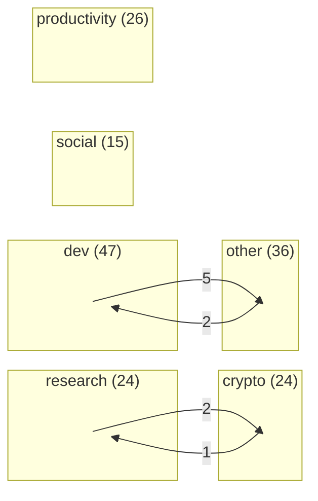
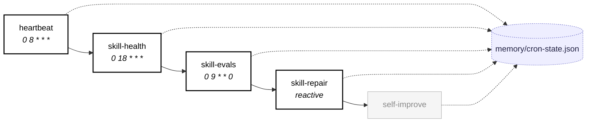

# Skill Dependency Graph

*Auto-generated by `skill-graph` on 2026-09-06 · mode: `SKILL_GRAPH_NEW`*

**Verdict:** ARCHITECTURE_INITIAL — 172 skills, 43 enabled, first mapping

## Overview

Cross-category dependency flow. Edge labels are counts of typed edges (depends_on + reactive + shared-state + content-pipeline).



## Self-healing loop

The reliability quintet. All five skills write to `memory/cron-state.json`; that shared state is drawn as a single node here, not as N edges across the per-category diagrams.



## Per-category diagrams

### research (24 skills)

```mermaid
flowchart LR
  agent-displacement[agent-displacement<br/><i>(unconfigured)</i>]
  ai-framework-watch[ai-framework-watch<br/><i>30 8 * * 1</i>]
  article[article]
  channel-recap[channel-recap]
  competitor-launch-radar[competitor-launch-radar]
  content-engine[content-engine]
  deep-research[deep-research]
  digest[digest]
  ecosystem-pulse[ecosystem-pulse]
  fetch-tweets[fetch-tweets]
  hacker-news-digest[hacker-news-digest]
  huggingface-trending[huggingface-trending]
  last30[last30]
  list-digest[list-digest]
  paper-digest[paper-digest]
  paper-pick[paper-pick]
  pm-intel[pm-intel<br/><i>(unconfigured)</i>]
  reddit-digest[reddit-digest]
  research-brief[research-brief]
  rss-digest[rss-digest]
  security-digest[security-digest]
  technical-explainer[technical-explainer]
  telegram-digest[telegram-digest]
  vibecoding-digest[vibecoding-digest]
  subgraph external["cross-category refs"]
    pm-manipulation["pm-manipulation<br/><i>crypto</i>"]:::external
    pm-pulse["pm-pulse<br/><i>crypto</i>"]:::external
  end
  pm-intel -..-> pm-manipulation
  pm-pulse -..-> pm-intel
  pm-intel -..-> pm-pulse
  class agent-displacement external
  class ai-framework-watch enabled
  class article disabled
  class channel-recap disabled
  class competitor-launch-radar disabled
  class content-engine disabled
  class deep-research disabled
  class digest disabled
  class ecosystem-pulse disabled
  class fetch-tweets disabled
  class hacker-news-digest disabled
  class huggingface-trending disabled
  class last30 disabled
  class list-digest disabled
  class paper-digest disabled
  class paper-pick disabled
  class pm-intel external
  class reddit-digest disabled
  class research-brief disabled
  class rss-digest disabled
  class security-digest disabled
  class technical-explainer disabled
  class telegram-digest disabled
  class vibecoding-digest disabled
  classDef enabled fill:#fff,stroke:#000,stroke-width:2px,color:#000
  classDef disabled fill:#f5f5f5,stroke:#bbb,color:#888
  classDef external fill:none,stroke:#bbb,stroke-dasharray:3 3,color:#888
  click agent-displacement "../skills/agent-displacement/SKILL.md"
  click ai-framework-watch "../skills/ai-framework-watch/SKILL.md"
  click article "../skills/article/SKILL.md"
  click channel-recap "../skills/channel-recap/SKILL.md"
  click competitor-launch-radar "../skills/competitor-launch-radar/SKILL.md"
  click content-engine "../skills/content-engine/SKILL.md"
  click deep-research "../skills/deep-research/SKILL.md"
  click digest "../skills/digest/SKILL.md"
  click ecosystem-pulse "../skills/ecosystem-pulse/SKILL.md"
  click fetch-tweets "../skills/fetch-tweets/SKILL.md"
  click hacker-news-digest "../skills/hacker-news-digest/SKILL.md"
  click huggingface-trending "../skills/huggingface-trending/SKILL.md"
  click last30 "../skills/last30/SKILL.md"
  click list-digest "../skills/list-digest/SKILL.md"
  click paper-digest "../skills/paper-digest/SKILL.md"
  click paper-pick "../skills/paper-pick/SKILL.md"
  click pm-intel "../skills/pm-intel/SKILL.md"
  click reddit-digest "../skills/reddit-digest/SKILL.md"
  click research-brief "../skills/research-brief/SKILL.md"
  click rss-digest "../skills/rss-digest/SKILL.md"
  click security-digest "../skills/security-digest/SKILL.md"
  click technical-explainer "../skills/technical-explainer/SKILL.md"
  click telegram-digest "../skills/telegram-digest/SKILL.md"
  click vibecoding-digest "../skills/vibecoding-digest/SKILL.md"
  click pm-manipulation "../skills/pm-manipulation/SKILL.md"
  click pm-pulse "../skills/pm-pulse/SKILL.md"
```

### dev (47 skills)

```mermaid
flowchart LR
  auto-merge[auto-merge]
  auto-workflow[auto-workflow]
  autoresearch[autoresearch]
  autoresearch-goal[autoresearch-goal<br/><i>(unconfigured)</i>]
  builder-map[builder-map<br/><i>(unconfigured)</i>]
  changelog[changelog<br/><i>0 16 * * 1</i>]
  code-health[code-health<br/><i>0 16 * * *</i>]
  config-validator[config-validator<br/><i>0 7 * * 0</i>]
  create-skill[create-skill]
  deploy-prototype[deploy-prototype]
  external-feature[external-feature]
  feature[feature<br/><i>(unconfigured)</i>]
  fleet-control[fleet-control<br/><i>0 9 * * *</i>]
  fork-cohort[fork-cohort]
  fork-first-run-alert[fork-first-run-alert]
  fork-fleet[fork-fleet]
  fork-skill-gap[fork-skill-gap]
  github-issues[github-issues]
  github-monitor[github-monitor<br/><i>0 9 * * *</i>]
  github-releases[github-releases]
  github-trending[github-trending]
  gitlawb-fleet[gitlawb-fleet]
  gitlawb-fleet-metrics[gitlawb-fleet-metrics<br/><i>0 8 * * *</i>]
  issue-triage[issue-triage<br/><i>0 9 * * *</i>]
  pr-review[pr-review<br/><i>0 9,18 * * *</i>]
  pr-triage[pr-triage<br/><i>30 9 * * *</i>]
  project-lens[project-lens]
  push-recap[push-recap]
  repo-actions[repo-actions]
  repo-article[repo-article]
  repo-pulse[repo-pulse]
  repo-revive[repo-revive<br/><i>0 10 * * 6</i>]
  repo-scanner[repo-scanner]
  search-skill[search-skill]
  skill-enabler[skill-enabler<br/><i>(unconfigured)</i>]
  skill-freshness[skill-freshness<br/><i>0 8 * * *</i>]
  skill-graph[skill-graph<br/><i>0 17 * * 0</i>]
  skill-security-scan[skill-security-scan]
  smithery-manifest[smithery-manifest]
  spawn-instance[spawn-instance]
  stale-content-pr-sweeper[stale-content-pr-sweeper<br/><i>45 23 * * *</i>]
  star-milestone[star-milestone]
  swarm-safety-eval[swarm-safety-eval<br/><i>30 7 * * 0</i>]
  vercel-projects[vercel-projects]
  vuln-scanner[vuln-scanner<br/><i>0 16 * * 6</i>]
  workflow-security-audit[workflow-security-audit<br/><i>0 16 * * 0</i>]
  x402-monitor[x402-monitor<br/><i>(unconfigured)</i>]
  subgraph external["cross-category refs"]
    contributor-spotlight["contributor-spotlight<br/><i>other</i>"]:::external
    fleet-state["fleet-state<br/><i>other</i>"]:::external
    idea-pipeline["idea-pipeline<br/><i>other</i>"]:::external
    notegraph["notegraph<br/><i>other</i>"]:::external
    vuln-tracker["vuln-tracker<br/><i>other</i>"]:::external
  end
  external-feature --> repo-scanner
  vuln-scanner --> github-trending
  repo-scanner -..->|"repos.md"| external-feature
  vercel-projects -..->|"repos.md"| repo-scanner
  repo-scanner -..->|"repos.md"| repo-actions
  repo-scanner -..->|"repos.md"| vercel-projects
  fork-cohort -..->|"fork-cohort-state.json"| fork-skill-gap
  vercel-projects -..->|"repos.md"| repo-actions
  vercel-projects -..->|"repos.md"| external-feature
  fork-cohort -..->|"fork-cohort-state.json"| fork-first-run-alert
  fork-cohort -..-> contributor-spotlight
  vuln-tracker --> vuln-scanner
  fork-cohort -..-> fleet-state
  notegraph -..-> stale-content-pr-sweeper
  builder-map -..-> idea-pipeline
  deploy-prototype -..-> idea-pipeline
  vercel-projects -..-> idea-pipeline
  class auto-merge disabled
  class auto-workflow disabled
  class autoresearch disabled
  class autoresearch-goal external
  class builder-map external
  class changelog enabled
  class code-health enabled
  class config-validator enabled
  class create-skill disabled
  class deploy-prototype disabled
  class external-feature disabled
  class feature external
  class fleet-control enabled
  class fork-cohort disabled
  class fork-first-run-alert disabled
  class fork-fleet disabled
  class fork-skill-gap disabled
  class github-issues disabled
  class github-monitor enabled
  class github-releases disabled
  class github-trending disabled
  class gitlawb-fleet disabled
  class gitlawb-fleet-metrics enabled
  class issue-triage enabled
  class pr-review enabled
  class pr-triage enabled
  class project-lens disabled
  class push-recap disabled
  class repo-actions disabled
  class repo-article disabled
  class repo-pulse disabled
  class repo-revive enabled
  class repo-scanner disabled
  class search-skill disabled
  class skill-enabler external
  class skill-freshness enabled
  class skill-graph enabled
  class skill-security-scan disabled
  class smithery-manifest disabled
  class spawn-instance disabled
  class stale-content-pr-sweeper enabled
  class star-milestone disabled
  class swarm-safety-eval enabled
  class vercel-projects disabled
  class vuln-scanner enabled
  class workflow-security-audit enabled
  class x402-monitor external
  classDef enabled fill:#fff,stroke:#000,stroke-width:2px,color:#000
  classDef disabled fill:#f5f5f5,stroke:#bbb,color:#888
  classDef external fill:none,stroke:#bbb,stroke-dasharray:3 3,color:#888
  click auto-merge "../skills/auto-merge/SKILL.md"
  click auto-workflow "../skills/auto-workflow/SKILL.md"
  click autoresearch "../skills/autoresearch/SKILL.md"
  click autoresearch-goal "../skills/autoresearch-goal/SKILL.md"
  click builder-map "../skills/builder-map/SKILL.md"
  click changelog "../skills/changelog/SKILL.md"
  click code-health "../skills/code-health/SKILL.md"
  click config-validator "../skills/config-validator/SKILL.md"
  click create-skill "../skills/create-skill/SKILL.md"
  click deploy-prototype "../skills/deploy-prototype/SKILL.md"
  click external-feature "../skills/external-feature/SKILL.md"
  click feature "../skills/feature/SKILL.md"
  click fleet-control "../skills/fleet-control/SKILL.md"
  click fork-cohort "../skills/fork-cohort/SKILL.md"
  click fork-first-run-alert "../skills/fork-first-run-alert/SKILL.md"
  click fork-fleet "../skills/fork-fleet/SKILL.md"
  click fork-skill-gap "../skills/fork-skill-gap/SKILL.md"
  click github-issues "../skills/github-issues/SKILL.md"
  click github-monitor "../skills/github-monitor/SKILL.md"
  click github-releases "../skills/github-releases/SKILL.md"
  click github-trending "../skills/github-trending/SKILL.md"
  click gitlawb-fleet "../skills/gitlawb-fleet/SKILL.md"
  click gitlawb-fleet-metrics "../skills/gitlawb-fleet-metrics/SKILL.md"
  click issue-triage "../skills/issue-triage/SKILL.md"
  click pr-review "../skills/pr-review/SKILL.md"
  click pr-triage "../skills/pr-triage/SKILL.md"
  click project-lens "../skills/project-lens/SKILL.md"
  click push-recap "../skills/push-recap/SKILL.md"
  click repo-actions "../skills/repo-actions/SKILL.md"
  click repo-article "../skills/repo-article/SKILL.md"
  click repo-pulse "../skills/repo-pulse/SKILL.md"
  click repo-revive "../skills/repo-revive/SKILL.md"
  click repo-scanner "../skills/repo-scanner/SKILL.md"
  click search-skill "../skills/search-skill/SKILL.md"
  click skill-enabler "../skills/skill-enabler/SKILL.md"
  click skill-freshness "../skills/skill-freshness/SKILL.md"
  click skill-graph "../skills/skill-graph/SKILL.md"
  click skill-security-scan "../skills/skill-security-scan/SKILL.md"
  click smithery-manifest "../skills/smithery-manifest/SKILL.md"
  click spawn-instance "../skills/spawn-instance/SKILL.md"
  click stale-content-pr-sweeper "../skills/stale-content-pr-sweeper/SKILL.md"
  click star-milestone "../skills/star-milestone/SKILL.md"
  click swarm-safety-eval "../skills/swarm-safety-eval/SKILL.md"
  click vercel-projects "../skills/vercel-projects/SKILL.md"
  click vuln-scanner "../skills/vuln-scanner/SKILL.md"
  click workflow-security-audit "../skills/workflow-security-audit/SKILL.md"
  click x402-monitor "../skills/x402-monitor/SKILL.md"
  click contributor-spotlight "../skills/contributor-spotlight/SKILL.md"
  click vuln-tracker "../skills/vuln-tracker/SKILL.md"
  click fleet-state "../skills/fleet-state/SKILL.md"
  click notegraph "../skills/notegraph/SKILL.md"
  click idea-pipeline "../skills/idea-pipeline/SKILL.md"
```

### crypto (24 skills)

```mermaid
flowchart LR
  aixbt-pulse[aixbt-pulse]
  contributor-reward[contributor-reward]
  defi-monitor[defi-monitor]
  defi-overview[defi-overview]
  distribute-tokens[distribute-tokens]
  market-context-refresh[market-context-refresh]
  monitor-kalshi[monitor-kalshi]
  monitor-polymarket[monitor-polymarket]
  monitor-runners[monitor-runners]
  narrative-tracker[narrative-tracker]
  on-chain-monitor[on-chain-monitor]
  pm-manipulation[pm-manipulation<br/><i>(unconfigured)</i>]
  pm-pulse[pm-pulse<br/><i>(unconfigured)</i>]
  polymarket[polymarket<br/><i>(unconfigured)</i>]
  polymarket-comments[polymarket-comments]
  price-threshold-alert[price-threshold-alert]
  rwa-pulse[rwa-pulse<br/><i>(unconfigured)</i>]
  token-alert[token-alert]
  token-movers[token-movers]
  token-pick[token-pick]
  token-report[token-report]
  treasury-info[treasury-info]
  unlock-monitor[unlock-monitor]
  wallet-digest[wallet-digest<br/><i>(unconfigured)</i>]
  subgraph external["cross-category refs"]
    pm-intel["pm-intel<br/><i>research</i>"]:::external
  end
  pm-pulse -..->|"prediction-markets.md"| pm-manipulation
  pm-intel -..-> pm-pulse
  pm-intel -..-> pm-manipulation
  pm-pulse -..-> pm-intel
  class aixbt-pulse disabled
  class contributor-reward disabled
  class defi-monitor disabled
  class defi-overview disabled
  class distribute-tokens disabled
  class market-context-refresh disabled
  class monitor-kalshi disabled
  class monitor-polymarket disabled
  class monitor-runners disabled
  class narrative-tracker disabled
  class on-chain-monitor disabled
  class pm-manipulation external
  class pm-pulse external
  class polymarket external
  class polymarket-comments disabled
  class price-threshold-alert disabled
  class rwa-pulse external
  class token-alert disabled
  class token-movers disabled
  class token-pick disabled
  class token-report disabled
  class treasury-info disabled
  class unlock-monitor disabled
  class wallet-digest external
  classDef enabled fill:#fff,stroke:#000,stroke-width:2px,color:#000
  classDef disabled fill:#f5f5f5,stroke:#bbb,color:#888
  classDef external fill:none,stroke:#bbb,stroke-dasharray:3 3,color:#888
  click aixbt-pulse "../skills/aixbt-pulse/SKILL.md"
  click contributor-reward "../skills/contributor-reward/SKILL.md"
  click defi-monitor "../skills/defi-monitor/SKILL.md"
  click defi-overview "../skills/defi-overview/SKILL.md"
  click distribute-tokens "../skills/distribute-tokens/SKILL.md"
  click market-context-refresh "../skills/market-context-refresh/SKILL.md"
  click monitor-kalshi "../skills/monitor-kalshi/SKILL.md"
  click monitor-polymarket "../skills/monitor-polymarket/SKILL.md"
  click monitor-runners "../skills/monitor-runners/SKILL.md"
  click narrative-tracker "../skills/narrative-tracker/SKILL.md"
  click on-chain-monitor "../skills/on-chain-monitor/SKILL.md"
  click pm-manipulation "../skills/pm-manipulation/SKILL.md"
  click pm-pulse "../skills/pm-pulse/SKILL.md"
  click polymarket "../skills/polymarket/SKILL.md"
  click polymarket-comments "../skills/polymarket-comments/SKILL.md"
  click price-threshold-alert "../skills/price-threshold-alert/SKILL.md"
  click rwa-pulse "../skills/rwa-pulse/SKILL.md"
  click token-alert "../skills/token-alert/SKILL.md"
  click token-movers "../skills/token-movers/SKILL.md"
  click token-pick "../skills/token-pick/SKILL.md"
  click token-report "../skills/token-report/SKILL.md"
  click treasury-info "../skills/treasury-info/SKILL.md"
  click unlock-monitor "../skills/unlock-monitor/SKILL.md"
  click wallet-digest "../skills/wallet-digest/SKILL.md"
  click pm-intel "../skills/pm-intel/SKILL.md"
```

### social (15 skills)

```mermaid
flowchart LR
  agent-buzz[agent-buzz]
  create-campaign[create-campaign]
  engagement-act[engagement-act<br/><i>(unconfigured)</i>]
  farcaster-digest[farcaster-digest]
  product-hunt-launch[product-hunt-launch]
  refresh-x[refresh-x]
  remix-tweets[remix-tweets]
  reply-maker[reply-maker]
  schedule-ads[schedule-ads]
  show-hn-draft[show-hn-draft]
  syndicate-article[syndicate-article]
  thread-formatter[thread-formatter]
  tweet-digest[tweet-digest<br/><i>(unconfigured)</i>]
  tweet-roundup[tweet-roundup]
  write-tweet[write-tweet]
  class agent-buzz disabled
  class create-campaign disabled
  class engagement-act external
  class farcaster-digest disabled
  class product-hunt-launch disabled
  class refresh-x disabled
  class remix-tweets disabled
  class reply-maker disabled
  class schedule-ads disabled
  class show-hn-draft disabled
  class syndicate-article disabled
  class thread-formatter disabled
  class tweet-digest external
  class tweet-roundup disabled
  class write-tweet disabled
  classDef enabled fill:#fff,stroke:#000,stroke-width:2px,color:#000
  classDef disabled fill:#f5f5f5,stroke:#bbb,color:#888
  classDef external fill:none,stroke:#bbb,stroke-dasharray:3 3,color:#888
  click agent-buzz "../skills/agent-buzz/SKILL.md"
  click create-campaign "../skills/create-campaign/SKILL.md"
  click engagement-act "../skills/engagement-act/SKILL.md"
  click farcaster-digest "../skills/farcaster-digest/SKILL.md"
  click product-hunt-launch "../skills/product-hunt-launch/SKILL.md"
  click refresh-x "../skills/refresh-x/SKILL.md"
  click remix-tweets "../skills/remix-tweets/SKILL.md"
  click reply-maker "../skills/reply-maker/SKILL.md"
  click schedule-ads "../skills/schedule-ads/SKILL.md"
  click show-hn-draft "../skills/show-hn-draft/SKILL.md"
  click syndicate-article "../skills/syndicate-article/SKILL.md"
  click thread-formatter "../skills/thread-formatter/SKILL.md"
  click tweet-digest "../skills/tweet-digest/SKILL.md"
  click tweet-roundup "../skills/tweet-roundup/SKILL.md"
  click write-tweet "../skills/write-tweet/SKILL.md"
```

### productivity (26 skills)

```mermaid
flowchart LR
  action-converter[action-converter]
  cost-report[cost-report<br/><i>0 7 * * 1</i>]
  daily-routine[daily-routine]
  deal-flow[deal-flow]
  evening-recap[evening-recap]
  goal-tracker[goal-tracker<br/><i>0 18 * * *</i>]
  heartbeat[heartbeat<br/><i>0 8 * * *</i>]
  idea-capture[idea-capture]
  morning-brief[morning-brief]
  onboard[onboard]
  operator-scorecard[operator-scorecard]
  reflect[reflect<br/><i>0 18 * * *</i>]
  reg-monitor[reg-monitor]
  rss-feed[rss-feed]
  self-improve[self-improve]
  skill-evals[skill-evals<br/><i>0 9 * * 0</i>]
  skill-health[skill-health<br/><i>0 18 * * *</i>]
  skill-leaderboard[skill-leaderboard]
  skill-repair[skill-repair<br/><i>reactive</i>]
  skill-update-check[skill-update-check<br/><i>0 19 * * 0</i>]
  startup-idea[startup-idea]
  tool-builder[tool-builder]
  update-gallery[update-gallery]
  v4-readiness[v4-readiness]
  weekly-review[weekly-review]
  weekly-shiplog[weekly-shiplog<br/><i>0 9 * * 1</i>]
  skill-repair --> skill-health
  tool-builder --> action-converter
  class action-converter disabled
  class cost-report enabled
  class daily-routine disabled
  class deal-flow disabled
  class evening-recap disabled
  class goal-tracker enabled
  class heartbeat enabled
  class idea-capture disabled
  class morning-brief disabled
  class onboard disabled
  class operator-scorecard disabled
  class reflect enabled
  class reg-monitor disabled
  class rss-feed disabled
  class self-improve disabled
  class skill-evals enabled
  class skill-health enabled
  class skill-leaderboard disabled
  class skill-repair enabled
  class skill-update-check enabled
  class startup-idea disabled
  class tool-builder disabled
  class update-gallery disabled
  class v4-readiness disabled
  class weekly-review disabled
  class weekly-shiplog enabled
  classDef enabled fill:#fff,stroke:#000,stroke-width:2px,color:#000
  classDef disabled fill:#f5f5f5,stroke:#bbb,color:#888
  classDef external fill:none,stroke:#bbb,stroke-dasharray:3 3,color:#888
  click action-converter "../skills/action-converter/SKILL.md"
  click cost-report "../skills/cost-report/SKILL.md"
  click daily-routine "../skills/daily-routine/SKILL.md"
  click deal-flow "../skills/deal-flow/SKILL.md"
  click evening-recap "../skills/evening-recap/SKILL.md"
  click goal-tracker "../skills/goal-tracker/SKILL.md"
  click heartbeat "../skills/heartbeat/SKILL.md"
  click idea-capture "../skills/idea-capture/SKILL.md"
  click morning-brief "../skills/morning-brief/SKILL.md"
  click onboard "../skills/onboard/SKILL.md"
  click operator-scorecard "../skills/operator-scorecard/SKILL.md"
  click reflect "../skills/reflect/SKILL.md"
  click reg-monitor "../skills/reg-monitor/SKILL.md"
  click rss-feed "../skills/rss-feed/SKILL.md"
  click self-improve "../skills/self-improve/SKILL.md"
  click skill-evals "../skills/skill-evals/SKILL.md"
  click skill-health "../skills/skill-health/SKILL.md"
  click skill-leaderboard "../skills/skill-leaderboard/SKILL.md"
  click skill-repair "../skills/skill-repair/SKILL.md"
  click skill-update-check "../skills/skill-update-check/SKILL.md"
  click startup-idea "../skills/startup-idea/SKILL.md"
  click tool-builder "../skills/tool-builder/SKILL.md"
  click update-gallery "../skills/update-gallery/SKILL.md"
  click v4-readiness "../skills/v4-readiness/SKILL.md"
  click weekly-review "../skills/weekly-review/SKILL.md"
  click weekly-shiplog "../skills/weekly-shiplog/SKILL.md"
```



### other (36 skills)

```mermaid
flowchart LR
  batch-health[batch-health<br/><i>0 8 * * *</i>]
  compute-futures-eda[compute-futures-eda<br/><i>0 6 * * *</i>]
  compute-macro-correlate[compute-macro-correlate<br/><i>30 6 * * 0</i>]
  compute-pulse[compute-pulse<br/><i>0 11 * * 6</i>]
  contributor-spotlight[contributor-spotlight]
  disclosure-tracker[disclosure-tracker]
  fleet-state[fleet-state]
  fork-contributor-leaderboard[fork-contributor-leaderboard]
  fork-release-tracker[fork-release-tracker]
  fork-skill-digest[fork-skill-digest]
  frontier-eval[frontier-eval<br/><i>(unconfigured)</i>]
  idea-pipeline[idea-pipeline<br/><i>(unconfigured)</i>]
  idea-validator[idea-validator<br/><i>(unconfigured)</i>]
  janitor[janitor<br/><i>30 5 * * 0</i>]
  launch-radar[launch-radar<br/><i>(unconfigured)</i>]
  memory-flush[memory-flush<br/><i>0 6 2/2 * *</i>]
  memory-structural-dedupe[memory-structural-dedupe<br/><i>10 6 2/2 * *</i>]
  milestone-tracker[milestone-tracker<br/><i>0 12 * * 1</i>]
  note-taking[note-taking<br/><i>(unconfigured)</i>]
  notegraph[notegraph<br/><i>0 5 * * *</i>]
  planner[planner<br/><i>30 6 * * *</i>]
  pr-tracker[pr-tracker<br/><i>0 10 * * *</i>]
  programmatic-eda[programmatic-eda<br/><i>(unconfigured)</i>]
  pvr-triage-monitor[pvr-triage-monitor]
  pvr-watchlist[pvr-watchlist]
  run-frequency-guard[run-frequency-guard<br/><i>0 23 * * *</i>]
  runpod-spot-pricing[runpod-spot-pricing]
  self-review[self-review<br/><i>30 18 * * 0</i>]
  signal-verdict[signal-verdict<br/><i>(unconfigured)</i>]
  skill-analytics[skill-analytics<br/><i>30 18 * * 3</i>]
  skillpacks[skillpacks<br/><i>0 6 * * 0</i>]
  star-momentum-alert[star-momentum-alert]
  suggest-edges[suggest-edges<br/><i>30 5 * * *</i>]
  surplus-pulse[surplus-pulse<br/><i>30 16 * * *</i>]
  topic-momentum[topic-momentum]
  vuln-tracker[vuln-tracker]
  subgraph external["cross-category refs"]
    builder-map["builder-map<br/><i>dev</i>"]:::external
    deploy-prototype["deploy-prototype<br/><i>dev</i>"]:::external
    fork-cohort["fork-cohort<br/><i>dev</i>"]:::external
    stale-content-pr-sweeper["stale-content-pr-sweeper<br/><i>dev</i>"]:::external
    vercel-projects["vercel-projects<br/><i>dev</i>"]:::external
    vuln-scanner["vuln-scanner<br/><i>dev</i>"]:::external
  end
  contributor-spotlight -..->|"contributor-spotlight-history.json"| fleet-state
  fork-release-tracker -..->|"fork-release-state.json"| fleet-state
  compute-pulse -..->|"compute-pulse.md"| runpod-spot-pricing
  idea-validator -..->|"startup-ideas-screened.md"| idea-pipeline
  pr-tracker -..->|"pr-status.md"| disclosure-tracker
  idea-validator -..->|"startup-ideas-screened.md"| launch-radar
  vercel-projects -..-> idea-pipeline
  notegraph -..-> stale-content-pr-sweeper
  fork-cohort -..-> contributor-spotlight
  fork-cohort -..-> fleet-state
  vuln-tracker --> vuln-scanner
  builder-map -..-> idea-pipeline
  deploy-prototype -..-> idea-pipeline
  class batch-health enabled
  class compute-futures-eda enabled
  class compute-macro-correlate enabled
  class compute-pulse enabled
  class contributor-spotlight disabled
  class disclosure-tracker disabled
  class fleet-state disabled
  class fork-contributor-leaderboard disabled
  class fork-release-tracker disabled
  class fork-skill-digest disabled
  class frontier-eval external
  class idea-pipeline external
  class idea-validator external
  class janitor enabled
  class launch-radar external
  class memory-flush enabled
  class memory-structural-dedupe enabled
  class milestone-tracker enabled
  class note-taking external
  class notegraph enabled
  class planner enabled
  class pr-tracker enabled
  class programmatic-eda external
  class pvr-triage-monitor disabled
  class pvr-watchlist disabled
  class run-frequency-guard enabled
  class runpod-spot-pricing disabled
  class self-review enabled
  class signal-verdict external
  class skill-analytics enabled
  class skillpacks enabled
  class star-momentum-alert disabled
  class suggest-edges enabled
  class surplus-pulse enabled
  class topic-momentum disabled
  class vuln-tracker disabled
  classDef enabled fill:#fff,stroke:#000,stroke-width:2px,color:#000
  classDef disabled fill:#f5f5f5,stroke:#bbb,color:#888
  classDef external fill:none,stroke:#bbb,stroke-dasharray:3 3,color:#888
  click batch-health "../skills/batch-health/SKILL.md"
  click compute-futures-eda "../skills/compute-futures-eda/SKILL.md"
  click compute-macro-correlate "../skills/compute-macro-correlate/SKILL.md"
  click compute-pulse "../skills/compute-pulse/SKILL.md"
  click contributor-spotlight "../skills/contributor-spotlight/SKILL.md"
  click disclosure-tracker "../skills/disclosure-tracker/SKILL.md"
  click fleet-state "../skills/fleet-state/SKILL.md"
  click fork-contributor-leaderboard "../skills/fork-contributor-leaderboard/SKILL.md"
  click fork-release-tracker "../skills/fork-release-tracker/SKILL.md"
  click fork-skill-digest "../skills/fork-skill-digest/SKILL.md"
  click frontier-eval "../skills/frontier-eval/SKILL.md"
  click idea-pipeline "../skills/idea-pipeline/SKILL.md"
  click idea-validator "../skills/idea-validator/SKILL.md"
  click janitor "../skills/janitor/SKILL.md"
  click launch-radar "../skills/launch-radar/SKILL.md"
  click memory-flush "../skills/memory-flush/SKILL.md"
  click memory-structural-dedupe "../skills/memory-structural-dedupe/SKILL.md"
  click milestone-tracker "../skills/milestone-tracker/SKILL.md"
  click note-taking "../skills/note-taking/SKILL.md"
  click notegraph "../skills/notegraph/SKILL.md"
  click planner "../skills/planner/SKILL.md"
  click pr-tracker "../skills/pr-tracker/SKILL.md"
  click programmatic-eda "../skills/programmatic-eda/SKILL.md"
  click pvr-triage-monitor "../skills/pvr-triage-monitor/SKILL.md"
  click pvr-watchlist "../skills/pvr-watchlist/SKILL.md"
  click run-frequency-guard "../skills/run-frequency-guard/SKILL.md"
  click runpod-spot-pricing "../skills/runpod-spot-pricing/SKILL.md"
  click self-review "../skills/self-review/SKILL.md"
  click signal-verdict "../skills/signal-verdict/SKILL.md"
  click skill-analytics "../skills/skill-analytics/SKILL.md"
  click skillpacks "../skills/skillpacks/SKILL.md"
  click star-momentum-alert "../skills/star-momentum-alert/SKILL.md"
  click suggest-edges "../skills/suggest-edges/SKILL.md"
  click surplus-pulse "../skills/surplus-pulse/SKILL.md"
  click topic-momentum "../skills/topic-momentum/SKILL.md"
  click vuln-tracker "../skills/vuln-tracker/SKILL.md"
  click vercel-projects "../skills/vercel-projects/SKILL.md"
  click stale-content-pr-sweeper "../skills/stale-content-pr-sweeper/SKILL.md"
  click fork-cohort "../skills/fork-cohort/SKILL.md"
  click vuln-scanner "../skills/vuln-scanner/SKILL.md"
  click builder-map "../skills/builder-map/SKILL.md"
  click deploy-prototype "../skills/deploy-prototype/SKILL.md"
```

## Legend

- `-->` &nbsp; explicit `depends_on:` from SKILL.md frontmatter
- `-.->` &nbsp; chain `consume:` output injection *(not currently used — chains block commented out in aeon.yml)*
- `-..->` &nbsp; reactive trigger (`reactive:` in aeon.yml) OR derived shared-state (writer → reader on the same `memory/topics/*` file)
- **bold border** = `enabled: true` in `aeon.yml`; grey = disabled; dashed = present on disk but not wired into `aeon.yml`
- Every node is a hyperlink to its `SKILL.md` on github.com — click through for the actual instructions
- Every skill also writes `memory/cron-state.json`. To keep the graph readable, that fan-in is drawn once inside the self-healing loop rather than as ~170 edges into `heartbeat`/`skill-health`/`skill-repair`.

## Summary

| Category | Total | Enabled | Disabled | Unconfigured |
|---|---:|---:|---:|---:|
| research | 24 | 1 | 21 | 2 |
| dev | 47 | 16 | 26 | 5 |
| crypto | 24 | 0 | 19 | 5 |
| social | 15 | 0 | 13 | 2 |
| productivity | 26 | 9 | 17 | 0 |
| other | 36 | 17 | 12 | 7 |
| **all** | **172** | **43** | **108** | **21** |

### Edges by type

| Kind | Count |
|---|---:|
| depends_on | 5 |
| consume | 0 |
| reactive | 2 |
| shared-state (derived) | 24 |
| content-pipeline (derived) | 0 |

---

*skills parsed: 172 · depends_on: 5 · consume: 0 · reactive: 2 · shared-state derived: 24 · enabled: 43/172 · mode: SKILL_GRAPH_NEW*
