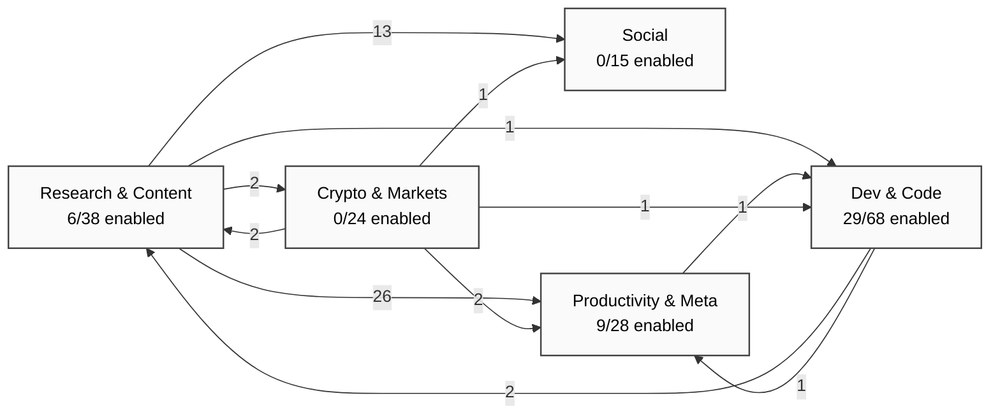
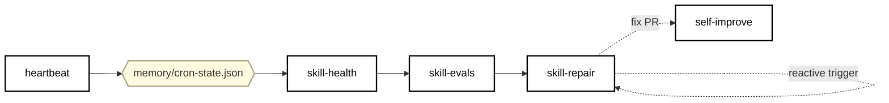
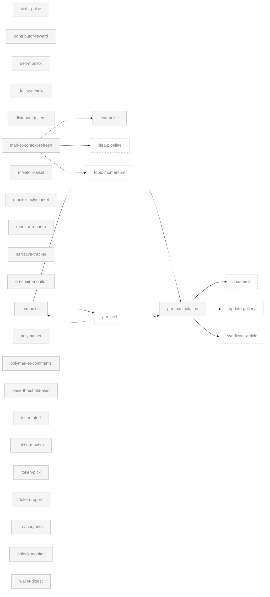

# Aeon Skill Dependency Graph

Auto-generated by `skill-graph` on 2026-06-28 · mode: `SKILL_GRAPH_NEW`

**Verdict:** INIT: 173 skills mapped across 5 categories (44 enabled)

## What changed since last run

_First run — no prior graph to diff against._

## Overview

## Self-healing loop

## Per-category detail

### Research & Content (38)

```mermaid
flowchart LR
  agent-displacement["agent-displacement"]
  agi-tracker["agi-tracker<br/><small>0 13 * * 1</small>"]
  ai-framework-watch["ai-framework-watch<br/><small>30 8 * * 1</small>"]
  article["article"]
  channel-recap["channel-recap"]
  competitor-launch-radar["competitor-launch-radar"]
  compute-futures-eda["compute-futures-eda<br/><small>0 6 * * *</small>"]
  compute-macro-correlate["compute-macro-correlate<br/><small>30 6 * * 0</small>"]
  compute-pulse["compute-pulse<br/><small>0 11 * * 6</small>"]
  content-engine["content-engine"]
  deep-research["deep-research"]
  digest["digest"]
  disclosure-tracker["disclosure-tracker"]
  ecosystem-pulse["ecosystem-pulse"]
  fetch-tweets["fetch-tweets"]
  frontier-eval["frontier-eval"]
  hacker-news-digest["hacker-news-digest"]
  huggingface-trending["huggingface-trending"]
  last30["last30"]
  launch-radar["launch-radar"]
  list-digest["list-digest"]
  paper-digest["paper-digest"]
  paper-pick["paper-pick"]
  pm-intel["pm-intel"]
  pvr-triage-monitor["pvr-triage-monitor"]
  pvr-watchlist["pvr-watchlist"]
  reddit-digest["reddit-digest"]
  research-brief["research-brief"]
  rss-digest["rss-digest"]
  runpod-spot-pricing["runpod-spot-pricing"]
  security-digest["security-digest"]
  signal-verdict["signal-verdict"]
  surplus-pulse["surplus-pulse<br/><small>30 16 * * *</small>"]
  technical-explainer["technical-explainer"]
  telegram-digest["telegram-digest"]
  topic-momentum["topic-momentum"]
  vibecoding-digest["vibecoding-digest"]
  vuln-tracker["vuln-tracker"]
  compute-pulse -..-> runpod-spot-pricing
  ext_idea_validator["idea-validator"]:::external
  ext_market_context_refresh["market-context-refresh"]:::external
  ext_pm_manipulation["pm-manipulation"]:::external
  ext_pm_pulse["pm-pulse"]:::external
  ext_pr_tracker["pr-tracker"]:::external
  ext_rss_feed["rss-feed"]:::external
  ext_syndicate_article["syndicate-article"]:::external
  ext_update_gallery["update-gallery"]:::external
  ext_vuln_scanner["vuln-scanner"]:::external
  vuln-tracker --> ext_vuln_scanner
  ext_pr_tracker -..-> disclosure-tracker
  pm-intel -..-> ext_pm_pulse
  ext_idea_validator -..-> launch-radar
  ext_market_context_refresh -..-> topic-momentum
  pm-intel -..-> ext_pm_manipulation
  ext_pm_pulse -..-> pm-intel
  competitor-launch-radar --> ext_rss_feed
  channel-recap --> ext_syndicate_article
  article --> ext_rss_feed
  last30 --> ext_syndicate_article
  ecosystem-pulse --> ext_rss_feed
  paper-digest --> ext_update_gallery
  ai-framework-watch --> ext_rss_feed
  paper-digest --> ext_syndicate_article
  content-engine --> ext_rss_feed
  signal-verdict --> ext_rss_feed
  competitor-launch-radar --> ext_update_gallery
  deep-research --> ext_rss_feed
  article --> ext_update_gallery
  technical-explainer --> ext_rss_feed
  competitor-launch-radar --> ext_syndicate_article
  research-brief --> ext_rss_feed
  article --> ext_syndicate_article
  ecosystem-pulse --> ext_update_gallery
  launch-radar --> ext_rss_feed
  ai-framework-watch --> ext_update_gallery
  content-engine --> ext_update_gallery
  ecosystem-pulse --> ext_syndicate_article
  signal-verdict --> ext_update_gallery
  ai-framework-watch --> ext_syndicate_article
  deep-research --> ext_update_gallery
  content-engine --> ext_syndicate_article
  signal-verdict --> ext_syndicate_article
  technical-explainer --> ext_update_gallery
  channel-recap --> ext_rss_feed
  deep-research --> ext_syndicate_article
  research-brief --> ext_update_gallery
  last30 --> ext_rss_feed
  launch-radar --> ext_update_gallery
  technical-explainer --> ext_syndicate_article
  research-brief --> ext_syndicate_article
  launch-radar --> ext_syndicate_article
  paper-digest --> ext_rss_feed
  channel-recap --> ext_update_gallery
  last30 --> ext_update_gallery
  classDef enabled fill:#fff,stroke:#000,stroke-width:2px,color:#000
  classDef disabled fill:#f5f5f5,stroke:#bbb,color:#888
  classDef external fill:none,stroke:#bbb,stroke-dasharray:3 3,color:#888
  class agi-tracker,ai-framework-watch,compute-futures-eda,compute-macro-correlate,compute-pulse,surplus-pulse enabled
  class agent-displacement,article,channel-recap,competitor-launch-radar,content-engine,deep-research,digest,disclosure-tracker,ecosystem-pulse,fetch-tweets,frontier-eval,hacker-news-digest,huggingface-trending,last30,launch-radar,list-digest,paper-digest,paper-pick,pm-intel,pvr-triage-monitor,pvr-watchlist,reddit-digest,research-brief,rss-digest,runpod-spot-pricing,security-digest,signal-verdict,technical-explainer,telegram-digest,topic-momentum,vibecoding-digest,vuln-tracker disabled
  click agent-displacement "../skills/agent-displacement/SKILL.md"
  click agi-tracker "../skills/agi-tracker/SKILL.md"
  click ai-framework-watch "../skills/ai-framework-watch/SKILL.md"
  click article "../skills/article/SKILL.md"
  click channel-recap "../skills/channel-recap/SKILL.md"
  click competitor-launch-radar "../skills/competitor-launch-radar/SKILL.md"
  click compute-futures-eda "../skills/compute-futures-eda/SKILL.md"
  click compute-macro-correlate "../skills/compute-macro-correlate/SKILL.md"
  click compute-pulse "../skills/compute-pulse/SKILL.md"
  click content-engine "../skills/content-engine/SKILL.md"
  click deep-research "../skills/deep-research/SKILL.md"
  click digest "../skills/digest/SKILL.md"
  click disclosure-tracker "../skills/disclosure-tracker/SKILL.md"
  click ecosystem-pulse "../skills/ecosystem-pulse/SKILL.md"
  click fetch-tweets "../skills/fetch-tweets/SKILL.md"
  click frontier-eval "../skills/frontier-eval/SKILL.md"
  click hacker-news-digest "../skills/hacker-news-digest/SKILL.md"
  click huggingface-trending "../skills/huggingface-trending/SKILL.md"
  click last30 "../skills/last30/SKILL.md"
  click launch-radar "../skills/launch-radar/SKILL.md"
  click list-digest "../skills/list-digest/SKILL.md"
  click paper-digest "../skills/paper-digest/SKILL.md"
  click paper-pick "../skills/paper-pick/SKILL.md"
  click pm-intel "../skills/pm-intel/SKILL.md"
  click pvr-triage-monitor "../skills/pvr-triage-monitor/SKILL.md"
  click pvr-watchlist "../skills/pvr-watchlist/SKILL.md"
  click reddit-digest "../skills/reddit-digest/SKILL.md"
  click research-brief "../skills/research-brief/SKILL.md"
  click rss-digest "../skills/rss-digest/SKILL.md"
  click runpod-spot-pricing "../skills/runpod-spot-pricing/SKILL.md"
  click security-digest "../skills/security-digest/SKILL.md"
  click signal-verdict "../skills/signal-verdict/SKILL.md"
  click surplus-pulse "../skills/surplus-pulse/SKILL.md"
  click technical-explainer "../skills/technical-explainer/SKILL.md"
  click telegram-digest "../skills/telegram-digest/SKILL.md"
  click topic-momentum "../skills/topic-momentum/SKILL.md"
  click vibecoding-digest "../skills/vibecoding-digest/SKILL.md"
  click vuln-tracker "../skills/vuln-tracker/SKILL.md"
```

### Dev & Code (68)

```mermaid
flowchart LR
  auto-merge["auto-merge"]
  auto-workflow["auto-workflow"]
  autoresearch["autoresearch"]
  autoresearch-goal["autoresearch-goal"]
  batch-health["batch-health<br/><small>0 8 * * *</small>"]
  builder-map["builder-map"]
  changelog["changelog<br/><small>0 16 * * 1</small>"]
  code-health["code-health<br/><small>0 16 * * *</small>"]
  config-validator["config-validator<br/><small>0 7 * * 0</small>"]
  create-skill["create-skill"]
  deploy-prototype["deploy-prototype"]
  external-feature["external-feature"]
  feature["feature"]
  fleet-control["fleet-control<br/><small>0 9 * * *</small>"]
  fleet-state["fleet-state"]
  fork-cohort["fork-cohort"]
  fork-contributor-leaderboard["fork-contributor-leaderboard"]
  fork-first-run-alert["fork-first-run-alert"]
  fork-fleet["fork-fleet"]
  fork-release-tracker["fork-release-tracker"]
  fork-skill-digest["fork-skill-digest"]
  fork-skill-gap["fork-skill-gap"]
  github-issues["github-issues"]
  github-monitor["github-monitor<br/><small>0 9 * * *</small>"]
  github-releases["github-releases"]
  github-trending["github-trending"]
  gitlawb-fleet["gitlawb-fleet"]
  gitlawb-fleet-metrics["gitlawb-fleet-metrics<br/><small>0 8 * * *</small>"]
  idea-pipeline["idea-pipeline"]
  idea-validator["idea-validator"]
  issue-triage["issue-triage<br/><small>0 9 * * *</small>"]
  janitor["janitor<br/><small>30 5 * * 0</small>"]
  memory-flush["memory-flush<br/><small>0 6 2/2 * *</small>"]
  memory-structural-dedupe["memory-structural-dedupe<br/><small>10 6 2/2 * *</small>"]
  milestone-tracker["milestone-tracker<br/><small>0 12 * * 1</small>"]
  note-taking["note-taking"]
  notegraph["notegraph<br/><small>0 5 * * *</small>"]
  planner["planner<br/><small>30 6 * * *</small>"]
  pr-review["pr-review<br/><small>0 9,18 * * *</small>"]
  pr-tracker["pr-tracker<br/><small>0 10 * * *</small>"]
  pr-triage["pr-triage<br/><small>30 9 * * *</small>"]
  project-lens["project-lens"]
  push-recap["push-recap"]
  repo-actions["repo-actions"]
  repo-article["repo-article"]
  repo-pulse["repo-pulse"]
  repo-revive["repo-revive<br/><small>0 10 * * 6</small>"]
  repo-scanner["repo-scanner"]
  run-frequency-guard["run-frequency-guard<br/><small>0 23 * * *</small>"]
  search-skill["search-skill"]
  self-review["self-review<br/><small>30 18 * * 0</small>"]
  skill-analytics["skill-analytics<br/><small>30 18 * * 3</small>"]
  skill-enabler["skill-enabler"]
  skill-freshness["skill-freshness<br/><small>0 8 * * *</small>"]
  skill-graph["skill-graph<br/><small>0 17 * * 0</small>"]
  skill-security-scan["skill-security-scan"]
  skillpacks["skillpacks<br/><small>0 6 * * 0</small>"]
  smithery-manifest["smithery-manifest"]
  spawn-instance["spawn-instance"]
  stale-content-pr-sweeper["stale-content-pr-sweeper<br/><small>45 23 * * *</small>"]
  star-milestone["star-milestone"]
  star-momentum-alert["star-momentum-alert"]
  suggest-edges["suggest-edges<br/><small>30 5 * * *</small>"]
  swarm-safety-eval["swarm-safety-eval<br/><small>30 7 * * 0</small>"]
  vercel-projects["vercel-projects"]
  vuln-scanner["vuln-scanner<br/><small>0 16 * * 6</small>"]
  workflow-security-audit["workflow-security-audit<br/><small>0 16 * * 0</small>"]
  x402-monitor["x402-monitor"]
  vuln-scanner --> github-trending
  external-feature --> repo-scanner
  fork-cohort -..-> fork-first-run-alert
  fork-cohort -..-> fork-skill-gap
  idea-validator -..-> idea-pipeline
  vercel-projects -..-> repo-actions
  fork-cohort -..-> fleet-state
  vercel-projects -..-> external-feature
  vercel-projects -..-> idea-pipeline
  repo-scanner -..-> repo-actions
  deploy-prototype -..-> idea-pipeline
  vercel-projects -..-> repo-scanner
  notegraph -..-> stale-content-pr-sweeper
  builder-map -..-> idea-pipeline
  repo-scanner -..-> external-feature
  fork-release-tracker -..-> fleet-state
  repo-scanner -..-> vercel-projects
  ext_contributor_spotlight["contributor-spotlight"]:::external
  ext_disclosure_tracker["disclosure-tracker"]:::external
  ext_launch_radar["launch-radar"]:::external
  ext_market_context_refresh["market-context-refresh"]:::external
  ext_vuln_tracker["vuln-tracker"]:::external
  ext_vuln_tracker --> vuln-scanner
  ext_contributor_spotlight -..-> fleet-state
  pr-tracker -..-> ext_disclosure_tracker
  ext_market_context_refresh -..-> idea-pipeline
  idea-validator -..-> ext_launch_radar
  fork-cohort -..-> ext_contributor_spotlight
  classDef enabled fill:#fff,stroke:#000,stroke-width:2px,color:#000
  classDef disabled fill:#f5f5f5,stroke:#bbb,color:#888
  classDef external fill:none,stroke:#bbb,stroke-dasharray:3 3,color:#888
  class batch-health,changelog,code-health,config-validator,fleet-control,github-monitor,gitlawb-fleet-metrics,issue-triage,janitor,memory-flush,memory-structural-dedupe,milestone-tracker,notegraph,planner,pr-review,pr-tracker,pr-triage,repo-revive,run-frequency-guard,self-review,skill-analytics,skill-freshness,skill-graph,skillpacks,stale-content-pr-sweeper,suggest-edges,swarm-safety-eval,vuln-scanner,workflow-security-audit enabled
  class auto-merge,auto-workflow,autoresearch,autoresearch-goal,builder-map,create-skill,deploy-prototype,external-feature,feature,fleet-state,fork-cohort,fork-contributor-leaderboard,fork-first-run-alert,fork-fleet,fork-release-tracker,fork-skill-digest,fork-skill-gap,github-issues,github-releases,github-trending,gitlawb-fleet,idea-pipeline,idea-validator,note-taking,project-lens,push-recap,repo-actions,repo-article,repo-pulse,repo-scanner,search-skill,skill-enabler,skill-security-scan,smithery-manifest,spawn-instance,star-milestone,star-momentum-alert,vercel-projects,x402-monitor disabled
  click auto-merge "../skills/auto-merge/SKILL.md"
  click auto-workflow "../skills/auto-workflow/SKILL.md"
  click autoresearch "../skills/autoresearch/SKILL.md"
  click autoresearch-goal "../skills/autoresearch-goal/SKILL.md"
  click batch-health "../skills/batch-health/SKILL.md"
  click builder-map "../skills/builder-map/SKILL.md"
  click changelog "../skills/changelog/SKILL.md"
  click code-health "../skills/code-health/SKILL.md"
  click config-validator "../skills/config-validator/SKILL.md"
  click create-skill "../skills/create-skill/SKILL.md"
  click deploy-prototype "../skills/deploy-prototype/SKILL.md"
  click external-feature "../skills/external-feature/SKILL.md"
  click feature "../skills/feature/SKILL.md"
  click fleet-control "../skills/fleet-control/SKILL.md"
  click fleet-state "../skills/fleet-state/SKILL.md"
  click fork-cohort "../skills/fork-cohort/SKILL.md"
  click fork-contributor-leaderboard "../skills/fork-contributor-leaderboard/SKILL.md"
  click fork-first-run-alert "../skills/fork-first-run-alert/SKILL.md"
  click fork-fleet "../skills/fork-fleet/SKILL.md"
  click fork-release-tracker "../skills/fork-release-tracker/SKILL.md"
  click fork-skill-digest "../skills/fork-skill-digest/SKILL.md"
  click fork-skill-gap "../skills/fork-skill-gap/SKILL.md"
  click github-issues "../skills/github-issues/SKILL.md"
  click github-monitor "../skills/github-monitor/SKILL.md"
  click github-releases "../skills/github-releases/SKILL.md"
  click github-trending "../skills/github-trending/SKILL.md"
  click gitlawb-fleet "../skills/gitlawb-fleet/SKILL.md"
  click gitlawb-fleet-metrics "../skills/gitlawb-fleet-metrics/SKILL.md"
  click idea-pipeline "../skills/idea-pipeline/SKILL.md"
  click idea-validator "../skills/idea-validator/SKILL.md"
  click issue-triage "../skills/issue-triage/SKILL.md"
  click janitor "../skills/janitor/SKILL.md"
  click memory-flush "../skills/memory-flush/SKILL.md"
  click memory-structural-dedupe "../skills/memory-structural-dedupe/SKILL.md"
  click milestone-tracker "../skills/milestone-tracker/SKILL.md"
  click note-taking "../skills/note-taking/SKILL.md"
  click notegraph "../skills/notegraph/SKILL.md"
  click planner "../skills/planner/SKILL.md"
  click pr-review "../skills/pr-review/SKILL.md"
  click pr-tracker "../skills/pr-tracker/SKILL.md"
  click pr-triage "../skills/pr-triage/SKILL.md"
  click project-lens "../skills/project-lens/SKILL.md"
  click push-recap "../skills/push-recap/SKILL.md"
  click repo-actions "../skills/repo-actions/SKILL.md"
  click repo-article "../skills/repo-article/SKILL.md"
  click repo-pulse "../skills/repo-pulse/SKILL.md"
  click repo-revive "../skills/repo-revive/SKILL.md"
  click repo-scanner "../skills/repo-scanner/SKILL.md"
  click run-frequency-guard "../skills/run-frequency-guard/SKILL.md"
  click search-skill "../skills/search-skill/SKILL.md"
  click self-review "../skills/self-review/SKILL.md"
  click skill-analytics "../skills/skill-analytics/SKILL.md"
  click skill-enabler "../skills/skill-enabler/SKILL.md"
  click skill-freshness "../skills/skill-freshness/SKILL.md"
  click skill-graph "../skills/skill-graph/SKILL.md"
  click skill-security-scan "../skills/skill-security-scan/SKILL.md"
  click skillpacks "../skills/skillpacks/SKILL.md"
  click smithery-manifest "../skills/smithery-manifest/SKILL.md"
  click spawn-instance "../skills/spawn-instance/SKILL.md"
  click stale-content-pr-sweeper "../skills/stale-content-pr-sweeper/SKILL.md"
  click star-milestone "../skills/star-milestone/SKILL.md"
  click star-momentum-alert "../skills/star-momentum-alert/SKILL.md"
  click suggest-edges "../skills/suggest-edges/SKILL.md"
  click swarm-safety-eval "../skills/swarm-safety-eval/SKILL.md"
  click vercel-projects "../skills/vercel-projects/SKILL.md"
  click vuln-scanner "../skills/vuln-scanner/SKILL.md"
  click workflow-security-audit "../skills/workflow-security-audit/SKILL.md"
  click x402-monitor "../skills/x402-monitor/SKILL.md"
```

### Crypto & Markets (24)

### Social (15)

```mermaid
flowchart LR
  agent-buzz["agent-buzz"]
  create-campaign["create-campaign"]
  engagement-act["engagement-act"]
  farcaster-digest["farcaster-digest"]
  product-hunt-launch["product-hunt-launch"]
  refresh-x["refresh-x"]
  remix-tweets["remix-tweets"]
  reply-maker["reply-maker"]
  schedule-ads["schedule-ads"]
  show-hn-draft["show-hn-draft"]
  syndicate-article["syndicate-article"]
  thread-formatter["thread-formatter"]
  tweet-digest["tweet-digest"]
  tweet-roundup["tweet-roundup"]
  write-tweet["write-tweet"]
  ext_ai_framework_watch["ai-framework-watch"]:::external
  ext_article["article"]:::external
  ext_channel_recap["channel-recap"]:::external
  ext_competitor_launch_radar["competitor-launch-radar"]:::external
  ext_content_engine["content-engine"]:::external
  ext_deep_research["deep-research"]:::external
  ext_ecosystem_pulse["ecosystem-pulse"]:::external
  ext_last30["last30"]:::external
  ext_launch_radar["launch-radar"]:::external
  ext_paper_digest["paper-digest"]:::external
  ext_pm_manipulation["pm-manipulation"]:::external
  ext_research_brief["research-brief"]:::external
  ext_signal_verdict["signal-verdict"]:::external
  ext_technical_explainer["technical-explainer"]:::external
  ext_channel_recap --> syndicate-article
  ext_last30 --> syndicate-article
  ext_paper_digest --> syndicate-article
  ext_competitor_launch_radar --> syndicate-article
  ext_article --> syndicate-article
  ext_ecosystem_pulse --> syndicate-article
  ext_ai_framework_watch --> syndicate-article
  ext_content_engine --> syndicate-article
  ext_signal_verdict --> syndicate-article
  ext_deep_research --> syndicate-article
  ext_pm_manipulation --> syndicate-article
  ext_technical_explainer --> syndicate-article
  ext_research_brief --> syndicate-article
  ext_launch_radar --> syndicate-article
  classDef enabled fill:#fff,stroke:#000,stroke-width:2px,color:#000
  classDef disabled fill:#f5f5f5,stroke:#bbb,color:#888
  classDef external fill:none,stroke:#bbb,stroke-dasharray:3 3,color:#888
  class agent-buzz,create-campaign,engagement-act,farcaster-digest,product-hunt-launch,refresh-x,remix-tweets,reply-maker,schedule-ads,show-hn-draft,syndicate-article,thread-formatter,tweet-digest,tweet-roundup,write-tweet disabled
  click agent-buzz "../skills/agent-buzz/SKILL.md"
  click create-campaign "../skills/create-campaign/SKILL.md"
  click engagement-act "../skills/engagement-act/SKILL.md"
  click farcaster-digest "../skills/farcaster-digest/SKILL.md"
  click product-hunt-launch "../skills/product-hunt-launch/SKILL.md"
  click refresh-x "../skills/refresh-x/SKILL.md"
  click remix-tweets "../skills/remix-tweets/SKILL.md"
  click reply-maker "../skills/reply-maker/SKILL.md"
  click schedule-ads "../skills/schedule-ads/SKILL.md"
  click show-hn-draft "../skills/show-hn-draft/SKILL.md"
  click syndicate-article "../skills/syndicate-article/SKILL.md"
  click thread-formatter "../skills/thread-formatter/SKILL.md"
  click tweet-digest "../skills/tweet-digest/SKILL.md"
  click tweet-roundup "../skills/tweet-roundup/SKILL.md"
  click write-tweet "../skills/write-tweet/SKILL.md"
```

### Productivity & Meta (28)

```mermaid
flowchart LR
  action-converter["action-converter"]
  contributor-spotlight["contributor-spotlight"]
  cost-report["cost-report<br/><small>0 7 * * 1</small>"]
  daily-routine["daily-routine"]
  deal-flow["deal-flow"]
  evening-recap["evening-recap"]
  goal-tracker["goal-tracker<br/><small>0 18 * * *</small>"]
  heartbeat["heartbeat<br/><small>0 8 * * *</small>"]
  idea-capture["idea-capture"]
  morning-brief["morning-brief"]
  onboard["onboard"]
  operator-scorecard["operator-scorecard"]
  programmatic-eda["programmatic-eda"]
  reflect["reflect<br/><small>0 18 * * *</small>"]
  reg-monitor["reg-monitor"]
  rss-feed["rss-feed"]
  self-improve["self-improve"]
  skill-evals["skill-evals<br/><small>0 9 * * 0</small>"]
  skill-health["skill-health<br/><small>0 18 * * *</small>"]
  skill-leaderboard["skill-leaderboard"]
  skill-repair["skill-repair<br/><small>reactive</small>"]
  skill-update-check["skill-update-check<br/><small>0 19 * * 0</small>"]
  startup-idea["startup-idea"]
  tool-builder["tool-builder"]
  update-gallery["update-gallery"]
  v4-readiness["v4-readiness"]
  weekly-review["weekly-review"]
  weekly-shiplog["weekly-shiplog<br/><small>0 9 * * 1</small>"]
  tool-builder --> action-converter
  skill-repair --> skill-health
  ext_ai_framework_watch["ai-framework-watch"]:::external
  ext_article["article"]:::external
  ext_channel_recap["channel-recap"]:::external
  ext_competitor_launch_radar["competitor-launch-radar"]:::external
  ext_content_engine["content-engine"]:::external
  ext_deep_research["deep-research"]:::external
  ext_ecosystem_pulse["ecosystem-pulse"]:::external
  ext_fleet_state["fleet-state"]:::external
  ext_fork_cohort["fork-cohort"]:::external
  ext_last30["last30"]:::external
  ext_launch_radar["launch-radar"]:::external
  ext_paper_digest["paper-digest"]:::external
  ext_pm_manipulation["pm-manipulation"]:::external
  ext_research_brief["research-brief"]:::external
  ext_signal_verdict["signal-verdict"]:::external
  ext_technical_explainer["technical-explainer"]:::external
  contributor-spotlight -..-> ext_fleet_state
  ext_fork_cohort -..-> contributor-spotlight
  ext_competitor_launch_radar --> rss-feed
  ext_article --> rss-feed
  ext_ecosystem_pulse --> rss-feed
  ext_paper_digest --> update-gallery
  ext_ai_framework_watch --> rss-feed
  ext_content_engine --> rss-feed
  ext_signal_verdict --> rss-feed
  ext_competitor_launch_radar --> update-gallery
  ext_deep_research --> rss-feed
  ext_article --> update-gallery
  ext_pm_manipulation --> rss-feed
  ext_technical_explainer --> rss-feed
  ext_research_brief --> rss-feed
  ext_ecosystem_pulse --> update-gallery
  ext_launch_radar --> rss-feed
  ext_ai_framework_watch --> update-gallery
  ext_content_engine --> update-gallery
  ext_signal_verdict --> update-gallery
  ext_deep_research --> update-gallery
  ext_pm_manipulation --> update-gallery
  ext_technical_explainer --> update-gallery
  ext_channel_recap --> rss-feed
  ext_research_brief --> update-gallery
  ext_last30 --> rss-feed
  ext_launch_radar --> update-gallery
  ext_paper_digest --> rss-feed
  ext_channel_recap --> update-gallery
  ext_last30 --> update-gallery
  classDef enabled fill:#fff,stroke:#000,stroke-width:2px,color:#000
  classDef disabled fill:#f5f5f5,stroke:#bbb,color:#888
  classDef external fill:none,stroke:#bbb,stroke-dasharray:3 3,color:#888
  class cost-report,goal-tracker,heartbeat,reflect,skill-evals,skill-health,skill-repair,skill-update-check,weekly-shiplog enabled
  class action-converter,contributor-spotlight,daily-routine,deal-flow,evening-recap,idea-capture,morning-brief,onboard,operator-scorecard,programmatic-eda,reg-monitor,rss-feed,self-improve,skill-leaderboard,startup-idea,tool-builder,update-gallery,v4-readiness,weekly-review disabled
  click action-converter "../skills/action-converter/SKILL.md"
  click contributor-spotlight "../skills/contributor-spotlight/SKILL.md"
  click cost-report "../skills/cost-report/SKILL.md"
  click daily-routine "../skills/daily-routine/SKILL.md"
  click deal-flow "../skills/deal-flow/SKILL.md"
  click evening-recap "../skills/evening-recap/SKILL.md"
  click goal-tracker "../skills/goal-tracker/SKILL.md"
  click heartbeat "../skills/heartbeat/SKILL.md"
  click idea-capture "../skills/idea-capture/SKILL.md"
  click morning-brief "../skills/morning-brief/SKILL.md"
  click onboard "../skills/onboard/SKILL.md"
  click operator-scorecard "../skills/operator-scorecard/SKILL.md"
  click programmatic-eda "../skills/programmatic-eda/SKILL.md"
  click reflect "../skills/reflect/SKILL.md"
  click reg-monitor "../skills/reg-monitor/SKILL.md"
  click rss-feed "../skills/rss-feed/SKILL.md"
  click self-improve "../skills/self-improve/SKILL.md"
  click skill-evals "../skills/skill-evals/SKILL.md"
  click skill-health "../skills/skill-health/SKILL.md"
  click skill-leaderboard "../skills/skill-leaderboard/SKILL.md"
  click skill-repair "../skills/skill-repair/SKILL.md"
  click skill-update-check "../skills/skill-update-check/SKILL.md"
  click startup-idea "../skills/startup-idea/SKILL.md"
  click tool-builder "../skills/tool-builder/SKILL.md"
  click update-gallery "../skills/update-gallery/SKILL.md"
  click v4-readiness "../skills/v4-readiness/SKILL.md"
  click weekly-review "../skills/weekly-review/SKILL.md"
  click weekly-shiplog "../skills/weekly-shiplog/SKILL.md"
```

## Legend

| Edge style | Meaning |
|---|---|
| `A --> B` | `A` declares `depends_on: B` (explicit) |
| `A -.-> B` | `A` consumes `B`'s output in a chain |
| `A ==> B` | `A` reactively triggers `B` |
| `A -..-> B` | Shared state — `A` writes a topic/state file that `B` reads |

**Node styling:** bold border + schedule annotation = enabled in `aeon.yml`; faded grey = disabled. Click any node to jump to its `SKILL.md`.

**Implicit edges not drawn:** every skill writes `memory/cron-state.json`; rather than draw N edges to heartbeat / skill-health / skill-repair, that loop is summarized in the [Self-healing loop](#self-healing-loop) section.

## Summary

| Category | Total | Enabled | Disabled |
|---|---:|---:|---:|
| Research & Content | 38 | 6 | 32 |
| Dev & Code | 68 | 29 | 39 |
| Crypto & Markets | 24 | 0 | 24 |
| Social | 15 | 0 | 15 |
| Productivity & Meta | 28 | 9 | 19 |
| **Total** | **173** | **44** | **129** |

| Edge type | Count |
|---|---:|
| depends_on | 5 |
| consume | 0 |
| reactive | 0 |
| shared_state | 27 |
| content | 42 |

---

skills parsed: 173 · depends_on: 5 · consume: 0 · reactive: 0 · shared-state derived: 27 · enabled: 44/173 · mode: `SKILL_GRAPH_NEW`

input fingerprint: `a22a18be6a02…`
