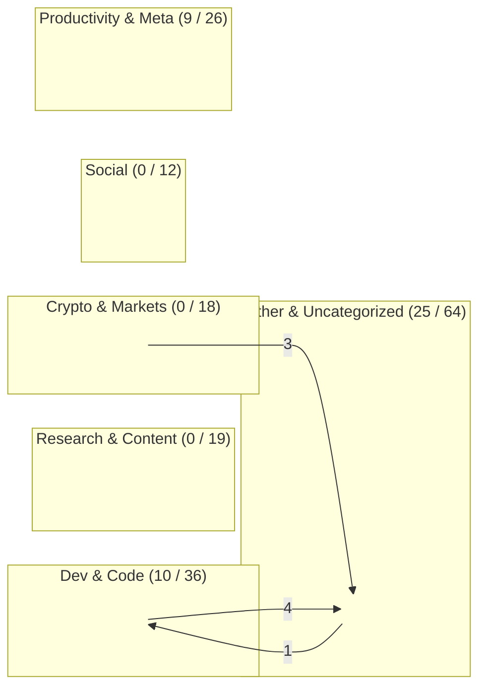
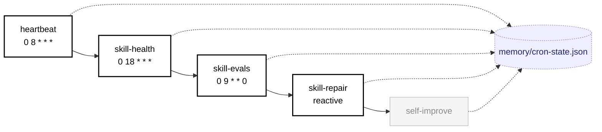
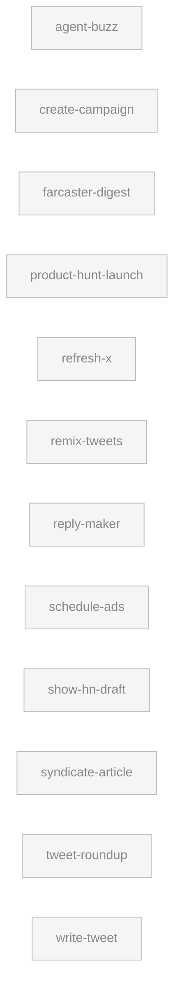

# Skill Dependency Graph

> Auto-generated by `skill-graph` on 2026-10-04. Mode: `SKILL_GRAPH_NEW`.

**Verdict:** SKILL_GRAPH_NEW: 175 skills mapped across 6 categories, 44 enabled

## What changed since last run

_First run — baseline fingerprint persisted. Future runs will diff node, edge, and enabled-state changes against this snapshot._

## Overview

Category boxes show **enabled / total** skill counts. Cross-category edges carry their count.

```mermaid
flowchart LR
    subgraph research["Research & Content (0 / 19)"]
        research_anchor( )
    end
    subgraph dev["Dev & Code (10 / 36)"]
        dev_anchor( )
    end
    subgraph crypto["Crypto & Markets (0 / 18)"]
        crypto_anchor( )
    end
    subgraph social["Social (0 / 12)"]
        social_anchor( )
    end
    subgraph productivity["Productivity & Meta (9 / 26)"]
        productivity_anchor( )
    end
    subgraph other["Other & Uncategorized (25 / 64)"]
        other_anchor( )
    end
    crypto_anchor -->|3| other_anchor
    dev_anchor -->|4| other_anchor
    other_anchor -->|1| dev_anchor
    classDef anchor fill:none,stroke:none,color:transparent
    class research_anchor anchor
    class dev_anchor anchor
    class crypto_anchor anchor
    class social_anchor anchor
    class productivity_anchor anchor
    class other_anchor anchor
```

## Self-healing loop

```mermaid
flowchart LR
    heartbeat["heartbeat<br/>0 8 * * *"]
    skill-health["skill-health<br/>0 18 * * *"]
    skill-evals["skill-evals<br/>0 9 * * 0"]
    skill-repair["skill-repair<br/>reactive"]
    self-improve["self-improve"]
    heartbeat --> skill-health
    skill-health --> skill-evals
    skill-evals --> skill-repair
    skill-repair --> self-improve
    cron_state[("memory/cron-state.json")]
    heartbeat -.-> cron_state
    skill-health -.-> cron_state
    skill-evals -.-> cron_state
    skill-repair -.-> cron_state
    self-improve -.-> cron_state
    classDef enabled fill:#fff,stroke:#000,stroke-width:2px,color:#000
    classDef disabled fill:#f5f5f5,stroke:#bbb,color:#888
    classDef state fill:#eef,stroke:#88c,color:#226,stroke-dasharray:2 2
    class heartbeat enabled
    class skill-health enabled
    class skill-evals enabled
    class skill-repair enabled
    class self-improve disabled
    class cron_state state
    click heartbeat "../skills/heartbeat/SKILL.md"
    click skill-health "../skills/skill-health/SKILL.md"
    click skill-evals "../skills/skill-evals/SKILL.md"
    click skill-repair "../skills/skill-repair/SKILL.md"
    click self-improve "../skills/self-improve/SKILL.md"
```

> Every scheduled skill writes `memory/cron-state.json` (success/fail counters). Collapsed here into one state node rather than fanning N edges across the graph.

## Per-category maps

### Research & Content

_0 enabled / 19 total_

```mermaid
flowchart LR
    article["article"]
    channel-recap["channel-recap"]
    competitor-launch-radar["competitor-launch-radar"]
    deep-research["deep-research"]
    digest["digest"]
    fetch-tweets["fetch-tweets"]
    hacker-news-digest["hacker-news-digest"]
    huggingface-trending["huggingface-trending"]
    last30["last30"]
    list-digest["list-digest"]
    paper-digest["paper-digest"]
    paper-pick["paper-pick"]
    reddit-digest["reddit-digest"]
    research-brief["research-brief"]
    rss-digest["rss-digest"]
    security-digest["security-digest"]
    technical-explainer["technical-explainer"]
    telegram-digest["telegram-digest"]
    vibecoding-digest["vibecoding-digest"]
    classDef enabled fill:#fff,stroke:#000,stroke-width:2px,color:#000
    classDef disabled fill:#f5f5f5,stroke:#bbb,color:#888
    classDef external fill:none,stroke:#bbb,stroke-dasharray:3 3,color:#888
    class article disabled
    class channel-recap disabled
    class competitor-launch-radar disabled
    class deep-research disabled
    class digest disabled
    class fetch-tweets disabled
    class hacker-news-digest disabled
    class huggingface-trending disabled
    class last30 disabled
    class list-digest disabled
    class paper-digest disabled
    class paper-pick disabled
    class reddit-digest disabled
    class research-brief disabled
    class rss-digest disabled
    class security-digest disabled
    class technical-explainer disabled
    class telegram-digest disabled
    class vibecoding-digest disabled
    click article "../skills/article/SKILL.md"
    click channel-recap "../skills/channel-recap/SKILL.md"
    click competitor-launch-radar "../skills/competitor-launch-radar/SKILL.md"
    click deep-research "../skills/deep-research/SKILL.md"
    click digest "../skills/digest/SKILL.md"
    click fetch-tweets "../skills/fetch-tweets/SKILL.md"
    click hacker-news-digest "../skills/hacker-news-digest/SKILL.md"
    click huggingface-trending "../skills/huggingface-trending/SKILL.md"
    click last30 "../skills/last30/SKILL.md"
    click list-digest "../skills/list-digest/SKILL.md"
    click paper-digest "../skills/paper-digest/SKILL.md"
    click paper-pick "../skills/paper-pick/SKILL.md"
    click reddit-digest "../skills/reddit-digest/SKILL.md"
    click research-brief "../skills/research-brief/SKILL.md"
    click rss-digest "../skills/rss-digest/SKILL.md"
    click security-digest "../skills/security-digest/SKILL.md"
    click technical-explainer "../skills/technical-explainer/SKILL.md"
    click telegram-digest "../skills/telegram-digest/SKILL.md"
    click vibecoding-digest "../skills/vibecoding-digest/SKILL.md"
```

### Dev & Code

_10 enabled / 36 total_

```mermaid
flowchart LR
    auto-merge["auto-merge"]
    auto-workflow["auto-workflow"]
    autoresearch["autoresearch"]
    autoresearch-goal["autoresearch-goal"]
    changelog["changelog<br/>0 16 * * 1"]
    code-health["code-health<br/>0 16 * * *"]
    create-skill["create-skill"]
    deploy-prototype["deploy-prototype"]
    external-feature["external-feature"]
    fleet-control["fleet-control<br/>0 9 * * *"]
    fork-cohort["fork-cohort"]
    fork-first-run-alert["fork-first-run-alert"]
    fork-fleet["fork-fleet"]
    fork-skill-gap["fork-skill-gap"]
    github-issues["github-issues"]
    github-monitor["github-monitor<br/>0 9 * * *"]
    github-releases["github-releases"]
    github-trending["github-trending"]
    issue-triage["issue-triage<br/>0 9 * * *"]
    pr-review["pr-review<br/>0 9,18 * * *"]
    pr-triage["pr-triage<br/>30 9 * * *"]
    project-lens["project-lens"]
    push-recap["push-recap"]
    repo-actions["repo-actions"]
    repo-article["repo-article"]
    repo-pulse["repo-pulse"]
    repo-scanner["repo-scanner"]
    search-skill["search-skill"]
    skill-security-scan["skill-security-scan"]
    smithery-manifest["smithery-manifest"]
    spawn-instance["spawn-instance"]
    stale-content-pr-sweeper["stale-content-pr-sweeper<br/>45 23 * * *"]
    star-milestone["star-milestone"]
    vercel-projects["vercel-projects"]
    vuln-scanner["vuln-scanner<br/>0 16 * * 6"]
    workflow-security-audit["workflow-security-audit<br/>0 16 * * 0"]
    external-feature --> repo-scanner
    fork-cohort -..-> fork-skill-gap
    fork-cohort -..-> fork-first-run-alert
    repo-scanner -..-> external-feature
    repo-scanner -..-> repo-actions
    vercel-projects -..-> external-feature
    vercel-projects -..-> repo-actions
    vuln-scanner --> github-trending
    subgraph external["(cross-category)"]
        ext_contributor-spotlight["contributor-spotlight"]
        ext_fleet-state["fleet-state"]
        ext_idea-pipeline["idea-pipeline"]
        ext_vuln-tracker["vuln-tracker"]
    end
    deploy-prototype -..-> ext_idea-pipeline
    fork-cohort -..-> ext_contributor-spotlight
    fork-cohort -..-> ext_fleet-state
    vercel-projects -..-> ext_idea-pipeline
    ext_vuln-tracker --> vuln-scanner
    classDef enabled fill:#fff,stroke:#000,stroke-width:2px,color:#000
    classDef disabled fill:#f5f5f5,stroke:#bbb,color:#888
    classDef external fill:none,stroke:#bbb,stroke-dasharray:3 3,color:#888
    class auto-merge disabled
    class auto-workflow disabled
    class autoresearch disabled
    class autoresearch-goal disabled
    class changelog enabled
    class code-health enabled
    class create-skill disabled
    class deploy-prototype disabled
    class external-feature disabled
    class fleet-control enabled
    class fork-cohort disabled
    class fork-first-run-alert disabled
    class fork-fleet disabled
    class fork-skill-gap disabled
    class github-issues disabled
    class github-monitor enabled
    class github-releases disabled
    class github-trending disabled
    class issue-triage enabled
    class pr-review enabled
    class pr-triage enabled
    class project-lens disabled
    class push-recap disabled
    class repo-actions disabled
    class repo-article disabled
    class repo-pulse disabled
    class repo-scanner disabled
    class search-skill disabled
    class skill-security-scan disabled
    class smithery-manifest disabled
    class spawn-instance disabled
    class stale-content-pr-sweeper enabled
    class star-milestone disabled
    class vercel-projects disabled
    class vuln-scanner enabled
    class workflow-security-audit enabled
    class ext_contributor-spotlight external
    class ext_fleet-state external
    class ext_idea-pipeline external
    class ext_vuln-tracker external
    click auto-merge "../skills/auto-merge/SKILL.md"
    click auto-workflow "../skills/auto-workflow/SKILL.md"
    click autoresearch "../skills/autoresearch/SKILL.md"
    click autoresearch-goal "../skills/autoresearch-goal/SKILL.md"
    click changelog "../skills/changelog/SKILL.md"
    click code-health "../skills/code-health/SKILL.md"
    click create-skill "../skills/create-skill/SKILL.md"
    click deploy-prototype "../skills/deploy-prototype/SKILL.md"
    click external-feature "../skills/external-feature/SKILL.md"
    click fleet-control "../skills/fleet-control/SKILL.md"
    click fork-cohort "../skills/fork-cohort/SKILL.md"
    click fork-first-run-alert "../skills/fork-first-run-alert/SKILL.md"
    click fork-fleet "../skills/fork-fleet/SKILL.md"
    click fork-skill-gap "../skills/fork-skill-gap/SKILL.md"
    click github-issues "../skills/github-issues/SKILL.md"
    click github-monitor "../skills/github-monitor/SKILL.md"
    click github-releases "../skills/github-releases/SKILL.md"
    click github-trending "../skills/github-trending/SKILL.md"
    click issue-triage "../skills/issue-triage/SKILL.md"
    click pr-review "../skills/pr-review/SKILL.md"
    click pr-triage "../skills/pr-triage/SKILL.md"
    click project-lens "../skills/project-lens/SKILL.md"
    click push-recap "../skills/push-recap/SKILL.md"
    click repo-actions "../skills/repo-actions/SKILL.md"
    click repo-article "../skills/repo-article/SKILL.md"
    click repo-pulse "../skills/repo-pulse/SKILL.md"
    click repo-scanner "../skills/repo-scanner/SKILL.md"
    click search-skill "../skills/search-skill/SKILL.md"
    click skill-security-scan "../skills/skill-security-scan/SKILL.md"
    click smithery-manifest "../skills/smithery-manifest/SKILL.md"
    click spawn-instance "../skills/spawn-instance/SKILL.md"
    click stale-content-pr-sweeper "../skills/stale-content-pr-sweeper/SKILL.md"
    click star-milestone "../skills/star-milestone/SKILL.md"
    click vercel-projects "../skills/vercel-projects/SKILL.md"
    click vuln-scanner "../skills/vuln-scanner/SKILL.md"
    click workflow-security-audit "../skills/workflow-security-audit/SKILL.md"
    click ext_contributor-spotlight "../skills/contributor-spotlight/SKILL.md"
    click ext_fleet-state "../skills/fleet-state/SKILL.md"
    click ext_idea-pipeline "../skills/idea-pipeline/SKILL.md"
    click ext_vuln-tracker "../skills/vuln-tracker/SKILL.md"
```

### Crypto & Markets

_0 enabled / 18 total_

```mermaid
flowchart LR
    contributor-reward["contributor-reward"]
    defi-monitor["defi-monitor"]
    defi-overview["defi-overview"]
    distribute-tokens["distribute-tokens"]
    market-context-refresh["market-context-refresh"]
    monitor-kalshi["monitor-kalshi"]
    monitor-polymarket["monitor-polymarket"]
    monitor-runners["monitor-runners"]
    narrative-tracker["narrative-tracker"]
    on-chain-monitor["on-chain-monitor"]
    polymarket-comments["polymarket-comments"]
    price-threshold-alert["price-threshold-alert"]
    token-alert["token-alert"]
    token-movers["token-movers"]
    token-pick["token-pick"]
    token-report["token-report"]
    treasury-info["treasury-info"]
    unlock-monitor["unlock-monitor"]
    subgraph external["(cross-category)"]
        ext_idea-pipeline["idea-pipeline"]
        ext_rwa-pulse["rwa-pulse"]
        ext_topic-momentum["topic-momentum"]
    end
    market-context-refresh -..-> ext_idea-pipeline
    market-context-refresh -..-> ext_rwa-pulse
    market-context-refresh -..-> ext_topic-momentum
    classDef enabled fill:#fff,stroke:#000,stroke-width:2px,color:#000
    classDef disabled fill:#f5f5f5,stroke:#bbb,color:#888
    classDef external fill:none,stroke:#bbb,stroke-dasharray:3 3,color:#888
    class contributor-reward disabled
    class defi-monitor disabled
    class defi-overview disabled
    class distribute-tokens disabled
    class market-context-refresh disabled
    class monitor-kalshi disabled
    class monitor-polymarket disabled
    class monitor-runners disabled
    class narrative-tracker disabled
    class on-chain-monitor disabled
    class polymarket-comments disabled
    class price-threshold-alert disabled
    class token-alert disabled
    class token-movers disabled
    class token-pick disabled
    class token-report disabled
    class treasury-info disabled
    class unlock-monitor disabled
    class ext_idea-pipeline external
    class ext_rwa-pulse external
    class ext_topic-momentum external
    click contributor-reward "../skills/contributor-reward/SKILL.md"
    click defi-monitor "../skills/defi-monitor/SKILL.md"
    click defi-overview "../skills/defi-overview/SKILL.md"
    click distribute-tokens "../skills/distribute-tokens/SKILL.md"
    click market-context-refresh "../skills/market-context-refresh/SKILL.md"
    click monitor-kalshi "../skills/monitor-kalshi/SKILL.md"
    click monitor-polymarket "../skills/monitor-polymarket/SKILL.md"
    click monitor-runners "../skills/monitor-runners/SKILL.md"
    click narrative-tracker "../skills/narrative-tracker/SKILL.md"
    click on-chain-monitor "../skills/on-chain-monitor/SKILL.md"
    click polymarket-comments "../skills/polymarket-comments/SKILL.md"
    click price-threshold-alert "../skills/price-threshold-alert/SKILL.md"
    click token-alert "../skills/token-alert/SKILL.md"
    click token-movers "../skills/token-movers/SKILL.md"
    click token-pick "../skills/token-pick/SKILL.md"
    click token-report "../skills/token-report/SKILL.md"
    click treasury-info "../skills/treasury-info/SKILL.md"
    click unlock-monitor "../skills/unlock-monitor/SKILL.md"
    click ext_idea-pipeline "../skills/idea-pipeline/SKILL.md"
    click ext_rwa-pulse "../skills/rwa-pulse/SKILL.md"
    click ext_topic-momentum "../skills/topic-momentum/SKILL.md"
```

### Social

_0 enabled / 12 total_

```mermaid
flowchart LR
    agent-buzz["agent-buzz"]
    create-campaign["create-campaign"]
    farcaster-digest["farcaster-digest"]
    product-hunt-launch["product-hunt-launch"]
    refresh-x["refresh-x"]
    remix-tweets["remix-tweets"]
    reply-maker["reply-maker"]
    schedule-ads["schedule-ads"]
    show-hn-draft["show-hn-draft"]
    syndicate-article["syndicate-article"]
    tweet-roundup["tweet-roundup"]
    write-tweet["write-tweet"]
    classDef enabled fill:#fff,stroke:#000,stroke-width:2px,color:#000
    classDef disabled fill:#f5f5f5,stroke:#bbb,color:#888
    classDef external fill:none,stroke:#bbb,stroke-dasharray:3 3,color:#888
    class agent-buzz disabled
    class create-campaign disabled
    class farcaster-digest disabled
    class product-hunt-launch disabled
    class refresh-x disabled
    class remix-tweets disabled
    class reply-maker disabled
    class schedule-ads disabled
    class show-hn-draft disabled
    class syndicate-article disabled
    class tweet-roundup disabled
    class write-tweet disabled
    click agent-buzz "../skills/agent-buzz/SKILL.md"
    click create-campaign "../skills/create-campaign/SKILL.md"
    click farcaster-digest "../skills/farcaster-digest/SKILL.md"
    click product-hunt-launch "../skills/product-hunt-launch/SKILL.md"
    click refresh-x "../skills/refresh-x/SKILL.md"
    click remix-tweets "../skills/remix-tweets/SKILL.md"
    click reply-maker "../skills/reply-maker/SKILL.md"
    click schedule-ads "../skills/schedule-ads/SKILL.md"
    click show-hn-draft "../skills/show-hn-draft/SKILL.md"
    click syndicate-article "../skills/syndicate-article/SKILL.md"
    click tweet-roundup "../skills/tweet-roundup/SKILL.md"
    click write-tweet "../skills/write-tweet/SKILL.md"
```

### Productivity & Meta

_9 enabled / 26 total_

```mermaid
flowchart LR
    action-converter["action-converter"]
    cost-report["cost-report<br/>0 7 * * 1"]
    daily-routine["daily-routine"]
    deal-flow["deal-flow"]
    evening-recap["evening-recap"]
    goal-tracker["goal-tracker<br/>0 18 * * *"]
    heartbeat["heartbeat<br/>0 8 * * *"]
    idea-capture["idea-capture"]
    morning-brief["morning-brief"]
    onboard["onboard"]
    operator-scorecard["operator-scorecard"]
    reflect["reflect<br/>0 18 * * *"]
    reg-monitor["reg-monitor"]
    rss-feed["rss-feed"]
    self-improve["self-improve"]
    skill-evals["skill-evals<br/>0 9 * * 0"]
    skill-health["skill-health<br/>0 18 * * *"]
    skill-leaderboard["skill-leaderboard"]
    skill-repair["skill-repair<br/>reactive"]
    skill-update-check["skill-update-check<br/>0 19 * * 0"]
    startup-idea["startup-idea"]
    tool-builder["tool-builder"]
    update-gallery["update-gallery"]
    v4-readiness["v4-readiness"]
    weekly-review["weekly-review"]
    weekly-shiplog["weekly-shiplog<br/>0 9 * * 1"]
    skill-repair --> skill-health
    tool-builder --> action-converter
    classDef enabled fill:#fff,stroke:#000,stroke-width:2px,color:#000
    classDef disabled fill:#f5f5f5,stroke:#bbb,color:#888
    classDef external fill:none,stroke:#bbb,stroke-dasharray:3 3,color:#888
    class action-converter disabled
    class cost-report enabled
    class daily-routine disabled
    class deal-flow disabled
    class evening-recap disabled
    class goal-tracker enabled
    class heartbeat enabled
    class idea-capture disabled
    class morning-brief disabled
    class onboard disabled
    class operator-scorecard disabled
    class reflect enabled
    class reg-monitor disabled
    class rss-feed disabled
    class self-improve disabled
    class skill-evals enabled
    class skill-health enabled
    class skill-leaderboard disabled
    class skill-repair enabled
    class skill-update-check enabled
    class startup-idea disabled
    class tool-builder disabled
    class update-gallery disabled
    class v4-readiness disabled
    class weekly-review disabled
    class weekly-shiplog enabled
    click action-converter "../skills/action-converter/SKILL.md"
    click cost-report "../skills/cost-report/SKILL.md"
    click daily-routine "../skills/daily-routine/SKILL.md"
    click deal-flow "../skills/deal-flow/SKILL.md"
    click evening-recap "../skills/evening-recap/SKILL.md"
    click goal-tracker "../skills/goal-tracker/SKILL.md"
    click heartbeat "../skills/heartbeat/SKILL.md"
    click idea-capture "../skills/idea-capture/SKILL.md"
    click morning-brief "../skills/morning-brief/SKILL.md"
    click onboard "../skills/onboard/SKILL.md"
    click operator-scorecard "../skills/operator-scorecard/SKILL.md"
    click reflect "../skills/reflect/SKILL.md"
    click reg-monitor "../skills/reg-monitor/SKILL.md"
    click rss-feed "../skills/rss-feed/SKILL.md"
    click self-improve "../skills/self-improve/SKILL.md"
    click skill-evals "../skills/skill-evals/SKILL.md"
    click skill-health "../skills/skill-health/SKILL.md"
    click skill-leaderboard "../skills/skill-leaderboard/SKILL.md"
    click skill-repair "../skills/skill-repair/SKILL.md"
    click skill-update-check "../skills/skill-update-check/SKILL.md"
    click startup-idea "../skills/startup-idea/SKILL.md"
    click tool-builder "../skills/tool-builder/SKILL.md"
    click update-gallery "../skills/update-gallery/SKILL.md"
    click v4-readiness "../skills/v4-readiness/SKILL.md"
    click weekly-review "../skills/weekly-review/SKILL.md"
    click weekly-shiplog "../skills/weekly-shiplog/SKILL.md"
```

### Other & Uncategorized

_25 enabled / 64 total_

```mermaid
flowchart LR
    agent-displacement["agent-displacement"]
    agi-tracker["agi-tracker<br/>0 13 * * 1"]
    ai-framework-watch["ai-framework-watch<br/>30 8 * * 1"]
    aixbt-pulse["aixbt-pulse"]
    batch-health["batch-health<br/>0 8 * * *"]
    builder-map["builder-map"]
    compute-futures-eda["compute-futures-eda<br/>0 6 * * *"]
    compute-macro-correlate["compute-macro-correlate<br/>30 6 * * 0"]
    compute-pulse["compute-pulse<br/>0 11 * * 6"]
    config-validator["config-validator<br/>0 7 * * 0"]
    content-engine["content-engine"]
    contributor-spotlight["contributor-spotlight"]
    disclosure-tracker["disclosure-tracker"]
    ecosystem-pulse["ecosystem-pulse"]
    engagement-act["engagement-act"]
    feature["feature"]
    fleet-runner["fleet-runner"]
    fleet-state["fleet-state"]
    fork-contributor-leaderboard["fork-contributor-leaderboard"]
    fork-release-tracker["fork-release-tracker"]
    fork-skill-digest["fork-skill-digest"]
    frontier-eval["frontier-eval"]
    gitlawb-fleet["gitlawb-fleet"]
    gitlawb-fleet-metrics["gitlawb-fleet-metrics<br/>0 8 * * *"]
    idea-pipeline["idea-pipeline"]
    idea-validator["idea-validator"]
    janitor["janitor<br/>30 5 * * 0"]
    launch-radar["launch-radar"]
    memory-flush["memory-flush<br/>0 6 2/2 * *"]
    memory-structural-dedupe["memory-structural-dedupe<br/>10 6 2/2 * *"]
    milestone-tracker["milestone-tracker<br/>0 12 * * 1"]
    note-taking["note-taking"]
    notegraph["notegraph<br/>0 5 * * *"]
    planner["planner<br/>30 6 * * *"]
    pm-intel["pm-intel"]
    pm-manipulation["pm-manipulation"]
    pm-pulse["pm-pulse"]
    polymarket["polymarket"]
    pr-tracker["pr-tracker<br/>0 10 * * *"]
    programmatic-eda["programmatic-eda"]
    pvr-triage-monitor["pvr-triage-monitor"]
    pvr-watchlist["pvr-watchlist"]
    repo-revive["repo-revive<br/>0 10 * * 6"]
    run-frequency-guard["run-frequency-guard<br/>0 23 * * *"]
    runpod-spot-pricing["runpod-spot-pricing"]
    rwa-pulse["rwa-pulse"]
    security["security"]
    self-review["self-review<br/>30 18 * * 0"]
    signal-verdict["signal-verdict"]
    skill-analytics["skill-analytics<br/>30 18 * * 3"]
    skill-enabler["skill-enabler"]
    skill-freshness["skill-freshness<br/>0 8 * * *"]
    skill-graph["skill-graph<br/>0 17 * * 0"]
    skillpacks["skillpacks<br/>0 6 * * 0"]
    star-momentum-alert["star-momentum-alert"]
    suggest-edges["suggest-edges<br/>30 5 * * *"]
    surplus-pulse["surplus-pulse<br/>30 16 * * *"]
    swarm-safety-eval["swarm-safety-eval<br/>30 7 * * 0"]
    thread-formatter["thread-formatter"]
    topic-momentum["topic-momentum"]
    tweet-digest["tweet-digest"]
    vuln-tracker["vuln-tracker"]
    wallet-digest["wallet-digest"]
    x402-monitor["x402-monitor"]
    builder-map -..-> idea-pipeline
    compute-pulse -..-> runpod-spot-pricing
    contributor-spotlight -..-> fleet-state
    fork-release-tracker -..-> fleet-state
    idea-validator -..-> idea-pipeline
    launch-radar -..-> idea-pipeline
    pm-intel -..-> pm-manipulation
    pm-pulse -..-> pm-manipulation
    pr-tracker -..-> disclosure-tracker
    subgraph external["(cross-category)"]
        ext_deploy-prototype["deploy-prototype"]
        ext_fork-cohort["fork-cohort"]
        ext_market-context-refresh["market-context-refresh"]
        ext_vercel-projects["vercel-projects"]
        ext_vuln-scanner["vuln-scanner"]
    end
    vuln-tracker --> ext_vuln-scanner
    ext_fork-cohort -..-> contributor-spotlight
    ext_fork-cohort -..-> fleet-state
    ext_deploy-prototype -..-> idea-pipeline
    ext_market-context-refresh -..-> idea-pipeline
    ext_vercel-projects -..-> idea-pipeline
    ext_market-context-refresh -..-> rwa-pulse
    ext_market-context-refresh -..-> topic-momentum
    classDef enabled fill:#fff,stroke:#000,stroke-width:2px,color:#000
    classDef disabled fill:#f5f5f5,stroke:#bbb,color:#888
    classDef external fill:none,stroke:#bbb,stroke-dasharray:3 3,color:#888
    class agent-displacement disabled
    class agi-tracker enabled
    class ai-framework-watch enabled
    class aixbt-pulse disabled
    class batch-health enabled
    class builder-map disabled
    class compute-futures-eda enabled
    class compute-macro-correlate enabled
    class compute-pulse enabled
    class config-validator enabled
    class content-engine disabled
    class contributor-spotlight disabled
    class disclosure-tracker disabled
    class ecosystem-pulse disabled
    class engagement-act disabled
    class feature disabled
    class fleet-runner disabled
    class fleet-state disabled
    class fork-contributor-leaderboard disabled
    class fork-release-tracker disabled
    class fork-skill-digest disabled
    class frontier-eval disabled
    class gitlawb-fleet disabled
    class gitlawb-fleet-metrics enabled
    class idea-pipeline disabled
    class idea-validator disabled
    class janitor enabled
    class launch-radar disabled
    class memory-flush enabled
    class memory-structural-dedupe enabled
    class milestone-tracker enabled
    class note-taking disabled
    class notegraph enabled
    class planner enabled
    class pm-intel disabled
    class pm-manipulation disabled
    class pm-pulse disabled
    class polymarket disabled
    class pr-tracker enabled
    class programmatic-eda disabled
    class pvr-triage-monitor disabled
    class pvr-watchlist disabled
    class repo-revive enabled
    class run-frequency-guard enabled
    class runpod-spot-pricing disabled
    class rwa-pulse disabled
    class security disabled
    class self-review enabled
    class signal-verdict disabled
    class skill-analytics enabled
    class skill-enabler disabled
    class skill-freshness enabled
    class skill-graph enabled
    class skillpacks enabled
    class star-momentum-alert disabled
    class suggest-edges enabled
    class surplus-pulse enabled
    class swarm-safety-eval enabled
    class thread-formatter disabled
    class topic-momentum disabled
    class tweet-digest disabled
    class vuln-tracker disabled
    class wallet-digest disabled
    class x402-monitor disabled
    class ext_deploy-prototype external
    class ext_fork-cohort external
    class ext_market-context-refresh external
    class ext_vercel-projects external
    class ext_vuln-scanner external
    click agent-displacement "../skills/agent-displacement/SKILL.md"
    click ai-framework-watch "../skills/ai-framework-watch/SKILL.md"
    click aixbt-pulse "../skills/aixbt-pulse/SKILL.md"
    click batch-health "../skills/batch-health/SKILL.md"
    click builder-map "../skills/builder-map/SKILL.md"
    click compute-futures-eda "../skills/compute-futures-eda/SKILL.md"
    click compute-macro-correlate "../skills/compute-macro-correlate/SKILL.md"
    click compute-pulse "../skills/compute-pulse/SKILL.md"
    click config-validator "../skills/config-validator/SKILL.md"
    click content-engine "../skills/content-engine/SKILL.md"
    click contributor-spotlight "../skills/contributor-spotlight/SKILL.md"
    click disclosure-tracker "../skills/disclosure-tracker/SKILL.md"
    click ecosystem-pulse "../skills/ecosystem-pulse/SKILL.md"
    click engagement-act "../skills/engagement-act/SKILL.md"
    click feature "../skills/feature/SKILL.md"
    click fleet-state "../skills/fleet-state/SKILL.md"
    click fork-contributor-leaderboard "../skills/fork-contributor-leaderboard/SKILL.md"
    click fork-release-tracker "../skills/fork-release-tracker/SKILL.md"
    click fork-skill-digest "../skills/fork-skill-digest/SKILL.md"
    click frontier-eval "../skills/frontier-eval/SKILL.md"
    click gitlawb-fleet "../skills/gitlawb-fleet/SKILL.md"
    click gitlawb-fleet-metrics "../skills/gitlawb-fleet-metrics/SKILL.md"
    click idea-pipeline "../skills/idea-pipeline/SKILL.md"
    click idea-validator "../skills/idea-validator/SKILL.md"
    click janitor "../skills/janitor/SKILL.md"
    click launch-radar "../skills/launch-radar/SKILL.md"
    click memory-flush "../skills/memory-flush/SKILL.md"
    click memory-structural-dedupe "../skills/memory-structural-dedupe/SKILL.md"
    click milestone-tracker "../skills/milestone-tracker/SKILL.md"
    click note-taking "../skills/note-taking/SKILL.md"
    click notegraph "../skills/notegraph/SKILL.md"
    click planner "../skills/planner/SKILL.md"
    click pm-intel "../skills/pm-intel/SKILL.md"
    click pm-manipulation "../skills/pm-manipulation/SKILL.md"
    click pm-pulse "../skills/pm-pulse/SKILL.md"
    click polymarket "../skills/polymarket/SKILL.md"
    click pr-tracker "../skills/pr-tracker/SKILL.md"
    click programmatic-eda "../skills/programmatic-eda/SKILL.md"
    click pvr-triage-monitor "../skills/pvr-triage-monitor/SKILL.md"
    click pvr-watchlist "../skills/pvr-watchlist/SKILL.md"
    click repo-revive "../skills/repo-revive/SKILL.md"
    click run-frequency-guard "../skills/run-frequency-guard/SKILL.md"
    click runpod-spot-pricing "../skills/runpod-spot-pricing/SKILL.md"
    click rwa-pulse "../skills/rwa-pulse/SKILL.md"
    click self-review "../skills/self-review/SKILL.md"
    click signal-verdict "../skills/signal-verdict/SKILL.md"
    click skill-analytics "../skills/skill-analytics/SKILL.md"
    click skill-enabler "../skills/skill-enabler/SKILL.md"
    click skill-freshness "../skills/skill-freshness/SKILL.md"
    click skill-graph "../skills/skill-graph/SKILL.md"
    click skillpacks "../skills/skillpacks/SKILL.md"
    click star-momentum-alert "../skills/star-momentum-alert/SKILL.md"
    click suggest-edges "../skills/suggest-edges/SKILL.md"
    click surplus-pulse "../skills/surplus-pulse/SKILL.md"
    click swarm-safety-eval "../skills/swarm-safety-eval/SKILL.md"
    click thread-formatter "../skills/thread-formatter/SKILL.md"
    click topic-momentum "../skills/topic-momentum/SKILL.md"
    click tweet-digest "../skills/tweet-digest/SKILL.md"
    click vuln-tracker "../skills/vuln-tracker/SKILL.md"
    click wallet-digest "../skills/wallet-digest/SKILL.md"
    click x402-monitor "../skills/x402-monitor/SKILL.md"
    click ext_deploy-prototype "../skills/deploy-prototype/SKILL.md"
    click ext_fork-cohort "../skills/fork-cohort/SKILL.md"
    click ext_market-context-refresh "../skills/market-context-refresh/SKILL.md"
    click ext_vercel-projects "../skills/vercel-projects/SKILL.md"
    click ext_vuln-scanner "../skills/vuln-scanner/SKILL.md"
```

## Legend

| Mark | Meaning |
| --- | --- |
| `A --> B` | `depends_on` (explicit) |
| `A -.-> B` | `consume` (chain output) |
| `A -..-> B` | `reactive` trigger or shared memory state (writer → reader) |
| **bold border** | enabled in `aeon.yml` (schedule in label) |
| faded grey | disabled (code exists but not scheduled) |
| dashed external | node lives in another category |

Nodes are clickable → `skills/<slug>/SKILL.md`. A few `aeon.yml`-only placeholders (`agi-tracker`, `fleet-runner`, `security`) ship no SKILL.md so they appear without a link.

## Summary

| Category | Enabled | Total |
| --- | ---: | ---: |
| Research & Content | 0 | 19 |
| Dev & Code | 10 | 36 |
| Crypto & Markets | 0 | 18 |
| Social | 0 | 12 |
| Productivity & Meta | 9 | 26 |
| Other & Uncategorized | 25 | 64 |
| **Total** | **44** | **175** |

| Edge type | Count |
| --- | ---: |
| depends_on | 5 |
| consume (chain) | 0 |
| reactive | 2 |
| shared memory state | 22 |

_skills parsed: 175 · depends_on: 5 · consume: 0 · reactive: 2 · shared-state derived: 22 · enabled: 44/175 · mode: SKILL_GRAPH_NEW_
