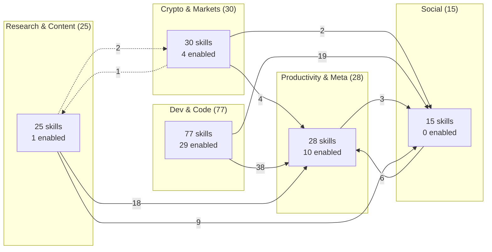
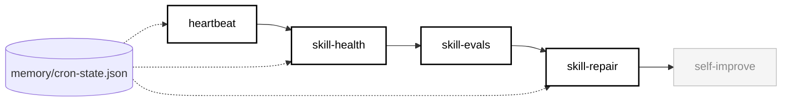

# Skill Dependency Graph

_Auto-generated by skill-graph on 2026-09-27_

**Mode:** `SKILL_GRAPH_OK` · **Verdict:** NEW_SKILLS: agi-tracker, fleet-runner, security

## What changed since last run

- **Added skills** (3): agi-tracker, fleet-runner, security
- **Added edges** (105):
  - `ai-framework-watch --> rss-feed`
  - `ai-framework-watch --> syndicate-article`
  - `ai-framework-watch --> update-gallery`
  - `article --> rss-feed`
  - `article --> syndicate-article`
  - `article --> update-gallery`
  - `auto-workflow --> rss-feed`
  - `auto-workflow --> syndicate-article`
  - `auto-workflow --> update-gallery`
  - `changelog --> rss-feed`
  - `changelog --> syndicate-article`
  - `changelog --> update-gallery`
  - `channel-recap --> rss-feed`
  - `channel-recap --> syndicate-article`
  - `channel-recap --> update-gallery`
  - `code-health --> rss-feed`
  - `code-health --> syndicate-article`
  - `code-health --> update-gallery`
  - `content-engine --> rss-feed`
  - `content-engine --> syndicate-article`
  - `content-engine --> update-gallery`
  - `deep-research --> rss-feed`
  - `deep-research --> syndicate-article`
  - `deep-research --> update-gallery`
  - `deploy-prototype --> rss-feed`
  - `deploy-prototype --> syndicate-article`
  - `deploy-prototype --> update-gallery`
  - `fleet-control --> rss-feed`
  - `fleet-control --> syndicate-article`
  - `fleet-control --> update-gallery`
  - `fork-contributor-leaderboard --> rss-feed`
  - `fork-contributor-leaderboard --> syndicate-article`
  - `fork-contributor-leaderboard --> update-gallery`
  - `fork-release-tracker --> rss-feed`
  - `fork-release-tracker --> syndicate-article`
  - `fork-release-tracker --> update-gallery`
  - `idea-pipeline --> rss-feed`
  - `idea-pipeline --> syndicate-article`
  - `idea-pipeline --> update-gallery`
  - `last30 --> rss-feed`
  - `last30 --> syndicate-article`
  - `last30 --> update-gallery`
  - `launch-radar --> rss-feed`
  - `launch-radar --> syndicate-article`
  - `launch-radar --> update-gallery`
  - `onboard --> rss-feed`
  - `onboard --> syndicate-article`
  - `onboard --> update-gallery`
  - `paper-digest --> rss-feed`
  - `paper-digest --> syndicate-article`
  - `paper-digest --> update-gallery`
  - `pm-intel -..-> pm-manipulation`
  - `pm-intel -..-> pm-pulse`
  - `pm-manipulation --> rss-feed`
  - `pm-manipulation --> syndicate-article`
  - `pm-manipulation --> update-gallery`
  - `pm-pulse -..-> pm-intel`
  - `product-hunt-launch --> rss-feed`
  - `product-hunt-launch --> syndicate-article`
  - `product-hunt-launch --> update-gallery`
  - `project-lens --> rss-feed`
  - `project-lens --> syndicate-article`
  - `project-lens --> update-gallery`
  - `push-recap --> rss-feed`
  - `push-recap --> syndicate-article`
  - `push-recap --> update-gallery`
  - `repo-actions --> rss-feed`
  - `repo-actions --> syndicate-article`
  - `repo-actions --> update-gallery`
  - `repo-article --> rss-feed`
  - `repo-article --> syndicate-article`
  - `repo-article --> update-gallery`
  - `research-brief --> rss-feed`
  - `research-brief --> syndicate-article`
  - `research-brief --> update-gallery`
  - `self-review --> rss-feed`
  - `self-review --> syndicate-article`
  - `self-review --> update-gallery`
  - `show-hn-draft --> rss-feed`
  - `show-hn-draft --> update-gallery`
  - `skill-freshness --> rss-feed`
  - `skill-freshness --> syndicate-article`
  - `skill-freshness --> update-gallery`
  - `skill-security-scan --> rss-feed`
  - `skill-security-scan --> syndicate-article`
  - `skill-security-scan --> update-gallery`
  - `star-momentum-alert --> rss-feed`
  - `star-momentum-alert --> syndicate-article`
  - `star-momentum-alert --> update-gallery`
  - `swarm-safety-eval --> rss-feed`
  - `swarm-safety-eval --> syndicate-article`
  - `swarm-safety-eval --> update-gallery`
  - `technical-explainer --> rss-feed`
  - `technical-explainer --> syndicate-article`
  - `technical-explainer --> update-gallery`
  - `thread-formatter --> rss-feed`
  - `thread-formatter --> update-gallery`
  - `token-report --> rss-feed`
  - `token-report --> syndicate-article`
  - `token-report --> update-gallery`
  - `vuln-scanner --> rss-feed`
  - `vuln-scanner --> syndicate-article`
  - `vuln-scanner --> update-gallery`
  - `weekly-review --> syndicate-article`
  - `weekly-shiplog --> syndicate-article`
- **Removed edges** (118):
  - `ai-framework-watch --> ext_rss-feed`
  - `ai-framework-watch --> ext_syndicate-article`
  - `ai-framework-watch --> ext_update-gallery`
  - `auto-workflow --> ext_rss-feed`
  - `auto-workflow --> ext_syndicate-article`
  - `auto-workflow --> ext_update-gallery`
  - `channel-recap --> ext_rss-feed`
  - `channel-recap --> ext_syndicate-article`
  - `channel-recap --> ext_update-gallery`
  - `code-health --> ext_rss-feed`
  - `code-health --> ext_syndicate-article`
  - `code-health --> ext_update-gallery`
  - `competitor-launch-radar --> ext_rss-feed`
  - `competitor-launch-radar --> ext_syndicate-article`
  - `competitor-launch-radar --> ext_update-gallery`
  - `content-engine --> ext_rss-feed`
  - `content-engine --> ext_syndicate-article`
  - `content-engine --> ext_update-gallery`
  - `contributor-spotlight --> ext_rss-feed`
  - `contributor-spotlight --> ext_syndicate-article`
  - `contributor-spotlight --> ext_update-gallery`
  - `cron_state -.-> heartbeat`
  - `cron_state -.-> skill-health`
  - `cron_state -.-> skill-repair`
  - `deep-research --> ext_rss-feed`
  - `deep-research --> ext_syndicate-article`
  - `deep-research --> ext_update-gallery`
  - `deploy-prototype --> ext_rss-feed`
  - `deploy-prototype --> ext_syndicate-article`
  - `deploy-prototype --> ext_update-gallery`
  - `ecosystem-pulse --> ext_rss-feed`
  - `ecosystem-pulse --> ext_syndicate-article`
  - `ecosystem-pulse --> ext_update-gallery`
  - `fleet-state --> ext_rss-feed`
  - `fleet-state --> ext_syndicate-article`
  - `fleet-state --> ext_update-gallery`
  - `fork-release-tracker --> ext_rss-feed`
  - `fork-release-tracker --> ext_syndicate-article`
  - `fork-release-tracker --> ext_update-gallery`
  - `fork-skill-gap --> ext_rss-feed`
  - `fork-skill-gap --> ext_syndicate-article`
  - `fork-skill-gap --> ext_update-gallery`
  - `heartbeat --> skill-health`
  - `last30 --> ext_rss-feed`
  - `last30 --> ext_syndicate-article`
  - `last30 --> ext_update-gallery`
  - `memory-flush --> ext_rss-feed`
  - `memory-flush --> ext_syndicate-article`
  - `memory-flush --> ext_update-gallery`
  - `operator-scorecard --> ext_syndicate-article`
  - `operator-scorecard --> rss-feed`
  - `operator-scorecard --> update-gallery`
  - `paper-digest --> ext_rss-feed`
  - `paper-digest --> ext_syndicate-article`
  - `paper-digest --> ext_update-gallery`
  - `pm-intel -..-> ext_pm-manipulation`
  - `pm-intel -..-> ext_pm-pulse`
  - `pm-manipulation --> ext_rss-feed`
  - `pm-manipulation --> ext_syndicate-article`
  - `pm-manipulation --> ext_update-gallery`
  - `pm-pulse -..-> ext_pm-intel`
  - `project-lens --> ext_rss-feed`
  - `project-lens --> ext_syndicate-article`
  - `project-lens --> ext_update-gallery`
  - `repo-actions --> ext_rss-feed`
  - `repo-actions --> ext_syndicate-article`
  - `repo-actions --> ext_update-gallery`
  - `repo-article --> ext_rss-feed`
  - `repo-article --> ext_syndicate-article`
  - `repo-article --> ext_update-gallery`
  - `research-brief --> ext_rss-feed`
  - `research-brief --> ext_syndicate-article`
  - `research-brief --> ext_update-gallery`
  - `rss-feed --> ext_syndicate-article`
  - `rss-feed --> rss-feed`
  - `rss-feed --> update-gallery`
  - `self-improve --> ext_syndicate-article`
  - `self-improve --> rss-feed`
  - `self-improve --> update-gallery`
  - `self-review --> ext_rss-feed`
  - `self-review --> ext_syndicate-article`
  - `self-review --> ext_update-gallery`
  - `show-hn-draft --> ext_rss-feed`
  - `show-hn-draft --> ext_update-gallery`
  - `signal-verdict --> ext_rss-feed`
  - `signal-verdict --> ext_syndicate-article`
  - `signal-verdict --> ext_update-gallery`
  - `skill-evals --> ext_syndicate-article`
  - `skill-evals --> rss-feed`
  - `skill-evals --> skill-repair`
  - `skill-evals --> update-gallery`
  - `skill-freshness --> ext_rss-feed`
  - `skill-freshness --> ext_syndicate-article`
  - `skill-freshness --> ext_update-gallery`
  - `skill-health --> skill-evals`
  - `skill-repair --> self-improve`
  - `skill-security-scan --> ext_rss-feed`
  - `skill-security-scan --> ext_syndicate-article`
  - `skill-security-scan --> ext_update-gallery`
  - `star-momentum-alert --> ext_rss-feed`
  - `star-momentum-alert --> ext_syndicate-article`
  - `star-momentum-alert --> ext_update-gallery`
  - `syndicate-article --> ext_rss-feed`
  - `syndicate-article --> ext_update-gallery`
  - `syndicate-article --> syndicate-article`
  - `technical-explainer --> ext_rss-feed`
  - `technical-explainer --> ext_syndicate-article`
  - `technical-explainer --> ext_update-gallery`
  - `thread-formatter --> ext_rss-feed`
  - `thread-formatter --> ext_update-gallery`
  - `token-report --> ext_rss-feed`
  - `token-report --> ext_syndicate-article`
  - `token-report --> ext_update-gallery`
  - `v4-readiness --> ext_syndicate-article`
  - `v4-readiness --> rss-feed`
  - `v4-readiness --> update-gallery`
  - `weekly-review --> ext_syndicate-article`
  - `weekly-shiplog --> ext_syndicate-article`

## Overview

Cross-category dependency map. Each category is a subgraph box; edge labels are the count of dependencies crossing that boundary.

```mermaid
flowchart LR
  subgraph research["Research & Content (25)"]
    research_hub["25 skills<br/>1 enabled"]
  end
  subgraph dev["Dev & Code (77)"]
    dev_hub["77 skills<br/>29 enabled"]
  end
  subgraph crypto["Crypto & Markets (30)"]
    crypto_hub["30 skills<br/>4 enabled"]
  end
  subgraph social["Social (15)"]
    social_hub["15 skills<br/>0 enabled"]
  end
  subgraph productivity["Productivity & Meta (28)"]
    productivity_hub["28 skills<br/>10 enabled"]
  end
  crypto_hub -->|4| productivity_hub
  crypto_hub -..->|1| research_hub
  crypto_hub -->|2| social_hub
  dev_hub -->|38| productivity_hub
  dev_hub -->|19| social_hub
  productivity_hub -->|3| social_hub
  research_hub -..->|2| crypto_hub
  research_hub -->|18| productivity_hub
  research_hub -->|9| social_hub
  social_hub -->|6| productivity_hub
```

## Self-healing loop

Every skill writes to `memory/cron-state.json`; the health/repair pipeline reads it. This shared-state node stands in for ~N edges the graph would otherwise carry to `heartbeat`, `skill-health`, and `skill-repair`.

```mermaid
flowchart LR
  cron_state[(memory/cron-state.json)]
  heartbeat --> skill-health
  skill-health --> skill-evals
  skill-evals --> skill-repair
  skill-repair --> self-improve
  cron_state -.-> heartbeat
  cron_state -.-> skill-health
  cron_state -.-> skill-repair
  click heartbeat "../skills/heartbeat/SKILL.md"
  class heartbeat enabled
  click skill-health "../skills/skill-health/SKILL.md"
  class skill-health enabled
  click skill-evals "../skills/skill-evals/SKILL.md"
  class skill-evals enabled
  click skill-repair "../skills/skill-repair/SKILL.md"
  class skill-repair enabled
  click self-improve "../skills/self-improve/SKILL.md"
  class self-improve disabled
  classDef enabled fill:#fff,stroke:#000,stroke-width:2px,color:#000
  classDef disabled fill:#f5f5f5,stroke:#bbb,color:#888
```

## Per-category detail

### Research & Content

_25 skills · 1 enabled_

```mermaid
flowchart LR
  agent-displacement["agent-displacement"]
  ai-framework-watch["ai-framework-watch<br/>30 8 * * 1"]
  article["article"]
  channel-recap["channel-recap"]
  competitor-launch-radar["competitor-launch-radar"]
  content-engine["content-engine"]
  deep-research["deep-research"]
  digest["digest"]
  ecosystem-pulse["ecosystem-pulse"]
  fetch-tweets["fetch-tweets"]
  hacker-news-digest["hacker-news-digest"]
  huggingface-trending["huggingface-trending"]
  last30["last30"]
  list-digest["list-digest"]
  paper-digest["paper-digest"]
  paper-pick["paper-pick"]
  pm-intel["pm-intel"]
  reddit-digest["reddit-digest"]
  research-brief["research-brief"]
  rss-digest["rss-digest"]
  security-digest["security-digest"]
  technical-explainer["technical-explainer"]
  telegram-digest["telegram-digest"]
  topic-momentum["topic-momentum"]
  vibecoding-digest["vibecoding-digest"]
  subgraph external["external"]
    ext_pm-manipulation["pm-manipulation"]:::external
    ext_pm-pulse["pm-pulse"]:::external
    ext_rss-feed["rss-feed"]:::external
    ext_syndicate-article["syndicate-article"]:::external
    ext_update-gallery["update-gallery"]:::external
  end
  pm-intel -..-> ext_pm-manipulation
  pm-intel -..-> ext_pm-pulse
  deep-research --> ext_rss-feed
  ai-framework-watch --> ext_rss-feed
  last30 --> ext_rss-feed
  paper-digest --> ext_rss-feed
  article --> ext_rss-feed
  channel-recap --> ext_rss-feed
  content-engine --> ext_rss-feed
  technical-explainer --> ext_rss-feed
  research-brief --> ext_rss-feed
  deep-research --> ext_syndicate-article
  ai-framework-watch --> ext_syndicate-article
  last30 --> ext_syndicate-article
  paper-digest --> ext_syndicate-article
  article --> ext_syndicate-article
  channel-recap --> ext_syndicate-article
  content-engine --> ext_syndicate-article
  technical-explainer --> ext_syndicate-article
  research-brief --> ext_syndicate-article
  deep-research --> ext_update-gallery
  ai-framework-watch --> ext_update-gallery
  last30 --> ext_update-gallery
  paper-digest --> ext_update-gallery
  article --> ext_update-gallery
  channel-recap --> ext_update-gallery
  content-engine --> ext_update-gallery
  technical-explainer --> ext_update-gallery
  research-brief --> ext_update-gallery
  click agent-displacement "../skills/agent-displacement/SKILL.md"
  class agent-displacement disabled
  click ai-framework-watch "../skills/ai-framework-watch/SKILL.md"
  class ai-framework-watch enabled
  click article "../skills/article/SKILL.md"
  class article disabled
  click channel-recap "../skills/channel-recap/SKILL.md"
  class channel-recap disabled
  click competitor-launch-radar "../skills/competitor-launch-radar/SKILL.md"
  class competitor-launch-radar disabled
  click content-engine "../skills/content-engine/SKILL.md"
  class content-engine disabled
  click deep-research "../skills/deep-research/SKILL.md"
  class deep-research disabled
  click digest "../skills/digest/SKILL.md"
  class digest disabled
  click ecosystem-pulse "../skills/ecosystem-pulse/SKILL.md"
  class ecosystem-pulse disabled
  click fetch-tweets "../skills/fetch-tweets/SKILL.md"
  class fetch-tweets disabled
  click hacker-news-digest "../skills/hacker-news-digest/SKILL.md"
  class hacker-news-digest disabled
  click huggingface-trending "../skills/huggingface-trending/SKILL.md"
  class huggingface-trending disabled
  click last30 "../skills/last30/SKILL.md"
  class last30 disabled
  click list-digest "../skills/list-digest/SKILL.md"
  class list-digest disabled
  click paper-digest "../skills/paper-digest/SKILL.md"
  class paper-digest disabled
  click paper-pick "../skills/paper-pick/SKILL.md"
  class paper-pick disabled
  click pm-intel "../skills/pm-intel/SKILL.md"
  class pm-intel disabled
  click reddit-digest "../skills/reddit-digest/SKILL.md"
  class reddit-digest disabled
  click research-brief "../skills/research-brief/SKILL.md"
  class research-brief disabled
  click rss-digest "../skills/rss-digest/SKILL.md"
  class rss-digest disabled
  click security-digest "../skills/security-digest/SKILL.md"
  class security-digest disabled
  click technical-explainer "../skills/technical-explainer/SKILL.md"
  class technical-explainer disabled
  click telegram-digest "../skills/telegram-digest/SKILL.md"
  class telegram-digest disabled
  click topic-momentum "../skills/topic-momentum/SKILL.md"
  class topic-momentum disabled
  click vibecoding-digest "../skills/vibecoding-digest/SKILL.md"
  class vibecoding-digest disabled
  classDef enabled fill:#fff,stroke:#000,stroke-width:2px,color:#000
  classDef disabled fill:#f5f5f5,stroke:#bbb,color:#888
  classDef external fill:none,stroke:#bbb,stroke-dasharray:3 3,color:#888
```

### Dev & Code

_77 skills · 29 enabled_

```mermaid
flowchart LR
  auto-merge["auto-merge"]
  auto-workflow["auto-workflow"]
  autoresearch["autoresearch"]
  autoresearch-goal["autoresearch-goal"]
  batch-health["batch-health<br/>0 8 * * *"]
  builder-map["builder-map"]
  changelog["changelog<br/>0 16 * * 1"]
  code-health["code-health<br/>0 16 * * *"]
  config-validator["config-validator<br/>0 7 * * 0"]
  contributor-spotlight["contributor-spotlight"]
  create-skill["create-skill"]
  deploy-prototype["deploy-prototype"]
  disclosure-tracker["disclosure-tracker"]
  external-feature["external-feature"]
  feature["feature"]
  fleet-control["fleet-control<br/>0 9 * * *"]
  fleet-state["fleet-state"]
  fork-cohort["fork-cohort"]
  fork-contributor-leaderboard["fork-contributor-leaderboard"]
  fork-first-run-alert["fork-first-run-alert"]
  fork-fleet["fork-fleet"]
  fork-release-tracker["fork-release-tracker"]
  fork-skill-digest["fork-skill-digest"]
  fork-skill-gap["fork-skill-gap"]
  github-issues["github-issues"]
  github-monitor["github-monitor<br/>0 9 * * *"]
  github-releases["github-releases"]
  github-trending["github-trending"]
  gitlawb-fleet["gitlawb-fleet"]
  gitlawb-fleet-metrics["gitlawb-fleet-metrics<br/>0 8 * * *"]
  idea-pipeline["idea-pipeline"]
  idea-validator["idea-validator"]
  issue-triage["issue-triage<br/>0 9 * * *"]
  janitor["janitor<br/>30 5 * * 0"]
  launch-radar["launch-radar"]
  memory-flush["memory-flush<br/>0 6 2/2 * *"]
  memory-structural-dedupe["memory-structural-dedupe<br/>10 6 2/2 * *"]
  milestone-tracker["milestone-tracker<br/>0 12 * * 1"]
  note-taking["note-taking"]
  notegraph["notegraph<br/>0 5 * * *"]
  planner["planner<br/>30 6 * * *"]
  pr-review["pr-review<br/>0 9,18 * * *"]
  pr-tracker["pr-tracker<br/>0 10 * * *"]
  pr-triage["pr-triage<br/>30 9 * * *"]
  programmatic-eda["programmatic-eda"]
  project-lens["project-lens"]
  push-recap["push-recap"]
  pvr-triage-monitor["pvr-triage-monitor"]
  pvr-watchlist["pvr-watchlist"]
  repo-actions["repo-actions"]
  repo-article["repo-article"]
  repo-pulse["repo-pulse"]
  repo-revive["repo-revive<br/>0 10 * * 6"]
  repo-scanner["repo-scanner"]
  run-frequency-guard["run-frequency-guard<br/>0 23 * * *"]
  search-skill["search-skill"]
  security["security"]
  self-review["self-review<br/>30 18 * * 0"]
  signal-verdict["signal-verdict"]
  skill-analytics["skill-analytics<br/>30 18 * * 3"]
  skill-enabler["skill-enabler"]
  skill-freshness["skill-freshness<br/>0 8 * * *"]
  skill-graph["skill-graph<br/>0 17 * * 0"]
  skill-security-scan["skill-security-scan"]
  skillpacks["skillpacks<br/>0 6 * * 0"]
  smithery-manifest["smithery-manifest"]
  spawn-instance["spawn-instance"]
  stale-content-pr-sweeper["stale-content-pr-sweeper<br/>45 23 * * *"]
  star-milestone["star-milestone"]
  star-momentum-alert["star-momentum-alert"]
  suggest-edges["suggest-edges<br/>30 5 * * *"]
  swarm-safety-eval["swarm-safety-eval<br/>30 7 * * 0"]
  vercel-projects["vercel-projects"]
  vuln-scanner["vuln-scanner<br/>0 16 * * 6"]
  vuln-tracker["vuln-tracker"]
  workflow-security-audit["workflow-security-audit<br/>0 16 * * 0"]
  x402-monitor["x402-monitor"]
  external-feature --> repo-scanner
  vuln-scanner --> github-trending
  vuln-tracker --> vuln-scanner
  pr-tracker -..-> disclosure-tracker
  fork-release-tracker -..-> fleet-state
  vercel-projects -..-> idea-pipeline
  builder-map -..-> idea-pipeline
  repo-scanner -..-> external-feature
  contributor-spotlight -..-> fleet-state
  fork-cohort -..-> contributor-spotlight
  idea-validator -..-> launch-radar
  notegraph -..-> stale-content-pr-sweeper
  vercel-projects -..-> repo-actions
  fork-cohort -..-> fleet-state
  repo-scanner -..-> vercel-projects
  fork-cohort -..-> fork-first-run-alert
  fork-cohort -..-> fork-skill-gap
  repo-scanner -..-> repo-actions
  vercel-projects -..-> external-feature
  vercel-projects -..-> repo-scanner
  deploy-prototype -..-> idea-pipeline
  idea-validator -..-> idea-pipeline
  subgraph external["external"]
    ext_rss-feed["rss-feed"]:::external
    ext_syndicate-article["syndicate-article"]:::external
    ext_update-gallery["update-gallery"]:::external
  end
  self-review --> ext_rss-feed
  repo-article --> ext_rss-feed
  deploy-prototype --> ext_rss-feed
  fleet-control --> ext_rss-feed
  launch-radar --> ext_rss-feed
  repo-actions --> ext_rss-feed
  idea-pipeline --> ext_rss-feed
  vuln-scanner --> ext_rss-feed
  auto-workflow --> ext_rss-feed
  code-health --> ext_rss-feed
  changelog --> ext_rss-feed
  fork-contributor-leaderboard --> ext_rss-feed
  skill-freshness --> ext_rss-feed
  star-momentum-alert --> ext_rss-feed
  skill-security-scan --> ext_rss-feed
  project-lens --> ext_rss-feed
  swarm-safety-eval --> ext_rss-feed
  push-recap --> ext_rss-feed
  fork-release-tracker --> ext_rss-feed
  self-review --> ext_syndicate-article
  repo-article --> ext_syndicate-article
  deploy-prototype --> ext_syndicate-article
  fleet-control --> ext_syndicate-article
  launch-radar --> ext_syndicate-article
  repo-actions --> ext_syndicate-article
  idea-pipeline --> ext_syndicate-article
  vuln-scanner --> ext_syndicate-article
  auto-workflow --> ext_syndicate-article
  code-health --> ext_syndicate-article
  changelog --> ext_syndicate-article
  fork-contributor-leaderboard --> ext_syndicate-article
  skill-freshness --> ext_syndicate-article
  star-momentum-alert --> ext_syndicate-article
  skill-security-scan --> ext_syndicate-article
  project-lens --> ext_syndicate-article
  swarm-safety-eval --> ext_syndicate-article
  push-recap --> ext_syndicate-article
  fork-release-tracker --> ext_syndicate-article
  self-review --> ext_update-gallery
  repo-article --> ext_update-gallery
  deploy-prototype --> ext_update-gallery
  fleet-control --> ext_update-gallery
  launch-radar --> ext_update-gallery
  repo-actions --> ext_update-gallery
  idea-pipeline --> ext_update-gallery
  vuln-scanner --> ext_update-gallery
  auto-workflow --> ext_update-gallery
  code-health --> ext_update-gallery
  changelog --> ext_update-gallery
  fork-contributor-leaderboard --> ext_update-gallery
  skill-freshness --> ext_update-gallery
  star-momentum-alert --> ext_update-gallery
  skill-security-scan --> ext_update-gallery
  project-lens --> ext_update-gallery
  swarm-safety-eval --> ext_update-gallery
  push-recap --> ext_update-gallery
  fork-release-tracker --> ext_update-gallery
  click auto-merge "../skills/auto-merge/SKILL.md"
  class auto-merge disabled
  click auto-workflow "../skills/auto-workflow/SKILL.md"
  class auto-workflow disabled
  click autoresearch "../skills/autoresearch/SKILL.md"
  class autoresearch disabled
  click autoresearch-goal "../skills/autoresearch-goal/SKILL.md"
  class autoresearch-goal disabled
  click batch-health "../skills/batch-health/SKILL.md"
  class batch-health enabled
  click builder-map "../skills/builder-map/SKILL.md"
  class builder-map disabled
  click changelog "../skills/changelog/SKILL.md"
  class changelog enabled
  click code-health "../skills/code-health/SKILL.md"
  class code-health enabled
  click config-validator "../skills/config-validator/SKILL.md"
  class config-validator enabled
  click contributor-spotlight "../skills/contributor-spotlight/SKILL.md"
  class contributor-spotlight disabled
  click create-skill "../skills/create-skill/SKILL.md"
  class create-skill disabled
  click deploy-prototype "../skills/deploy-prototype/SKILL.md"
  class deploy-prototype disabled
  click disclosure-tracker "../skills/disclosure-tracker/SKILL.md"
  class disclosure-tracker disabled
  click external-feature "../skills/external-feature/SKILL.md"
  class external-feature disabled
  click feature "../skills/feature/SKILL.md"
  class feature disabled
  click fleet-control "../skills/fleet-control/SKILL.md"
  class fleet-control enabled
  click fleet-state "../skills/fleet-state/SKILL.md"
  class fleet-state disabled
  click fork-cohort "../skills/fork-cohort/SKILL.md"
  class fork-cohort disabled
  click fork-contributor-leaderboard "../skills/fork-contributor-leaderboard/SKILL.md"
  class fork-contributor-leaderboard disabled
  click fork-first-run-alert "../skills/fork-first-run-alert/SKILL.md"
  class fork-first-run-alert disabled
  click fork-fleet "../skills/fork-fleet/SKILL.md"
  class fork-fleet disabled
  click fork-release-tracker "../skills/fork-release-tracker/SKILL.md"
  class fork-release-tracker disabled
  click fork-skill-digest "../skills/fork-skill-digest/SKILL.md"
  class fork-skill-digest disabled
  click fork-skill-gap "../skills/fork-skill-gap/SKILL.md"
  class fork-skill-gap disabled
  click github-issues "../skills/github-issues/SKILL.md"
  class github-issues disabled
  click github-monitor "../skills/github-monitor/SKILL.md"
  class github-monitor enabled
  click github-releases "../skills/github-releases/SKILL.md"
  class github-releases disabled
  click github-trending "../skills/github-trending/SKILL.md"
  class github-trending disabled
  click gitlawb-fleet "../skills/gitlawb-fleet/SKILL.md"
  class gitlawb-fleet disabled
  click gitlawb-fleet-metrics "../skills/gitlawb-fleet-metrics/SKILL.md"
  class gitlawb-fleet-metrics enabled
  click idea-pipeline "../skills/idea-pipeline/SKILL.md"
  class idea-pipeline disabled
  click idea-validator "../skills/idea-validator/SKILL.md"
  class idea-validator disabled
  click issue-triage "../skills/issue-triage/SKILL.md"
  class issue-triage enabled
  click janitor "../skills/janitor/SKILL.md"
  class janitor enabled
  click launch-radar "../skills/launch-radar/SKILL.md"
  class launch-radar disabled
  click memory-flush "../skills/memory-flush/SKILL.md"
  class memory-flush enabled
  click memory-structural-dedupe "../skills/memory-structural-dedupe/SKILL.md"
  class memory-structural-dedupe enabled
  click milestone-tracker "../skills/milestone-tracker/SKILL.md"
  class milestone-tracker enabled
  click note-taking "../skills/note-taking/SKILL.md"
  class note-taking disabled
  click notegraph "../skills/notegraph/SKILL.md"
  class notegraph enabled
  click planner "../skills/planner/SKILL.md"
  class planner enabled
  click pr-review "../skills/pr-review/SKILL.md"
  class pr-review enabled
  click pr-tracker "../skills/pr-tracker/SKILL.md"
  class pr-tracker enabled
  click pr-triage "../skills/pr-triage/SKILL.md"
  class pr-triage enabled
  click programmatic-eda "../skills/programmatic-eda/SKILL.md"
  class programmatic-eda disabled
  click project-lens "../skills/project-lens/SKILL.md"
  class project-lens disabled
  click push-recap "../skills/push-recap/SKILL.md"
  class push-recap disabled
  click pvr-triage-monitor "../skills/pvr-triage-monitor/SKILL.md"
  class pvr-triage-monitor disabled
  click pvr-watchlist "../skills/pvr-watchlist/SKILL.md"
  class pvr-watchlist disabled
  click repo-actions "../skills/repo-actions/SKILL.md"
  class repo-actions disabled
  click repo-article "../skills/repo-article/SKILL.md"
  class repo-article disabled
  click repo-pulse "../skills/repo-pulse/SKILL.md"
  class repo-pulse disabled
  click repo-revive "../skills/repo-revive/SKILL.md"
  class repo-revive enabled
  click repo-scanner "../skills/repo-scanner/SKILL.md"
  class repo-scanner disabled
  click run-frequency-guard "../skills/run-frequency-guard/SKILL.md"
  class run-frequency-guard enabled
  click search-skill "../skills/search-skill/SKILL.md"
  class search-skill disabled
  class security disabled
  click self-review "../skills/self-review/SKILL.md"
  class self-review enabled
  click signal-verdict "../skills/signal-verdict/SKILL.md"
  class signal-verdict disabled
  click skill-analytics "../skills/skill-analytics/SKILL.md"
  class skill-analytics enabled
  click skill-enabler "../skills/skill-enabler/SKILL.md"
  class skill-enabler disabled
  click skill-freshness "../skills/skill-freshness/SKILL.md"
  class skill-freshness enabled
  click skill-graph "../skills/skill-graph/SKILL.md"
  class skill-graph enabled
  click skill-security-scan "../skills/skill-security-scan/SKILL.md"
  class skill-security-scan disabled
  click skillpacks "../skills/skillpacks/SKILL.md"
  class skillpacks enabled
  click smithery-manifest "../skills/smithery-manifest/SKILL.md"
  class smithery-manifest disabled
  click spawn-instance "../skills/spawn-instance/SKILL.md"
  class spawn-instance disabled
  click stale-content-pr-sweeper "../skills/stale-content-pr-sweeper/SKILL.md"
  class stale-content-pr-sweeper enabled
  click star-milestone "../skills/star-milestone/SKILL.md"
  class star-milestone disabled
  click star-momentum-alert "../skills/star-momentum-alert/SKILL.md"
  class star-momentum-alert disabled
  click suggest-edges "../skills/suggest-edges/SKILL.md"
  class suggest-edges enabled
  click swarm-safety-eval "../skills/swarm-safety-eval/SKILL.md"
  class swarm-safety-eval enabled
  click vercel-projects "../skills/vercel-projects/SKILL.md"
  class vercel-projects disabled
  click vuln-scanner "../skills/vuln-scanner/SKILL.md"
  class vuln-scanner enabled
  click vuln-tracker "../skills/vuln-tracker/SKILL.md"
  class vuln-tracker disabled
  click workflow-security-audit "../skills/workflow-security-audit/SKILL.md"
  class workflow-security-audit enabled
  click x402-monitor "../skills/x402-monitor/SKILL.md"
  class x402-monitor disabled
  classDef enabled fill:#fff,stroke:#000,stroke-width:2px,color:#000
  classDef disabled fill:#f5f5f5,stroke:#bbb,color:#888
  classDef external fill:none,stroke:#bbb,stroke-dasharray:3 3,color:#888
```

### Crypto & Markets

_30 skills · 4 enabled_

```mermaid
flowchart LR
  aixbt-pulse["aixbt-pulse"]
  compute-futures-eda["compute-futures-eda<br/>0 6 * * *"]
  compute-macro-correlate["compute-macro-correlate<br/>30 6 * * 0"]
  compute-pulse["compute-pulse<br/>0 11 * * 6"]
  contributor-reward["contributor-reward"]
  defi-monitor["defi-monitor"]
  defi-overview["defi-overview"]
  distribute-tokens["distribute-tokens"]
  frontier-eval["frontier-eval"]
  market-context-refresh["market-context-refresh"]
  monitor-kalshi["monitor-kalshi"]
  monitor-polymarket["monitor-polymarket"]
  monitor-runners["monitor-runners"]
  narrative-tracker["narrative-tracker"]
  on-chain-monitor["on-chain-monitor"]
  pm-manipulation["pm-manipulation"]
  pm-pulse["pm-pulse"]
  polymarket["polymarket"]
  polymarket-comments["polymarket-comments"]
  price-threshold-alert["price-threshold-alert"]
  runpod-spot-pricing["runpod-spot-pricing"]
  rwa-pulse["rwa-pulse"]
  surplus-pulse["surplus-pulse<br/>30 16 * * *"]
  token-alert["token-alert"]
  token-movers["token-movers"]
  token-pick["token-pick"]
  token-report["token-report"]
  treasury-info["treasury-info"]
  unlock-monitor["unlock-monitor"]
  wallet-digest["wallet-digest"]
  compute-pulse -..-> runpod-spot-pricing
  pm-pulse -..-> pm-manipulation
  subgraph external["external"]
    ext_pm-intel["pm-intel"]:::external
    ext_rss-feed["rss-feed"]:::external
    ext_syndicate-article["syndicate-article"]:::external
    ext_update-gallery["update-gallery"]:::external
  end
  pm-pulse -..-> ext_pm-intel
  token-report --> ext_rss-feed
  pm-manipulation --> ext_rss-feed
  token-report --> ext_syndicate-article
  pm-manipulation --> ext_syndicate-article
  token-report --> ext_update-gallery
  pm-manipulation --> ext_update-gallery
  click aixbt-pulse "../skills/aixbt-pulse/SKILL.md"
  class aixbt-pulse disabled
  click compute-futures-eda "../skills/compute-futures-eda/SKILL.md"
  class compute-futures-eda enabled
  click compute-macro-correlate "../skills/compute-macro-correlate/SKILL.md"
  class compute-macro-correlate enabled
  click compute-pulse "../skills/compute-pulse/SKILL.md"
  class compute-pulse enabled
  click contributor-reward "../skills/contributor-reward/SKILL.md"
  class contributor-reward disabled
  click defi-monitor "../skills/defi-monitor/SKILL.md"
  class defi-monitor disabled
  click defi-overview "../skills/defi-overview/SKILL.md"
  class defi-overview disabled
  click distribute-tokens "../skills/distribute-tokens/SKILL.md"
  class distribute-tokens disabled
  click frontier-eval "../skills/frontier-eval/SKILL.md"
  class frontier-eval disabled
  click market-context-refresh "../skills/market-context-refresh/SKILL.md"
  class market-context-refresh disabled
  click monitor-kalshi "../skills/monitor-kalshi/SKILL.md"
  class monitor-kalshi disabled
  click monitor-polymarket "../skills/monitor-polymarket/SKILL.md"
  class monitor-polymarket disabled
  click monitor-runners "../skills/monitor-runners/SKILL.md"
  class monitor-runners disabled
  click narrative-tracker "../skills/narrative-tracker/SKILL.md"
  class narrative-tracker disabled
  click on-chain-monitor "../skills/on-chain-monitor/SKILL.md"
  class on-chain-monitor disabled
  click pm-manipulation "../skills/pm-manipulation/SKILL.md"
  class pm-manipulation disabled
  click pm-pulse "../skills/pm-pulse/SKILL.md"
  class pm-pulse disabled
  click polymarket "../skills/polymarket/SKILL.md"
  class polymarket disabled
  click polymarket-comments "../skills/polymarket-comments/SKILL.md"
  class polymarket-comments disabled
  click price-threshold-alert "../skills/price-threshold-alert/SKILL.md"
  class price-threshold-alert disabled
  click runpod-spot-pricing "../skills/runpod-spot-pricing/SKILL.md"
  class runpod-spot-pricing disabled
  click rwa-pulse "../skills/rwa-pulse/SKILL.md"
  class rwa-pulse disabled
  click surplus-pulse "../skills/surplus-pulse/SKILL.md"
  class surplus-pulse enabled
  click token-alert "../skills/token-alert/SKILL.md"
  class token-alert disabled
  click token-movers "../skills/token-movers/SKILL.md"
  class token-movers disabled
  click token-pick "../skills/token-pick/SKILL.md"
  class token-pick disabled
  click token-report "../skills/token-report/SKILL.md"
  class token-report disabled
  click treasury-info "../skills/treasury-info/SKILL.md"
  class treasury-info disabled
  click unlock-monitor "../skills/unlock-monitor/SKILL.md"
  class unlock-monitor disabled
  click wallet-digest "../skills/wallet-digest/SKILL.md"
  class wallet-digest disabled
  classDef enabled fill:#fff,stroke:#000,stroke-width:2px,color:#000
  classDef disabled fill:#f5f5f5,stroke:#bbb,color:#888
  classDef external fill:none,stroke:#bbb,stroke-dasharray:3 3,color:#888
```

### Social

_15 skills · 0 enabled_

```mermaid
flowchart LR
  agent-buzz["agent-buzz"]
  create-campaign["create-campaign"]
  engagement-act["engagement-act"]
  farcaster-digest["farcaster-digest"]
  product-hunt-launch["product-hunt-launch"]
  refresh-x["refresh-x"]
  remix-tweets["remix-tweets"]
  reply-maker["reply-maker"]
  schedule-ads["schedule-ads"]
  show-hn-draft["show-hn-draft"]
  syndicate-article["syndicate-article"]
  thread-formatter["thread-formatter"]
  tweet-digest["tweet-digest"]
  tweet-roundup["tweet-roundup"]
  write-tweet["write-tweet"]
  show-hn-draft --> syndicate-article
  thread-formatter --> syndicate-article
  product-hunt-launch --> syndicate-article
  subgraph external["external"]
    ext_ai-framework-watch["ai-framework-watch"]:::external
    ext_article["article"]:::external
    ext_auto-workflow["auto-workflow"]:::external
    ext_changelog["changelog"]:::external
    ext_channel-recap["channel-recap"]:::external
    ext_code-health["code-health"]:::external
    ext_content-engine["content-engine"]:::external
    ext_deep-research["deep-research"]:::external
    ext_deploy-prototype["deploy-prototype"]:::external
    ext_fleet-control["fleet-control"]:::external
    ext_fork-contributor-leaderboard["fork-contributor-leaderboard"]:::external
    ext_fork-release-tracker["fork-release-tracker"]:::external
    ext_idea-pipeline["idea-pipeline"]:::external
    ext_last30["last30"]:::external
    ext_launch-radar["launch-radar"]:::external
    ext_onboard["onboard"]:::external
    ext_paper-digest["paper-digest"]:::external
    ext_pm-manipulation["pm-manipulation"]:::external
    ext_project-lens["project-lens"]:::external
    ext_push-recap["push-recap"]:::external
    ext_repo-actions["repo-actions"]:::external
    ext_repo-article["repo-article"]:::external
    ext_research-brief["research-brief"]:::external
    ext_rss-feed["rss-feed"]:::external
    ext_self-review["self-review"]:::external
    ext_skill-freshness["skill-freshness"]:::external
    ext_skill-security-scan["skill-security-scan"]:::external
    ext_star-momentum-alert["star-momentum-alert"]:::external
    ext_swarm-safety-eval["swarm-safety-eval"]:::external
    ext_technical-explainer["technical-explainer"]:::external
    ext_token-report["token-report"]:::external
    ext_update-gallery["update-gallery"]:::external
    ext_vuln-scanner["vuln-scanner"]:::external
    ext_weekly-review["weekly-review"]:::external
    ext_weekly-shiplog["weekly-shiplog"]:::external
  end
  show-hn-draft --> ext_rss-feed
  thread-formatter --> ext_rss-feed
  product-hunt-launch --> ext_rss-feed
  show-hn-draft --> ext_update-gallery
  thread-formatter --> ext_update-gallery
  product-hunt-launch --> ext_update-gallery
  click agent-buzz "../skills/agent-buzz/SKILL.md"
  class agent-buzz disabled
  click create-campaign "../skills/create-campaign/SKILL.md"
  class create-campaign disabled
  click engagement-act "../skills/engagement-act/SKILL.md"
  class engagement-act disabled
  click farcaster-digest "../skills/farcaster-digest/SKILL.md"
  class farcaster-digest disabled
  click product-hunt-launch "../skills/product-hunt-launch/SKILL.md"
  class product-hunt-launch disabled
  click refresh-x "../skills/refresh-x/SKILL.md"
  class refresh-x disabled
  click remix-tweets "../skills/remix-tweets/SKILL.md"
  class remix-tweets disabled
  click reply-maker "../skills/reply-maker/SKILL.md"
  class reply-maker disabled
  click schedule-ads "../skills/schedule-ads/SKILL.md"
  class schedule-ads disabled
  click show-hn-draft "../skills/show-hn-draft/SKILL.md"
  class show-hn-draft disabled
  click syndicate-article "../skills/syndicate-article/SKILL.md"
  class syndicate-article disabled
  click thread-formatter "../skills/thread-formatter/SKILL.md"
  class thread-formatter disabled
  click tweet-digest "../skills/tweet-digest/SKILL.md"
  class tweet-digest disabled
  click tweet-roundup "../skills/tweet-roundup/SKILL.md"
  class tweet-roundup disabled
  click write-tweet "../skills/write-tweet/SKILL.md"
  class write-tweet disabled
  classDef enabled fill:#fff,stroke:#000,stroke-width:2px,color:#000
  classDef disabled fill:#f5f5f5,stroke:#bbb,color:#888
  classDef external fill:none,stroke:#bbb,stroke-dasharray:3 3,color:#888
```

### Productivity & Meta

_28 skills · 10 enabled_

```mermaid
flowchart LR
  action-converter["action-converter"]
  agi-tracker["agi-tracker<br/>0 13 * * 1"]
  cost-report["cost-report<br/>0 7 * * 1"]
  daily-routine["daily-routine"]
  deal-flow["deal-flow"]
  evening-recap["evening-recap"]
  fleet-runner["fleet-runner"]
  goal-tracker["goal-tracker<br/>0 18 * * *"]
  heartbeat["heartbeat<br/>0 8 * * *"]
  idea-capture["idea-capture"]
  morning-brief["morning-brief"]
  onboard["onboard"]
  operator-scorecard["operator-scorecard"]
  reflect["reflect<br/>0 18 * * *"]
  reg-monitor["reg-monitor"]
  rss-feed["rss-feed"]
  self-improve["self-improve"]
  skill-evals["skill-evals<br/>0 9 * * 0"]
  skill-health["skill-health<br/>0 18 * * *"]
  skill-leaderboard["skill-leaderboard"]
  skill-repair["skill-repair<br/>reactive"]
  skill-update-check["skill-update-check<br/>0 19 * * 0"]
  startup-idea["startup-idea"]
  tool-builder["tool-builder"]
  update-gallery["update-gallery"]
  v4-readiness["v4-readiness"]
  weekly-review["weekly-review"]
  weekly-shiplog["weekly-shiplog<br/>0 9 * * 1"]
  skill-repair --> skill-health
  tool-builder --> action-converter
  onboard --> rss-feed
  onboard --> update-gallery
  weekly-shiplog --> rss-feed
  weekly-shiplog --> update-gallery
  weekly-review --> rss-feed
  weekly-review --> update-gallery
  subgraph external["external"]
    ext_ai-framework-watch["ai-framework-watch"]:::external
    ext_article["article"]:::external
    ext_auto-workflow["auto-workflow"]:::external
    ext_changelog["changelog"]:::external
    ext_channel-recap["channel-recap"]:::external
    ext_code-health["code-health"]:::external
    ext_content-engine["content-engine"]:::external
    ext_deep-research["deep-research"]:::external
    ext_deploy-prototype["deploy-prototype"]:::external
    ext_fleet-control["fleet-control"]:::external
    ext_fork-contributor-leaderboard["fork-contributor-leaderboard"]:::external
    ext_fork-release-tracker["fork-release-tracker"]:::external
    ext_idea-pipeline["idea-pipeline"]:::external
    ext_last30["last30"]:::external
    ext_launch-radar["launch-radar"]:::external
    ext_paper-digest["paper-digest"]:::external
    ext_pm-manipulation["pm-manipulation"]:::external
    ext_product-hunt-launch["product-hunt-launch"]:::external
    ext_project-lens["project-lens"]:::external
    ext_push-recap["push-recap"]:::external
    ext_repo-actions["repo-actions"]:::external
    ext_repo-article["repo-article"]:::external
    ext_research-brief["research-brief"]:::external
    ext_self-review["self-review"]:::external
    ext_show-hn-draft["show-hn-draft"]:::external
    ext_skill-freshness["skill-freshness"]:::external
    ext_skill-security-scan["skill-security-scan"]:::external
    ext_star-momentum-alert["star-momentum-alert"]:::external
    ext_swarm-safety-eval["swarm-safety-eval"]:::external
    ext_syndicate-article["syndicate-article"]:::external
    ext_technical-explainer["technical-explainer"]:::external
    ext_thread-formatter["thread-formatter"]:::external
    ext_token-report["token-report"]:::external
    ext_vuln-scanner["vuln-scanner"]:::external
  end
  onboard --> ext_syndicate-article
  weekly-shiplog --> ext_syndicate-article
  weekly-review --> ext_syndicate-article
  click action-converter "../skills/action-converter/SKILL.md"
  class action-converter disabled
  class agi-tracker enabled
  click cost-report "../skills/cost-report/SKILL.md"
  class cost-report enabled
  click daily-routine "../skills/daily-routine/SKILL.md"
  class daily-routine disabled
  click deal-flow "../skills/deal-flow/SKILL.md"
  class deal-flow disabled
  click evening-recap "../skills/evening-recap/SKILL.md"
  class evening-recap disabled
  class fleet-runner disabled
  click goal-tracker "../skills/goal-tracker/SKILL.md"
  class goal-tracker enabled
  click heartbeat "../skills/heartbeat/SKILL.md"
  class heartbeat enabled
  click idea-capture "../skills/idea-capture/SKILL.md"
  class idea-capture disabled
  click morning-brief "../skills/morning-brief/SKILL.md"
  class morning-brief disabled
  click onboard "../skills/onboard/SKILL.md"
  class onboard disabled
  click operator-scorecard "../skills/operator-scorecard/SKILL.md"
  class operator-scorecard disabled
  click reflect "../skills/reflect/SKILL.md"
  class reflect enabled
  click reg-monitor "../skills/reg-monitor/SKILL.md"
  class reg-monitor disabled
  click rss-feed "../skills/rss-feed/SKILL.md"
  class rss-feed disabled
  click self-improve "../skills/self-improve/SKILL.md"
  class self-improve disabled
  click skill-evals "../skills/skill-evals/SKILL.md"
  class skill-evals enabled
  click skill-health "../skills/skill-health/SKILL.md"
  class skill-health enabled
  click skill-leaderboard "../skills/skill-leaderboard/SKILL.md"
  class skill-leaderboard disabled
  click skill-repair "../skills/skill-repair/SKILL.md"
  class skill-repair enabled
  click skill-update-check "../skills/skill-update-check/SKILL.md"
  class skill-update-check enabled
  click startup-idea "../skills/startup-idea/SKILL.md"
  class startup-idea disabled
  click tool-builder "../skills/tool-builder/SKILL.md"
  class tool-builder disabled
  click update-gallery "../skills/update-gallery/SKILL.md"
  class update-gallery disabled
  click v4-readiness "../skills/v4-readiness/SKILL.md"
  class v4-readiness disabled
  click weekly-review "../skills/weekly-review/SKILL.md"
  class weekly-review disabled
  click weekly-shiplog "../skills/weekly-shiplog/SKILL.md"
  class weekly-shiplog enabled
  classDef enabled fill:#fff,stroke:#000,stroke-width:2px,color:#000
  classDef disabled fill:#f5f5f5,stroke:#bbb,color:#888
  classDef external fill:none,stroke:#bbb,stroke-dasharray:3 3,color:#888
```

## Legend

- `A --> B` — A depends on B (explicit `depends_on:` or content pipeline)
- `A -.-> B` — A consumes B (chain injection) or reactive trigger
- `A -..-> B` — A and B share state (writer→reader over `memory/topics/*` or `memory/state/*`)
- **Bold border** — skill is `enabled: true` in `aeon.yml`; schedule shown in node label
- **Faded grey** — skill is disabled (present but not scheduled)
- **Dashed border** — external ghost node (skill lives in another category)
- Click any node to open its `SKILL.md`

**Collapsed edge:** every enabled skill writes `memory/cron-state.json` on completion. Rather than drawing ~90 edges into `skill-health`/`skill-repair`/`heartbeat`, the self-healing loop diagram represents it as a single shared-state node.

## Summary

| Metric | Value |
| --- | --- |
| Total skills | 175 |
| Enabled | 44 |
| Disabled | 131 |
| Research & Content | 25 (1 enabled) |
| Dev & Code | 77 (29 enabled) |
| Crypto & Markets | 30 (4 enabled) |
| Social | 15 (0 enabled) |
| Productivity & Meta | 28 (10 enabled) |
| Edges `-->` (depends_on) | 113 |
| Edges `-.->` (consume) | 0 |
| Reactive triggers | 2 |
| Shared-state edges | 24 |

---

_skills parsed: 175 · depends_on: 113 · consume: 0 · reactive: 2 · shared-state derived: 24 · enabled: 44/175 · mode: SKILL_GRAPH_OK_
