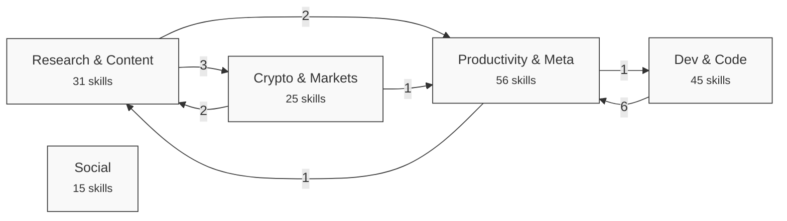
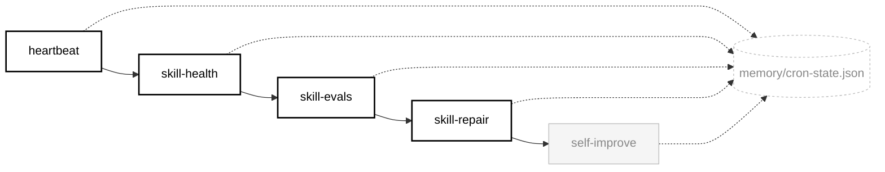

# Skill Dependency Graph

Auto-generated by `skill-graph` on 2026-08-16. Mode: `SKILL_GRAPH_NEW`.

**Verdict:** INITIALIZED: 172 skills

## Overview

## Self-healing loop

## Per-category detail

### Research & Content (31 skills)

```mermaid
flowchart LR
  subgraph research["Research & Content (31)"]
    agent-displacement["agent-displacement"]:::disabled
    ai-framework-watch["ai-framework-watch<br/><small>30 8 * * 1</small>"]:::enabled
    article["article"]:::disabled
    channel-recap["channel-recap"]:::disabled
    competitor-launch-radar["competitor-launch-radar"]:::disabled
    compute-futures-eda["compute-futures-eda<br/><small>0 6 * * *</small>"]:::enabled
    compute-macro-correlate["compute-macro-correlate<br/><small>30 6 * * 0</small>"]:::enabled
    compute-pulse["compute-pulse<br/><small>0 11 * * 6</small>"]:::enabled
    content-engine["content-engine"]:::disabled
    deep-research["deep-research"]:::disabled
    digest["digest"]:::disabled
    ecosystem-pulse["ecosystem-pulse"]:::disabled
    fetch-tweets["fetch-tweets"]:::disabled
    hacker-news-digest["hacker-news-digest"]:::disabled
    huggingface-trending["huggingface-trending"]:::disabled
    idea-validator["idea-validator"]:::disabled
    last30["last30"]:::disabled
    list-digest["list-digest"]:::disabled
    paper-digest["paper-digest"]:::disabled
    paper-pick["paper-pick"]:::disabled
    pm-intel["pm-intel"]:::disabled
    programmatic-eda["programmatic-eda"]:::disabled
    reddit-digest["reddit-digest"]:::disabled
    research-brief["research-brief"]:::disabled
    rss-digest["rss-digest"]:::disabled
    security-digest["security-digest"]:::disabled
    surplus-pulse["surplus-pulse<br/><small>30 16 * * *</small>"]:::enabled
    technical-explainer["technical-explainer"]:::disabled
    telegram-digest["telegram-digest"]:::disabled
    topic-momentum["topic-momentum"]:::disabled
    vibecoding-digest["vibecoding-digest"]:::disabled
  end
  subgraph ext[" "]
    direction TB
    runpod-spot-pricing[runpod-spot-pricing]:::external
    idea-pipeline[idea-pipeline]:::external
    launch-radar[launch-radar]:::external
    market-context-refresh[market-context-refresh]:::external
    pm-manipulation[pm-manipulation]:::external
    pm-pulse[pm-pulse]:::external
  end
  style ext fill:none,stroke:#ddd,stroke-dasharray:3 3
  compute-pulse -..-> runpod-spot-pricing
  idea-pipeline -..-> idea-validator
  idea-validator -..-> launch-radar
  idea-validator -..-> idea-pipeline
  market-context-refresh -..-> topic-momentum
  pm-intel -..-> pm-manipulation
  pm-intel -..-> pm-pulse
  pm-pulse -..-> pm-intel
  classDef enabled fill:#fff,stroke:#000,stroke-width:2px,color:#000
  classDef disabled fill:#f5f5f5,stroke:#bbb,color:#888
  classDef external fill:none,stroke:#bbb,stroke-dasharray:3 3,color:#888
  click agent-displacement "../skills/agent-displacement/SKILL.md"
  click ai-framework-watch "../skills/ai-framework-watch/SKILL.md"
  click article "../skills/article/SKILL.md"
  click channel-recap "../skills/channel-recap/SKILL.md"
  click competitor-launch-radar "../skills/competitor-launch-radar/SKILL.md"
  click compute-futures-eda "../skills/compute-futures-eda/SKILL.md"
  click compute-macro-correlate "../skills/compute-macro-correlate/SKILL.md"
  click compute-pulse "../skills/compute-pulse/SKILL.md"
  click content-engine "../skills/content-engine/SKILL.md"
  click deep-research "../skills/deep-research/SKILL.md"
  click digest "../skills/digest/SKILL.md"
  click ecosystem-pulse "../skills/ecosystem-pulse/SKILL.md"
  click fetch-tweets "../skills/fetch-tweets/SKILL.md"
  click hacker-news-digest "../skills/hacker-news-digest/SKILL.md"
  click huggingface-trending "../skills/huggingface-trending/SKILL.md"
  click idea-validator "../skills/idea-validator/SKILL.md"
  click last30 "../skills/last30/SKILL.md"
  click list-digest "../skills/list-digest/SKILL.md"
  click paper-digest "../skills/paper-digest/SKILL.md"
  click paper-pick "../skills/paper-pick/SKILL.md"
  click pm-intel "../skills/pm-intel/SKILL.md"
  click programmatic-eda "../skills/programmatic-eda/SKILL.md"
  click reddit-digest "../skills/reddit-digest/SKILL.md"
  click research-brief "../skills/research-brief/SKILL.md"
  click rss-digest "../skills/rss-digest/SKILL.md"
  click security-digest "../skills/security-digest/SKILL.md"
  click surplus-pulse "../skills/surplus-pulse/SKILL.md"
  click technical-explainer "../skills/technical-explainer/SKILL.md"
  click telegram-digest "../skills/telegram-digest/SKILL.md"
  click topic-momentum "../skills/topic-momentum/SKILL.md"
  click vibecoding-digest "../skills/vibecoding-digest/SKILL.md"
  click runpod-spot-pricing "../skills/runpod-spot-pricing/SKILL.md"
  click idea-pipeline "../skills/idea-pipeline/SKILL.md"
  click launch-radar "../skills/launch-radar/SKILL.md"
  click market-context-refresh "../skills/market-context-refresh/SKILL.md"
  click pm-manipulation "../skills/pm-manipulation/SKILL.md"
  click pm-pulse "../skills/pm-pulse/SKILL.md"
```

### Dev & Code (45 skills)

```mermaid
flowchart LR
  subgraph dev["Dev & Code (45)"]
    auto-merge["auto-merge"]:::disabled
    auto-workflow["auto-workflow"]:::disabled
    autoresearch["autoresearch"]:::disabled
    builder-map["builder-map"]:::disabled
    changelog["changelog<br/><small>0 16 * * 1</small>"]:::enabled
    code-health["code-health<br/><small>0 16 * * *</small>"]:::enabled
    create-skill["create-skill"]:::disabled
    deploy-prototype["deploy-prototype"]:::disabled
    disclosure-tracker["disclosure-tracker"]:::disabled
    external-feature["external-feature"]:::disabled
    feature["feature"]:::disabled
    fleet-control["fleet-control<br/><small>0 9 * * *</small>"]:::enabled
    fork-cohort["fork-cohort"]:::disabled
    fork-first-run-alert["fork-first-run-alert"]:::disabled
    fork-fleet["fork-fleet"]:::disabled
    fork-skill-gap["fork-skill-gap"]:::disabled
    frontier-eval["frontier-eval"]:::disabled
    github-issues["github-issues"]:::disabled
    github-monitor["github-monitor<br/><small>0 9 * * *</small>"]:::enabled
    github-releases["github-releases"]:::disabled
    github-trending["github-trending"]:::disabled
    gitlawb-fleet["gitlawb-fleet"]:::disabled
    gitlawb-fleet-metrics["gitlawb-fleet-metrics<br/><small>0 8 * * *</small>"]:::enabled
    issue-triage["issue-triage<br/><small>0 9 * * *</small>"]:::enabled
    pr-review["pr-review<br/><small>0 9,18 * * *</small>"]:::enabled
    pr-triage["pr-triage<br/><small>30 9 * * *</small>"]:::enabled
    project-lens["project-lens"]:::disabled
    push-recap["push-recap"]:::disabled
    pvr-triage-monitor["pvr-triage-monitor"]:::disabled
    pvr-watchlist["pvr-watchlist"]:::disabled
    repo-actions["repo-actions"]:::disabled
    repo-article["repo-article"]:::disabled
    repo-pulse["repo-pulse"]:::disabled
    repo-revive["repo-revive<br/><small>0 10 * * 6</small>"]:::enabled
    repo-scanner["repo-scanner"]:::disabled
    search-skill["search-skill"]:::disabled
    skill-enabler["skill-enabler"]:::disabled
    skill-security-scan["skill-security-scan"]:::disabled
    smithery-manifest["smithery-manifest"]:::disabled
    spawn-instance["spawn-instance"]:::disabled
    star-milestone["star-milestone"]:::disabled
    vercel-projects["vercel-projects"]:::disabled
    vuln-scanner["vuln-scanner<br/><small>0 16 * * 6</small>"]:::enabled
    workflow-security-audit["workflow-security-audit<br/><small>0 16 * * 0</small>"]:::enabled
    x402-monitor["x402-monitor"]:::disabled
  end
  subgraph ext[" "]
    direction TB
    vuln-tracker[vuln-tracker]:::external
    idea-pipeline[idea-pipeline]:::external
    contributor-spotlight[contributor-spotlight]:::external
    fleet-state[fleet-state]:::external
    pr-tracker[pr-tracker]:::external
  end
  style ext fill:none,stroke:#ddd,stroke-dasharray:3 3
  repo-scanner --> external-feature
  github-trending --> vuln-scanner
  fork-cohort -..-> fork-first-run-alert
  fork-cohort -..-> fork-skill-gap
  repo-scanner -..-> external-feature
  repo-scanner -..-> repo-actions
  repo-scanner -..-> vercel-projects
  vercel-projects -..-> external-feature
  vercel-projects -..-> repo-actions
  vercel-projects -..-> repo-scanner
  vuln-scanner --> vuln-tracker
  builder-map -..-> idea-pipeline
  deploy-prototype -..-> idea-pipeline
  fork-cohort -..-> contributor-spotlight
  fork-cohort -..-> fleet-state
  pr-tracker -..-> disclosure-tracker
  vercel-projects -..-> idea-pipeline
  classDef enabled fill:#fff,stroke:#000,stroke-width:2px,color:#000
  classDef disabled fill:#f5f5f5,stroke:#bbb,color:#888
  classDef external fill:none,stroke:#bbb,stroke-dasharray:3 3,color:#888
  click auto-merge "../skills/auto-merge/SKILL.md"
  click auto-workflow "../skills/auto-workflow/SKILL.md"
  click autoresearch "../skills/autoresearch/SKILL.md"
  click builder-map "../skills/builder-map/SKILL.md"
  click changelog "../skills/changelog/SKILL.md"
  click code-health "../skills/code-health/SKILL.md"
  click create-skill "../skills/create-skill/SKILL.md"
  click deploy-prototype "../skills/deploy-prototype/SKILL.md"
  click disclosure-tracker "../skills/disclosure-tracker/SKILL.md"
  click external-feature "../skills/external-feature/SKILL.md"
  click feature "../skills/feature/SKILL.md"
  click fleet-control "../skills/fleet-control/SKILL.md"
  click fork-cohort "../skills/fork-cohort/SKILL.md"
  click fork-first-run-alert "../skills/fork-first-run-alert/SKILL.md"
  click fork-fleet "../skills/fork-fleet/SKILL.md"
  click fork-skill-gap "../skills/fork-skill-gap/SKILL.md"
  click frontier-eval "../skills/frontier-eval/SKILL.md"
  click github-issues "../skills/github-issues/SKILL.md"
  click github-monitor "../skills/github-monitor/SKILL.md"
  click github-releases "../skills/github-releases/SKILL.md"
  click github-trending "../skills/github-trending/SKILL.md"
  click gitlawb-fleet "../skills/gitlawb-fleet/SKILL.md"
  click gitlawb-fleet-metrics "../skills/gitlawb-fleet-metrics/SKILL.md"
  click issue-triage "../skills/issue-triage/SKILL.md"
  click pr-review "../skills/pr-review/SKILL.md"
  click pr-triage "../skills/pr-triage/SKILL.md"
  click project-lens "../skills/project-lens/SKILL.md"
  click push-recap "../skills/push-recap/SKILL.md"
  click pvr-triage-monitor "../skills/pvr-triage-monitor/SKILL.md"
  click pvr-watchlist "../skills/pvr-watchlist/SKILL.md"
  click repo-actions "../skills/repo-actions/SKILL.md"
  click repo-article "../skills/repo-article/SKILL.md"
  click repo-pulse "../skills/repo-pulse/SKILL.md"
  click repo-revive "../skills/repo-revive/SKILL.md"
  click repo-scanner "../skills/repo-scanner/SKILL.md"
  click search-skill "../skills/search-skill/SKILL.md"
  click skill-enabler "../skills/skill-enabler/SKILL.md"
  click skill-security-scan "../skills/skill-security-scan/SKILL.md"
  click smithery-manifest "../skills/smithery-manifest/SKILL.md"
  click spawn-instance "../skills/spawn-instance/SKILL.md"
  click star-milestone "../skills/star-milestone/SKILL.md"
  click vercel-projects "../skills/vercel-projects/SKILL.md"
  click vuln-scanner "../skills/vuln-scanner/SKILL.md"
  click workflow-security-audit "../skills/workflow-security-audit/SKILL.md"
  click x402-monitor "../skills/x402-monitor/SKILL.md"
  click vuln-tracker "../skills/vuln-tracker/SKILL.md"
  click idea-pipeline "../skills/idea-pipeline/SKILL.md"
  click contributor-spotlight "../skills/contributor-spotlight/SKILL.md"
  click fleet-state "../skills/fleet-state/SKILL.md"
  click pr-tracker "../skills/pr-tracker/SKILL.md"
```

### Crypto & Markets (25 skills)

```mermaid
flowchart LR
  subgraph crypto["Crypto & Markets (25)"]
    aixbt-pulse["aixbt-pulse"]:::disabled
    contributor-reward["contributor-reward"]:::disabled
    defi-monitor["defi-monitor"]:::disabled
    defi-overview["defi-overview"]:::disabled
    distribute-tokens["distribute-tokens"]:::disabled
    market-context-refresh["market-context-refresh"]:::disabled
    monitor-kalshi["monitor-kalshi"]:::disabled
    monitor-polymarket["monitor-polymarket"]:::disabled
    monitor-runners["monitor-runners"]:::disabled
    narrative-tracker["narrative-tracker"]:::disabled
    on-chain-monitor["on-chain-monitor"]:::disabled
    pm-manipulation["pm-manipulation"]:::disabled
    pm-pulse["pm-pulse"]:::disabled
    polymarket["polymarket"]:::disabled
    polymarket-comments["polymarket-comments"]:::disabled
    price-threshold-alert["price-threshold-alert"]:::disabled
    runpod-spot-pricing["runpod-spot-pricing"]:::disabled
    rwa-pulse["rwa-pulse"]:::disabled
    token-alert["token-alert"]:::disabled
    token-movers["token-movers"]:::disabled
    token-pick["token-pick"]:::disabled
    token-report["token-report"]:::disabled
    treasury-info["treasury-info"]:::disabled
    unlock-monitor["unlock-monitor"]:::disabled
    wallet-digest["wallet-digest"]:::disabled
  end
  subgraph ext[" "]
    direction TB
    compute-pulse[compute-pulse]:::external
    idea-pipeline[idea-pipeline]:::external
    topic-momentum[topic-momentum]:::external
    pm-intel[pm-intel]:::external
  end
  style ext fill:none,stroke:#ddd,stroke-dasharray:3 3
  market-context-refresh -..-> rwa-pulse
  pm-pulse -..-> pm-manipulation
  compute-pulse -..-> runpod-spot-pricing
  market-context-refresh -..-> idea-pipeline
  market-context-refresh -..-> topic-momentum
  pm-intel -..-> pm-manipulation
  pm-intel -..-> pm-pulse
  pm-pulse -..-> pm-intel
  classDef enabled fill:#fff,stroke:#000,stroke-width:2px,color:#000
  classDef disabled fill:#f5f5f5,stroke:#bbb,color:#888
  classDef external fill:none,stroke:#bbb,stroke-dasharray:3 3,color:#888
  click aixbt-pulse "../skills/aixbt-pulse/SKILL.md"
  click contributor-reward "../skills/contributor-reward/SKILL.md"
  click defi-monitor "../skills/defi-monitor/SKILL.md"
  click defi-overview "../skills/defi-overview/SKILL.md"
  click distribute-tokens "../skills/distribute-tokens/SKILL.md"
  click market-context-refresh "../skills/market-context-refresh/SKILL.md"
  click monitor-kalshi "../skills/monitor-kalshi/SKILL.md"
  click monitor-polymarket "../skills/monitor-polymarket/SKILL.md"
  click monitor-runners "../skills/monitor-runners/SKILL.md"
  click narrative-tracker "../skills/narrative-tracker/SKILL.md"
  click on-chain-monitor "../skills/on-chain-monitor/SKILL.md"
  click pm-manipulation "../skills/pm-manipulation/SKILL.md"
  click pm-pulse "../skills/pm-pulse/SKILL.md"
  click polymarket "../skills/polymarket/SKILL.md"
  click polymarket-comments "../skills/polymarket-comments/SKILL.md"
  click price-threshold-alert "../skills/price-threshold-alert/SKILL.md"
  click runpod-spot-pricing "../skills/runpod-spot-pricing/SKILL.md"
  click rwa-pulse "../skills/rwa-pulse/SKILL.md"
  click token-alert "../skills/token-alert/SKILL.md"
  click token-movers "../skills/token-movers/SKILL.md"
  click token-pick "../skills/token-pick/SKILL.md"
  click token-report "../skills/token-report/SKILL.md"
  click treasury-info "../skills/treasury-info/SKILL.md"
  click unlock-monitor "../skills/unlock-monitor/SKILL.md"
  click wallet-digest "../skills/wallet-digest/SKILL.md"
  click compute-pulse "../skills/compute-pulse/SKILL.md"
  click idea-pipeline "../skills/idea-pipeline/SKILL.md"
  click topic-momentum "../skills/topic-momentum/SKILL.md"
  click pm-intel "../skills/pm-intel/SKILL.md"
```

### Social (15 skills)

### Productivity & Meta (56 skills)

```mermaid
flowchart LR
  subgraph productivity["Productivity & Meta (56)"]
    action-converter["action-converter"]:::disabled
    autoresearch-goal["autoresearch-goal"]:::disabled
    batch-health["batch-health<br/><small>0 8 * * *</small>"]:::enabled
    config-validator["config-validator<br/><small>0 7 * * 0</small>"]:::enabled
    contributor-spotlight["contributor-spotlight"]:::disabled
    cost-report["cost-report<br/><small>0 7 * * 1</small>"]:::enabled
    daily-routine["daily-routine"]:::disabled
    deal-flow["deal-flow"]:::disabled
    evening-recap["evening-recap"]:::disabled
    fleet-state["fleet-state"]:::disabled
    fork-contributor-leaderboard["fork-contributor-leaderboard"]:::disabled
    fork-release-tracker["fork-release-tracker"]:::disabled
    fork-skill-digest["fork-skill-digest"]:::disabled
    goal-tracker["goal-tracker<br/><small>0 18 * * *</small>"]:::enabled
    heartbeat["heartbeat<br/><small>0 8 * * *</small>"]:::enabled
    idea-capture["idea-capture"]:::disabled
    idea-pipeline["idea-pipeline"]:::disabled
    janitor["janitor<br/><small>30 5 * * 0</small>"]:::enabled
    launch-radar["launch-radar"]:::disabled
    memory-flush["memory-flush<br/><small>0 6 2/2 * *</small>"]:::enabled
    memory-structural-dedupe["memory-structural-dedupe<br/><small>10 6 2/2 * *</small>"]:::enabled
    milestone-tracker["milestone-tracker<br/><small>0 12 * * 1</small>"]:::enabled
    morning-brief["morning-brief"]:::disabled
    note-taking["note-taking"]:::disabled
    notegraph["notegraph<br/><small>0 5 * * *</small>"]:::enabled
    onboard["onboard"]:::disabled
    operator-scorecard["operator-scorecard"]:::disabled
    planner["planner<br/><small>30 6 * * *</small>"]:::enabled
    pr-tracker["pr-tracker<br/><small>0 10 * * *</small>"]:::enabled
    reflect["reflect<br/><small>0 18 * * *</small>"]:::enabled
    reg-monitor["reg-monitor"]:::disabled
    rss-feed["rss-feed"]:::disabled
    run-frequency-guard["run-frequency-guard<br/><small>0 23 * * *</small>"]:::enabled
    self-improve["self-improve"]:::disabled
    self-review["self-review<br/><small>30 18 * * 0</small>"]:::enabled
    signal-verdict["signal-verdict"]:::disabled
    skill-analytics["skill-analytics<br/><small>30 18 * * 3</small>"]:::enabled
    skill-evals["skill-evals<br/><small>0 9 * * 0</small>"]:::enabled
    skill-freshness["skill-freshness<br/><small>0 8 * * *</small>"]:::enabled
    skill-graph["skill-graph<br/><small>0 17 * * 0</small>"]:::enabled
    skill-health["skill-health<br/><small>0 18 * * *</small>"]:::enabled
    skill-leaderboard["skill-leaderboard"]:::disabled
    skill-repair["skill-repair<br/><small>reactive</small>"]:::enabled
    skill-update-check["skill-update-check<br/><small>0 19 * * 0</small>"]:::enabled
    skillpacks["skillpacks<br/><small>0 6 * * 0</small>"]:::enabled
    stale-content-pr-sweeper["stale-content-pr-sweeper<br/><small>45 23 * * *</small>"]:::enabled
    star-momentum-alert["star-momentum-alert"]:::disabled
    startup-idea["startup-idea"]:::disabled
    suggest-edges["suggest-edges<br/><small>30 5 * * *</small>"]:::enabled
    swarm-safety-eval["swarm-safety-eval<br/><small>30 7 * * 0</small>"]:::enabled
    tool-builder["tool-builder"]:::disabled
    update-gallery["update-gallery"]:::disabled
    v4-readiness["v4-readiness"]:::disabled
    vuln-tracker["vuln-tracker"]:::disabled
    weekly-review["weekly-review"]:::disabled
    weekly-shiplog["weekly-shiplog<br/><small>0 9 * * 1</small>"]:::enabled
  end
  subgraph ext[" "]
    direction TB
    vuln-scanner[vuln-scanner]:::external
    builder-map[builder-map]:::external
    deploy-prototype[deploy-prototype]:::external
    fork-cohort[fork-cohort]:::external
    idea-validator[idea-validator]:::external
    market-context-refresh[market-context-refresh]:::external
    disclosure-tracker[disclosure-tracker]:::external
    vercel-projects[vercel-projects]:::external
  end
  style ext fill:none,stroke:#ddd,stroke-dasharray:3 3
  skill-health --> skill-repair
  action-converter --> tool-builder
  contributor-spotlight -..-> fleet-state
  fork-release-tracker -..-> fleet-state
  idea-pipeline -..-> launch-radar
  notegraph -..-> stale-content-pr-sweeper
  vuln-scanner --> vuln-tracker
  builder-map -..-> idea-pipeline
  deploy-prototype -..-> idea-pipeline
  fork-cohort -..-> contributor-spotlight
  fork-cohort -..-> fleet-state
  idea-pipeline -..-> idea-validator
  idea-validator -..-> launch-radar
  idea-validator -..-> idea-pipeline
  market-context-refresh -..-> idea-pipeline
  pr-tracker -..-> disclosure-tracker
  vercel-projects -..-> idea-pipeline
  classDef enabled fill:#fff,stroke:#000,stroke-width:2px,color:#000
  classDef disabled fill:#f5f5f5,stroke:#bbb,color:#888
  classDef external fill:none,stroke:#bbb,stroke-dasharray:3 3,color:#888
  click action-converter "../skills/action-converter/SKILL.md"
  click autoresearch-goal "../skills/autoresearch-goal/SKILL.md"
  click batch-health "../skills/batch-health/SKILL.md"
  click config-validator "../skills/config-validator/SKILL.md"
  click contributor-spotlight "../skills/contributor-spotlight/SKILL.md"
  click cost-report "../skills/cost-report/SKILL.md"
  click daily-routine "../skills/daily-routine/SKILL.md"
  click deal-flow "../skills/deal-flow/SKILL.md"
  click evening-recap "../skills/evening-recap/SKILL.md"
  click fleet-state "../skills/fleet-state/SKILL.md"
  click fork-contributor-leaderboard "../skills/fork-contributor-leaderboard/SKILL.md"
  click fork-release-tracker "../skills/fork-release-tracker/SKILL.md"
  click fork-skill-digest "../skills/fork-skill-digest/SKILL.md"
  click goal-tracker "../skills/goal-tracker/SKILL.md"
  click heartbeat "../skills/heartbeat/SKILL.md"
  click idea-capture "../skills/idea-capture/SKILL.md"
  click idea-pipeline "../skills/idea-pipeline/SKILL.md"
  click janitor "../skills/janitor/SKILL.md"
  click launch-radar "../skills/launch-radar/SKILL.md"
  click memory-flush "../skills/memory-flush/SKILL.md"
  click memory-structural-dedupe "../skills/memory-structural-dedupe/SKILL.md"
  click milestone-tracker "../skills/milestone-tracker/SKILL.md"
  click morning-brief "../skills/morning-brief/SKILL.md"
  click note-taking "../skills/note-taking/SKILL.md"
  click notegraph "../skills/notegraph/SKILL.md"
  click onboard "../skills/onboard/SKILL.md"
  click operator-scorecard "../skills/operator-scorecard/SKILL.md"
  click planner "../skills/planner/SKILL.md"
  click pr-tracker "../skills/pr-tracker/SKILL.md"
  click reflect "../skills/reflect/SKILL.md"
  click reg-monitor "../skills/reg-monitor/SKILL.md"
  click rss-feed "../skills/rss-feed/SKILL.md"
  click run-frequency-guard "../skills/run-frequency-guard/SKILL.md"
  click self-improve "../skills/self-improve/SKILL.md"
  click self-review "../skills/self-review/SKILL.md"
  click signal-verdict "../skills/signal-verdict/SKILL.md"
  click skill-analytics "../skills/skill-analytics/SKILL.md"
  click skill-evals "../skills/skill-evals/SKILL.md"
  click skill-freshness "../skills/skill-freshness/SKILL.md"
  click skill-graph "../skills/skill-graph/SKILL.md"
  click skill-health "../skills/skill-health/SKILL.md"
  click skill-leaderboard "../skills/skill-leaderboard/SKILL.md"
  click skill-repair "../skills/skill-repair/SKILL.md"
  click skill-update-check "../skills/skill-update-check/SKILL.md"
  click skillpacks "../skills/skillpacks/SKILL.md"
  click stale-content-pr-sweeper "../skills/stale-content-pr-sweeper/SKILL.md"
  click star-momentum-alert "../skills/star-momentum-alert/SKILL.md"
  click startup-idea "../skills/startup-idea/SKILL.md"
  click suggest-edges "../skills/suggest-edges/SKILL.md"
  click swarm-safety-eval "../skills/swarm-safety-eval/SKILL.md"
  click tool-builder "../skills/tool-builder/SKILL.md"
  click update-gallery "../skills/update-gallery/SKILL.md"
  click v4-readiness "../skills/v4-readiness/SKILL.md"
  click vuln-tracker "../skills/vuln-tracker/SKILL.md"
  click weekly-review "../skills/weekly-review/SKILL.md"
  click weekly-shiplog "../skills/weekly-shiplog/SKILL.md"
  click vuln-scanner "../skills/vuln-scanner/SKILL.md"
  click builder-map "../skills/builder-map/SKILL.md"
  click deploy-prototype "../skills/deploy-prototype/SKILL.md"
  click fork-cohort "../skills/fork-cohort/SKILL.md"
  click idea-validator "../skills/idea-validator/SKILL.md"
  click market-context-refresh "../skills/market-context-refresh/SKILL.md"
  click disclosure-tracker "../skills/disclosure-tracker/SKILL.md"
  click vercel-projects "../skills/vercel-projects/SKILL.md"
```

## Legend

- `-->` **depends_on** — declared in SKILL.md frontmatter
- `-.->` **consume** — chain step in `aeon.yml` consumes prior step's output
- `-..->` **reactive / shared-state** — one skill writes memory that another reads
- **Bold, white** = `enabled: true` in `aeon.yml` (schedule shown under node)
- **Grey, faded** = disabled
- **Dashed border, ghost node** = external cross-category reference in per-category diagrams
- Every node is a hyperlink to its `SKILL.md`

> Note: every skill also writes `memory/cron-state.json` (consumed by `heartbeat` / `skill-health` / `skill-repair`) — collapsed to the self-healing loop diagram above.

## Summary

| Metric | Count |
|---|---|
| Total skills | 172 |
| Enabled | 43 |
| Disabled | 129 |
| Category: Research & Content | 31 |
| Category: Dev & Code | 45 |
| Category: Crypto & Markets | 25 |
| Category: Social | 15 |
| Category: Productivity & Meta | 56 |
| Edges: depends_on | 5 |
| Edges: consume | 0 |
| Edges: reactive | 2 |
| Edges: shared-state (derived) | 29 |

---

_skills parsed: 172 · depends_on: 5 · consume: 0 · reactive: 2 · shared-state derived: 29 · enabled: 43/172 · mode: SKILL_GRAPH_NEW_
